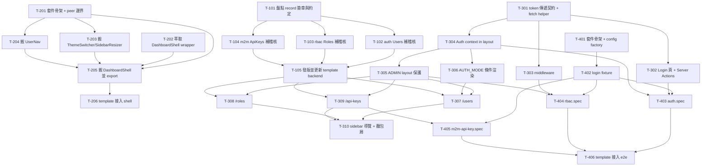

# 004 - 框架完整收尾 Task Breakdown

> 本文件是 `004-framework-completion-plan.md` 的執行拆解，把四個工作包拆成「一次一個 commit 可完成」的 task。
> 資深架構師 review 意見放最前面，最後附依賴關係圖與「可立刻開始的第一批 task」。
> 狀態：**已完成（27/27）**。四個工作包均已落地；`@appspine/frontend-shell` 已發布正式版本，
> template 已使用套件版本並完成接線與驗證。
---

## 1. Review 意見

整體計劃方向正確、範圍收斂得宜（只抽真正通用的東西、明確排除集中化機制），這裡補充實作前需要留意或修正的地方：

### 1.1 與現況不符 / 需先對齊的事實

- **`next.config` 副檔名**：計劃寫 `next.config.ts`，但 template 現況是 `next.config.mjs`（`transpilePackages` 要加在 `.mjs` 裡）。不要照抄計劃的檔名。
- **前端 sidebar 元件實際路徑**：計劃表格寫 `sidebar/theme-switcher.tsx` 等，實際在 `src/app/(main)/dashboard/_components/sidebar/` 底下（`theme-switcher.tsx`、`sidebar-resizer.tsx`、`nav-user.tsx`）；layout 在 `src/app/(main)/dashboard/layout.tsx`。抽套件時以實際路徑為準。
- **前端目前沒有 login / middleware / auth store**：`src/app/(external)/` 存在但沒有 `login/`；沒有 `middleware.ts`；`src/stores/` 只有 `preferences/`。工作包 3 的 Auth 層是**從無到有**，不是改既有。
- **`<DashboardShell>` 目前不存在**：現況是 `layout.tsx` 直接組 `AppSidebar`。抽套件其實是「先萃取出一個 shell wrapper，再搬進套件」，比計劃描述多一步。

### 1.2 技術方案值得商榷 / 補強處

- **前端如何拿 JWT 打後端（跨埠 cookie）**：計劃定案「httpOnly cookie」，但沒講清楚 cookie 是誰 set 的。後端 `/auth/login` 目前回的是 JSON body 裡的 token（不是 `Set-Cookie`）。建議：**cookie 由 Next.js Server Action set**（前端自己的 domain），Server Action 收到後端回傳的 token 後用 `cookies().set()` 寫 httpOnly cookie；之後所有對後端的呼叫都在 Server Action / Route Handler 裡把 cookie 讀出來、以 `Authorization: Bearer` 轉發。這樣避免跨 domain cookie 的 SameSite 問題，也不用改後端。此決策要在 T-201 之前釘死。
- **middleware 只能做「有沒有登入」的粗略判斷**：Edge middleware 不該解 JWT 驗簽（沒有 secret、跑在 edge）。`roleNames` 的 ADMIN 保護要放在 layout（Server Component）層，透過呼叫後端 `/auth/me` 取得，不要塞進 middleware。計劃 3b 寫「透過 roleNames check 在 layout 層保護」是對的，middleware 只擋「完全沒 cookie」。
- **audit-log 的 `record()` 需要 actor / traceId**：補稽核前要先確認 `AuditLogService.record()` 的簽章（actor userId、action、resource、resourceId、before/after payload 從哪來）。controller 裡拿 actor 要靠 `@CurrentUser()`；API Key 呼叫者的 actor 怎麼記（沒有 userId）要有一致約定。建議 T-101 先做一個「盤點 + 定義 helper」的準備，避免每個 controller 各寫各的。
- **frontend-shell 的 `UserNav` 依賴 shadcn 元件**：`nav-user.tsx` 會 import `@/components/ui/*`（dropdown、avatar 等）。套件化後這些 UI primitive 要嘛也進套件、要嘛宣告成 peer 並要求 app 端用 shadcn 標準路徑。計劃只列了 `next/react/tailwind` 當 peer，漏了 shadcn primitive 的處理策略——建議套件**不**打包 shadcn primitive，改為套件內自帶精簡版或要求 app 傳入，這點要在 T-201 決定。
- **`transpilePackages` + Tailwind content 掃描**：套件裡的 className 要被 app 的 Tailwind 掃到，app 的 `content` glob 必須含 `node_modules/@appspine/frontend-shell`。這是常見漏掉的一步，獨立成一個 task。

### 1.3 依賴順序 review

- 計劃的順序（① → ②③ 平行 → ④⑤ 平行 → ⑥）大方向合理。補充：
  - **工作包 1（稽核）發版**是工作包 3 後端行為的前提，但**不阻擋**工作包 3 的前端 Auth 層開發（前端 Auth 不依賴 audit log）。所以工作包 1 可以跟工作包 2/3 的前端部分完全平行，只在「template backend bump 版本」那一步交會。
  - **工作包 4（e2e-kit）**的 spec 依賴前端 Auth 流程（登入、RBAC redirect）與 API Key 流程都可用，所以排最後正確。但 e2e-kit 的**套件骨架 + config factory + auth fixture**（不含實際 assert 業務行為的 spec）其實不依賴任何前端頁面，可以提早開工，只有 spec 本身要等前端就緒。
- **建議微調**：把工作包 4 拆成「套件基礎設施（可提早）」與「golden path spec（要等前端）」兩批，提升平行度。

### 1.4 邊界情況 / 風險

- **稽核紀錄的交易一致性**：`record()` 若和主要寫入不在同一個 DB transaction，寫入成功但 audit 失敗會產生「有異動沒紀錄」。要決定 audit 失敗時是吞掉（log warning）還是連帶 rollback。建議吞掉（audit 不該擋業務），但要明確。
- **一次性顯示 API key**：建立 API key 後明碼只在當下回一次，前端 Dialog 關掉就再也拿不到。UI 要防呆（強制使用者複製 / 明確提示），且不可把明碼寫進任何 query cache / log。
- **停用 vs 刪除使用者**：計劃 users 頁面同時有「停用」與「刪除」。刪除自己 / 刪除最後一個 ADMIN 要擋（後端可能已擋，前端要處理 4xx 並給友善訊息）。
- **OIDC 模式下管理 UI 差異**：001 定案 `AUTH_MODE=oidc` 時要隱藏帳密管理 UI（改密碼/建帳號），但角色指派 UI 兩種模式都留。管理 UI 要吃 `AUTH_MODE` 條件渲染，否則 OIDC 部署會出現用不到的建立本地使用者按鈕。計劃 3b 沒提這點，補一個 task。
- **changeset 版本聯動**：三個套件（auth/rbac/m2m-api-key）補稽核是各自 patch bump，但它們新增 `@appspine/audit-log` 為 peer/dev dep——template 端安裝時要確保 audit-log 版本相容。發版順序：先確認 audit-log 已發布的版本號，再把它填進三個套件的 peerDependency range。

### 1.5 顆粒度

- 大部分 task 控制在單一 commit 可完成。少數（如「三個 controller 補稽核」）刻意拆成一個套件一個 task，因為三個套件各自要 bump 版本、各自可獨立驗證；若嫌太碎可合併成一個 commit，但分開比較好 review 與回溯。

---

## 2. 完整 Task Breakdown

編號規則：`T-1xx` 稽核紀錄、`T-2xx` frontend-shell、`T-3xx` 管理 UI（含前端 Auth 層）、`T-4xx` e2e-kit。

### 工作包 1 — 補稽核紀錄

- [x] **T-101** 盤點 `AuditLogService.record()` 簽章並定義 controller 端呼叫約定
      _工作包：1 | 依賴：無_
      說明：讀 `packages/audit-log/src/audit-log.service.ts` 確認 `record()` 參數（actor、action、resource、resourceId、payload、traceId），並在本 task 決定「JWT 使用者 vs API Key 呼叫者」的 actor 記法、audit 寫入失敗的處理策略（吞掉並 log warning）。產出寫進本文件或程式碼註解，作為 T-102~T-104 的共同基準。此 task 不改業務碼。

      **決定（供 T-102~T-104 直接套用）：**

      - **`record()` 簽章**（`RecordAuditLogDto`）：`entityType`、`entityId`、`action`（`AuditAction`）、`actorId`、`actorEmail`、`appName`、`isAiOperation?`（預設 `false`）、`mcpTool?`（預設 `null`）。工作包 1 這三個 controller 都是人類走 UI/API 操作，不經 MCP tool，所以不用傳 `isAiOperation`/`mcpTool`，吃預設值即可。
      - **actor 記法**：`@CurrentUser()` 的型別在 controller 端寫成 `{ sub: string; email?: string }`（不用完整 `JwtPayload`，因為呼叫者可能是 API Key，其 `request.user` 實際是 `ApiKeyUser` 形狀、沒有 `email` 欄位——`@CurrentUser()` decorator 本身不區分兩者，型別上是騙人的）。
        - `actorId` = `actor.sub`（JWT 與 API Key 呼叫者皆有此欄位）
        - `actorEmail` = `actor.email ?? \`api-key:${actor.sub}\``（沿用 auranest 原本的 fallback 慣例，讓查 audit log 時能分辨是人類還是 M2M 呼叫）
      - **`appName`**：`process.env.APP_NAME ?? 'appspine-app-template'`。**新增 `APP_NAME` env var**（已補進 `appspine-app-template/.env.example` 與 `.env`，並修正 README「Forking this template」章節——原本寫的 `APP_SLUG` 從未被任何套件實際讀取，MCP server 名稱其實來自 `npm_package_name`（即 `backend/package.json` 的 `name`），不是 env var，已一併修正）。
      - **失敗處理策略**：audit 寫入失敗不可擋住業務操作的回應。呼叫方式一律用 fire-and-forget：`void this.auditLogService.record({...}).catch((err) => this.logger.warn(...))`，不要 `await`，也不要讓它拋出的例外進到 controller 的 try/catch 影響回應。
      - **不建共用 helper**：`actorEmail` 的 fallback 運算式很短（一行），且 `@appspine/audit-log` 目前刻意不依賴 `@appspine/auth`（避免多一條套件依賴邊），三個 controller 各自直接寫這行運算式即可，不需要為此在任一套件新增共用函式。

- [x] **T-102** `@appspine/auth`：`UsersController` 四個寫入操作補稽核 + 新增 audit-log peer/dev 依賴
      _工作包：1 | 依賴：T-101_
      說明：`packages/auth/src/users/users.controller.ts` 的 `create/update/updateRoles/remove` 注入 `AuditLogService` 並呼叫 `record()`；`packages/auth/package.json` 加 `@appspine/audit-log` 為 peerDependency + devDependency；必要時調整 `UsersModule` 讓 DI 能解析（`AuditLogModule` 已 `@Global()`，理論上不需 import，實測確認）。附 changeset（patch）。

- [x] **T-103** `@appspine/rbac`：`RolesController` 寫入操作補稽核 + 新增 audit-log peer/dev 依賴
      _工作包：1 | 依賴：T-101_
      說明：`packages/rbac/src/roles/roles.controller.ts` 的 `create/update/replacePermissions/remove` 注入並呼叫 `AuditLogService.record()`；`packages/rbac/package.json` 加 `@appspine/audit-log` peer/dev；附 changeset（patch）。

- [x] **T-104** `@appspine/m2m-api-key`：`ApiKeysController` 寫入操作補稽核 + 新增 audit-log peer/dev 依賴
      _工作包：1 | 依賴：T-101_
      說明：`packages/m2m-api-key/src/api-keys.controller.ts` 的 `create/update/remove` 注入並呼叫 `AuditLogService.record()`（注意不要把 API key 明碼寫進 audit payload）；`package.json` 加 `@appspine/audit-log` peer/dev；附 changeset（patch）。

- [x] **T-105** 發布三個套件新版本並更新 template backend
      _工作包：1 | 依賴：T-102, T-103, T-104_
      說明：跑 changeset version / publish 讓 auth/rbac/m2m-api-key 出新 patch 版；`appspine-app-template/backend/package.json` 三個套件升到新版並確認 `@appspine/audit-log` 版本相容；跑一次 migration/seed/開機，實打一個寫入 endpoint 確認 `audit_logs` 有新資料。

### 工作包 2 — `@appspine/frontend-shell`（新套件）

- [x] **T-201** 決定 frontend-shell 的 peer 邊界（shadcn primitive 策略）與套件骨架
      _工作包：2 | 依賴：無_
      說明：建立 `packages/frontend-shell/`（`package.json` / `tsconfig.json` with `"jsx": "preserve"` / `src/index.ts`）；在本 task 釘死「shadcn UI primitive 由 app 端提供（peer / 傳入）還是套件自帶」的策略，寫進套件 README。peer deps 列 `next`/`react`/`react-dom`/`tailwindcss`（＋依決策增列 shadcn 相關）。此 task 只出骨架，不搬元件。

      **決定（已定案，Codex 執行時直接套用，不用再自己決策）：** 套件自帶一份精簡的 shadcn primitive 拷貝
      （`src/components/ui/` 底下放 `button.tsx`、`dropdown-menu.tsx`、`avatar.tsx` 等 `DashboardShell`/`UserNav`
      內部會用到的元件），`peerDependencies` 只列底層 npm 函式庫（`radix-ui`、`lucide-react`、
      `class-variance-authority`、`clsx`、`tailwind-merge` 等），**不要求 app 端提供/共用它自己的 shadcn 元件**。
      理由：比照 `auranest` 的 `@auranest/ui` 已驗證過的作法——如果改成「peer 依賴 app 端的 shadcn 元件」，
      app fork 出去後只要自己跑 shadcn CLI 重新產生元件、改了 className 或 API 形狀，套件就可能悄悄壞掉且
      `tsc`/編譯期完全抓不到；自帶一份小拷貝的代價只是套件體積略增，換到的是版本邊界乾淨。

- [x] **T-202** 從 template 萃取 `<DashboardShell>` wrapper（先在 template 內成形）
      _工作包：2 | 依賴：無_
      說明：把 `src/app/(main)/dashboard/layout.tsx` 內組 sidebar + main content 的邏輯抽成一個 `DashboardShell` 元件（接受 `navItems` / `header` props），先放在 template 內驗證可運作。這是後續搬進套件的前置重構，可與 T-201 平行。

- [x] **T-203** 把 `ThemeSwitcher` / `SidebarResizer` 搬進 frontend-shell
      _工作包：2 | 依賴：T-201_
      說明：將 `_components/sidebar/theme-switcher.tsx`、`sidebar-resizer.tsx` 搬進 `packages/frontend-shell/src/`，處理 import 路徑與 `"use client"`；套件 `index.ts` export。這兩個相對獨立（依賴少），先搬。

- [x] **T-204** 把 `UserNav` 搬進 frontend-shell（改為 `user` + `onSignOut` props 介面）
      _工作包：2 | 依賴：T-201_
      說明：將 `_components/sidebar/nav-user.tsx` 搬進套件，改成受控介面 `<UserNav user={} onSignOut={fn} />`，去掉對 app 特定資料源的耦合；依 T-201 的 shadcn 策略處理 dropdown/avatar primitive。

- [x] **T-205** 把 `<DashboardShell>` 搬進 frontend-shell 並 export
      _工作包：2 | 依賴：T-201, T-202, T-203, T-204_
      說明：將 T-202 成形的 `DashboardShell` 搬進套件，組合 T-203/T-204 的子元件；確立最終 public API（props 型別 export）。

- [x] **T-206** template 接入 frontend-shell：`transpilePackages` + Tailwind content glob + 改 import
      _工作包：2 | 依賴：T-205（發版後）_
      說明：`appspine-app-template/frontend/next.config.mjs` 加 `transpilePackages: ['@appspine/frontend-shell']`（注意副檔名是 `.mjs`）；Tailwind `content` 加入 `node_modules/@appspine/frontend-shell` glob；把 template 內原本的 shell 元件 import 改成從套件 import，刪掉已搬走的本地檔；`tsc --noEmit` + 瀏覽器驗證 layout 沒壞。
      完成補充：template 已使用正式發布的 `@appspine/frontend-shell`，並完成接線與 runtime 驗證。

### 工作包 3 — 管理 UI（含前端 Auth 層）

#### 3a. 前端 Auth 層（先決條件）

- [x] **T-301** 定義前端 → 後端的 token 傳遞契約（Server Action 轉發 Bearer）
      _工作包：3 | 依賴：無_
      說明：釘死決策：Next.js Server Action 呼叫後端 `/auth/login` 拿到 token → 用 `cookies().set()` 寫 httpOnly cookie（前端 domain）→ 之後所有後端呼叫在 server 端讀 cookie 並以 `Authorization: Bearer` 轉發。建立一個共用的 server-side fetch helper（`src/server/api-client.ts` 之類）封裝「讀 cookie + 加 header + 統一錯誤處理」。此 task 出契約與 helper，不出頁面。

- [x] **T-302** Login 頁面 + login/logout Server Action
      _工作包：3 | 依賴：T-301_
      說明：`src/app/(external)/login/page.tsx`（shadcn form），login Server Action 呼叫後端、set cookie、redirect 到 `/dashboard`；logout Server Action 清 cookie 並 redirect `/login`。處理登入失敗（401）的表單錯誤顯示。

- [x] **T-303** `middleware.ts`：未帶 cookie 一律導向 `/login`
      _工作包：3 | 依賴：T-301_
      說明：新增 `src/middleware.ts`，只做粗略判斷（有無 auth cookie），保護 `(main)` 路由群組，未登入 redirect `/login`。**不**在 middleware 解 JWT 或查角色。

- [x] **T-304** Auth context：在 layout 取得 `{ userId, email, roleNames }` 並下傳
      _工作包：3 | 依賴：T-301_
      說明：在 `(main)` 的 Server Component layout 呼叫後端 `/auth/me`（透過 T-301 helper）取得使用者資訊，傳給 `UserNav` 與下游；作為 T-306 ADMIN 保護與 T-307~T-309 頁面的資料來源。

- [x] **T-305** ADMIN 專區的 layout 層 roleNames 保護
      _工作包：3 | 依賴：T-304_
      說明：在管理頁面所屬 layout（如 `dashboard/(admin)/layout.tsx`）檢查 `roleNames` 含 ADMIN，否則 redirect 到 `/dashboard/unauthorized`（`unauthorized/page.tsx` 已存在）。純 server-side 檢查。

- [x] **T-306** 依 `AUTH_MODE` 條件渲染帳密管理 UI 的機制
      _工作包：3 | 依賴：T-304_
      說明：建立取得 `AUTH_MODE` 的機制（env 讀取或後端 `/auth/me`／config endpoint 回傳），讓 T-307 的「建立本地使用者 / 改密碼」等元素在 `AUTH_MODE=oidc` 時隱藏、角色指派 UI 兩模式都顯示（呼應 001）。

#### 3b. 管理頁面

- [x] **T-307** `/dashboard/users`：列表（分頁搜尋）+ 建立/停用/刪除 + 指派角色
      _工作包：3 | 依賴：T-305, T-306, T-105_
      說明：shadcn DataTable 列表（走後端分頁 `paginate`）；建立/停用/刪除與指派角色透過 Server Actions 打後端；建立/改密碼 UI 吃 T-306 的 `AUTH_MODE` 條件；防呆「刪自己 / 刪最後一個 ADMIN」的 4xx 友善訊息。依賴 T-105 是為了讓寫入操作已有 audit log（行為完整）。
      **完成備註**：後端 `UsersService.remove()` 目前**沒有**「刪自己 / 刪最後一個 ADMIN」的伺服器端防呆，只有前端 disable 自己那一列的刪除按鈕。這是已知缺口，未來要在 `@appspine/auth` 補上（需要另一次發版）。

- [x] **T-308** `/dashboard/roles`：列表 + 建立/刪除 + Permission 勾選
      _工作包：3 | 依賴：T-305, T-105_
      說明：角色列表 + 建立/刪除（系統角色如 ADMIN 不可刪，後端已擋，前端 disable + 提示）；Permission 多選勾選對應後端 `replacePermissions`。走 Server Actions。

- [x] **T-309** `/dashboard/api-keys`：列表 + 建立（一次性顯示 key）+ 停用/刪除
      _工作包：3 | 依賴：T-305, T-105_
      說明：API key 列表 + 建立時勾選 scope、明碼**只在建立當下**用 Dialog 顯示一次（強制複製提示，不寫入任何 cache/log）+ 停用/刪除。走 Server Actions。
      **完成備註**：目前沒有 scope catalog 端點，scope 勾選清單是前端寫死、對應現有 `Permission` enum 的 resource（`users`/`api-keys`）手動維護；等 `@appspine/metadata-schema` 有真正的 scope catalog 後可以換掉。

- [x] **T-310** 三個管理頁面的 sidebar 導覽項目與麵包屑
      _工作包：3 | 依賴：T-307, T-308, T-309_
      說明：在 `navigation/sidebar/sidebar-items.ts` 補上 Users / Roles / API Keys 選單項目（僅 ADMIN 可見，配合 T-305 的 roleNames），補對應麵包屑；補 i18n 翻譯檔（若有）。
      **完成備註**：i18n 機制目前整個框架還沒有（見下方新規劃），麵包屑與選單文字目前都是寫死的英文字串，之後導入 i18n 時要一併處理。

### 工作包 4 — `@appspine/e2e-kit`（新套件）

- [x] **T-401** e2e-kit 套件骨架 + `createPlaywrightConfig` factory
      _工作包：4 | 依賴：無_
      說明：建立 `packages/e2e-kit/`（`package.json` / `tsconfig.json`），實作 `src/config.ts` 的 `createPlaywrightConfig({ baseURL, apiURL })`；不含業務 spec，可提早開工。

- [x] **T-402** 登入 fixture（`auth.fixture.ts`，storageState 快取到 `.auth/`）
      _工作包：4 | 依賴：T-401_
      說明：`src/fixtures/auth.fixture.ts` 提供以種子帳號登入並快取 `storageState` 的 Playwright fixture；此 fixture 契約需與 T-302 的 login 流程（cookie 寫法）對齊，但套件本身可先寫成參數化（帳密與 URL 由 config 傳入）。

- [x] **T-403** golden path spec：`auth.spec.ts`（register/login/me）
      _工作包：4 | 依賴：T-402, T-302, T-304_
      說明：`src/specs/auth.spec.ts` 驗證登入導向、`/auth/me` 回正確使用者。依賴前端登入流程已就緒。

- [x] **T-404** golden path spec：`rbac.spec.ts`（未授權者被擋 → redirect `/login`）
      _工作包：4 | 依賴：T-402, T-303, T-305_
      說明：`src/specs/rbac.spec.ts` 驗證未登入 / 非 ADMIN 存取受保護路由會被 middleware/layout 擋下並 redirect。依賴 T-303/T-305 的保護邏輯。

- [x] **T-405** golden path spec：`m2m-api-key.spec.ts`（建 key → 呼叫受保護 endpoint）
      _工作包：4 | 依賴：T-402, T-309_
      說明：`src/specs/m2m-api-key.spec.ts` 透過 UI 或 API 建立 key，用該 key 打受 scope 保護的 endpoint 驗證放行/擋下。依賴 T-309 的 API key 建立流程。

- [x] **T-406** template 接入 e2e-kit：`e2e/` 目錄 + `playwright.config.ts` + 條件式 CI job
      _工作包：4 | 依賴：T-403, T-404, T-405_
      說明：`appspine-app-template/` 加 `e2e/playwright.config.ts`（呼叫 `createPlaywrightConfig`，URL 由 env 提供，不寫死 `localhost`）；新增 `.github/workflows/e2e.yml`，用 path filter 只在 `e2e/` 存在時觸發；實跑一次確認 golden path 綠燈。

---

## 3. 依賴關係圖

---

## 4. 可以立刻開始的第一批 task（不依賴任何未完成 task）

工作包 1 與工作包 3（含前端 Auth 層）已全部完成。剩下沒有前置依賴、可立刻開工的：

- **T-201** frontend-shell 套件骨架 + peer 邊界決策
- **T-202** 從 template 萃取 `<DashboardShell>` wrapper（可與 T-201 平行）
- **T-401** e2e-kit 套件骨架 + `createPlaywrightConfig` factory（工作包 4 的基礎設施可提早）

所有工作包均已完成；後續維護以各套件與 template 的現行版本為準。
