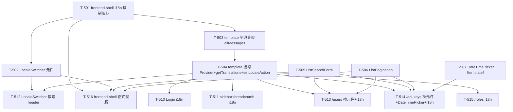

# 005 - 共用 UI 元件與 i18n Task Breakdown

> 本文件是 `005-shared-ui-i18n-plan.md` 的執行拆解，把三個工作項目（i18n 基礎設施 / 共用 UI 元件 /
> 既有頁面回頭改 i18n）拆成「一次一個 commit 可完成」的 task。資深架構師 review 意見放最前面，最後附
> 依賴關係圖與「可立刻開始的第一批 task」。
> 狀態：**已完成（14/14）**。i18n 基礎設施、共用 UI 元件、既有頁面收斂與
> `@appspine/frontend-shell` 正式發版均已完成。

---

## 1. Review 意見

計劃方向正確、範圍收斂得宜（沿用已驗證的 server-component 分頁模式、不引入 next-intl、不開新套件），這裡先把
「與現況不符的事實」「要先釘死的技術決策」逐項列出——尤其是計劃自己標記的「最大的技術不確定性」（Server
Component 沒有 `useTranslations()` hook），本文件在 1.2 直接定案，供 T-5xx 直接套用，不留給實作者臨場發揮。

### 1.1 與現況不符 / 需先對齊的事實

實地讀過 `appspine/packages/frontend-shell/` 與 `appspine-app-template/frontend/` 之後，發現計劃描述有幾處
drift，task 敘述一律以下列實際狀況為準：

- **`calendar.tsx` / `popover.tsx` 已經存在於 template**：計劃 A 表格把 `<DateTimePicker>` 描述成要「新引入
  `calendar.tsx`（react-day-picker）+ `popover.tsx` + `date-fns`」，但實際上
  `appspine-app-template/frontend/src/components/ui/calendar.tsx`、`popover.tsx` **都已經在**（來自
  blank_shadcn_app 起點），且 `frontend/package.json` 已列 `react-day-picker@^10.0.1` 與 `date-fns@^4.4.0`。
  所以 DateTimePicker **不需要新裝任何相依、也不需要新增 primitive**，只是把既有 primitive 組起來。這也影響
  「放哪裡」的決策（見 1.2）。

- **frontend-shell 沒有 `calendar` / `popover` primitive**：`packages/frontend-shell/src/components/ui/` 底下
  只有 `avatar / button / collapsible / dropdown-menu / input / separator / sheet / sidebar / skeleton /
  tooltip`（見 `src/index.ts` 的 export 清單），**沒有** calendar / popover。若硬要把 DateTimePicker 放進套件，
  得連帶把 calendar/popover/react-day-picker/date-fns 也搬進套件（套件目前 peer 只列
  `radix-ui / lucide-react / cva / clsx / tailwind-merge`，不含 react-day-picker）。這是 DateTimePicker
  歸屬決策的關鍵成本（見 1.2）。

- **Roles 頁面沒有搜尋 / 分頁**：計劃 A 表格說 `<ListSearchForm>` / `<ListPagination>` 在
  「T-307 `users/page.tsx`、T-309 `api-keys/page.tsx` 各自重複一份」——這是對的，但要補一句：
  `roles/page.tsx` 是**扁平清單**（`apiFetch<RoleRow[]>("/roles")`，無 `searchParams`、無 `paginate`），
  **沒有**搜尋列也沒有分頁。所以共用元件的替換對象只有 **users + api-keys 兩頁**，不是三頁。回頭改 i18n 才是
  三個管理頁 + Login 都要動。

- **既有重複的 JSX 形狀已確認**：`users/page.tsx` 與 `api-keys/page.tsx` 各自有一模一樣的
  `buildPageHref(search, page)` + 一段 `<form className="flex gap-2"><Input name="search" .../>
  <Button type="submit" variant="outline">Search</Button></form>` + 一段
  `page > 1 ? <Button asChild><Link .../></Button> : <Button disabled>` 的 Previous/Next 區塊。共用元件抽出
  的就是這兩塊，計劃描述屬實。

- **`getPreference` / `setValueToCookie` 簽章屬實**：`frontend/src/server/server-actions.ts` 的
  `getPreference<T extends string>(key: string, allowed: readonly T[], fallback: T): Promise<T>` 與
  `setValueToCookie(key, value, options?)` 形狀與計劃描述一致，locale 可直接沿用，**不用**另寫
  `getLocale/setLocale`。注意 `getPreference` 是 `async`（回 `Promise`），server component 內要 `await`。
  另外它是宣告在 `"use server"` 檔案（Server Action 檔），純讀取型的 `getPreference` 放在 server action 檔
  裡從 server component 呼叫沒問題，但 locale 的「server 端翻譯讀取」helper 不要混進這個 `"use server"` 檔
  （見 1.2 的方案）。

- **header actions 在 client 元件裡**：計劃說 `<LocaleSwitcher>` 放進「`dashboard/layout.tsx` 的 header 右側，
  `ThemeSwitcher` 旁邊」。實際上 `dashboard/layout.tsx`（Server Component）本身不組 header，header 的
  `headerActions`（含 `<ThemeSwitcher .../>`）是在
  `dashboard/_components/dashboard-shell-bridge.tsx`（`"use client"`）裡透過 `DashboardShell` 的
  `headerActions` prop 傳的。所以 `<LocaleSwitcher>` 要放進 `dashboard-shell-bridge.tsx` 的 `headerActions`，
  跟 `ThemeSwitcher` 並排——這剛好也是個 client 元件，`useTranslations()` 在這裡完全可用。

- **`ThemeSwitcher` 是受控 icon 按鈕、不是 dropdown**：計劃說 `<LocaleSwitcher>` 樣式「比照現有
  `ThemeSwitcher`」並描述為「dropdown menu」。但 `frontend-shell` 的 `ThemeSwitcher` 其實是一個
  **受控 icon 按鈕**（`themeMode` + `onThemeModeChange` props，點一下循環 light/dark/system），**不是**
  dropdown。因為只有兩個語系（zh-TW / en），LocaleSwitcher 用同樣的「受控按鈕、點一下切換」形狀最一致，
  介面設計成 `<LocaleSwitcher currentLocale onLocaleChange />`（受控），而不是計劃寫的
  `<LocaleSwitcher currentLocale={locale}>`（自己讀 cookie）——切換動作交給 bridge 呼叫 server action，比照
  `ThemeSwitcher` 的 `onThemeModeChange` 慣例。若之後語系超過兩個再改 dropdown。

- **root layout 檔名與現況**：計劃「Template 端改動」說要改 `frontend/src/app/layout.tsx`（root layout）包
  `<I18nProvider>`。該檔存在且是 Server Component，目前已包 `TooltipProvider` / `PreferencesStoreProvider`。
  `<I18nProvider>` 要包在 body 內、與這兩個 provider 同層。`<html lang="en">` 目前寫死 `en`，i18n 落地後應
  依 locale 改成動態（`lang={locale}`）。

- **Tailwind 掃描機制是 `@source`（v4），不是 `content` glob**：計劃「回頭債」與 004 都講「Tailwind content
  glob」，但 template 用的是 Tailwind v4，`frontend/src/app/globals.css` 已有
  `@source "../../node_modules/@appspine/frontend-shell/dist";`。若有新元件進 frontend-shell，className 已被此
  `@source` 掃到，**不需**再動 Tailwind 設定；若共用元件留在 template 端則本來就在掃描範圍內。這點讓「元件放
  template 還是 frontend-shell」的成本差再縮小。

- **frontend-shell 用 changeset 發版**：`appspine/.changeset/` 下有 `config.json` 與
  `frontend-shell-package-init.md`、`e2e-kit-package-init.md`。凡動到 `packages/frontend-shell/src/` 且要讓
  template 用到的變更，都要附 changeset（版本 bump）；但目前 T-206 是本地 `file:` 依賴，發版被 GitHub
  Packages token 卡住（見 004 頂端）。這對本輪的排程影響見 1.3。

### 1.2 技術方案要先釘死的決策

- **【最大不確定性定案】Server Component 的翻譯讀取方式**：計劃點名「Server Component（`page.tsx`）沒有
  `useTranslations()` hook 可用」是本計劃最大技術不確定性，要求「先花一個 task 定案」。**本文件現在定案**（供
  T-501 建立、T-51x 回頭債直接套用）：

  **決定：提供一個 server 端的 `getTranslations(namespace)` async helper，與 client 端的
  `useTranslations(namespace)` 共用同一份 `allMessages` 字典，回傳同形狀的 `t(key)` 函式。不拆 client 子元件、
  不引入 next-intl。**

  - client 端：`I18nProvider`（React context，locale 由 root layout 從 `getPreference` 讀出後當 prop 傳入）+
    `useTranslations(namespace)` + `useLocale()`。字典來源 `allMessages`。
  - server 端：`getTranslations(namespace)`（放在**獨立的非 `"use server"` 純函式模組**，例如
    `frontend/src/i18n/server.ts`，不要塞進 `server-actions.ts` 那個 `"use server"` 檔）。它內部
    `await getPreference("locale", locales, defaultLocale)` 拿到 locale，從**同一份** `allMessages` 取對應
    namespace，回傳 `t(key)`。Server Component（`users/page.tsx` 等）就 `const t = await getTranslations("users")`
    然後 `t("title")`。
  - 兩邊 `t()` 的 key 命名空間與型別完全對齊（都吃 `buildAllMessages` 產出的 `Messages` 型別），所以同一組
    翻譯字串在 server / client 都能用，改頁面時不用煩惱「這段是 server 還是 client」——server 用
    `await getTranslations`，client 用 `useTranslations`，字串同一份。
  - **理由**：這比計劃列的兩個選項（「把區塊拆成 client 元件」或「另提供 server 讀取方式」）更省事也更一致——
    拆 client 元件會把純顯示的 server 頁面無謂 client 化（失去 RSC 好處），而「另提供 server 讀取方式」正是
    這裡實作的東西，只是把它明確化成一個共用 helper、避免每頁各自 `getPreference + 手動查字典`。auranest 沒這
    問題是因為它列表頁全是 client component，appspine 不走這條路，所以必須自己提供 server helper。

  這個 `getTranslations` 要放哪裡（frontend-shell 套件 vs template 端）：**放 template 端
  `frontend/src/i18n/`**。理由見下一點「i18n 歸屬」。

- **i18n 的「機制」vs「字串」歸屬切乾淨**：計劃 B 說 i18n「併入 `@appspine/frontend-shell`」，但要區分兩層，
  避免重演 auranest `frontend-core` vs `ui` 邊界不清：
  - **進 frontend-shell 套件**（機制、與字串無關）：`Locale` type / `locales` / `defaultLocale` /
    `buildAllMessages(en, zhTW)` shape helper / `I18nProvider` / `useTranslations` / `useLocale` /
    `<LocaleSwitcher>` 元件。套件**不擁有任何翻譯字串**。
  - **留 template 端**（字串與 app 綁定）：`frontend/messages/en.json`、`frontend/messages/zh-TW.json`、
    `frontend/src/i18n/messages.ts`（`export const allMessages = buildAllMessages(en, zhTW)`）、以及
    server 端 helper `frontend/src/i18n/server.ts` 的 `getTranslations`。**`getTranslations` 之所以留 template
    端**：它得依賴 template 特有的 `allMessages`（實際字串）與 template 的 `getPreference`，把它放進套件會讓
    套件反向依賴 app 的字典，正是要避免的邊界污染。套件只出「怎麼查字典」的機制，「查哪本字典」由 app 提供。

- **`<DateTimePicker>` 歸屬：放 template 端，不進 frontend-shell**：由 1.1 兩點得出——DateTimePicker 依賴
  `calendar.tsx` / `popover.tsx` / `react-day-picker` / `date-fns`，這些**已經全在 template**、**都不在
  frontend-shell**。若硬塞進套件，得連帶把四樣東西一起搬進套件（含 react-day-picker 這個較重的相依變成套件
  peer），成本明顯高於收益，且 DateTimePicker 高度依賴日期在地化（locale、format），跟 app 端 i18n 更近。
  **決定：DateTimePicker 放 `frontend/src/components/`（template 端共用元件），不進 frontend-shell。**
  這與計劃 A「併入 frontend-shell」不同，但計劃當時假設 primitive 不存在；既然已存在於 template，就地組裝最省。

- **`<ListSearchForm>` / `<ListPagination>` 歸屬：放 frontend-shell**：這兩個只依賴
  `Button` / `Input`（frontend-shell 已 export 這兩個 primitive）+ 一個 `LinkComponent` prop（比照
  `DashboardShell` 已用的 `ShellLinkComponent` 慣例，讓 app 傳 `next/link` 包裝，套件不直接 import
  `next/link`）。放套件乾淨、可跨 app 共用，符合計劃 A 的原意。`ListPagination` 要把 004 已修過的
  「`<Link>` 不能真的 disabled、要用 `<Button disabled>` vs `<Button asChild><Link>`」條件邏輯封進元件內。

- **locale 寫入的 server action + refresh 策略**：計劃說「Client 端 Server Action 包一層
  `setValueToCookie("locale", next)` + `redirect`/`refresh`」。定案：新增一個 `setLocaleAction(next: Locale)`
  server action（放 template 端 `frontend/src/server/`），內部 `setValueToCookie("locale", next)` 後不做
  `redirect`（會跳頁），改在 client 端 `LocaleSwitcher` 的 handler 裡 `startTransition` 呼叫 action 後
  `router.refresh()`，讓 server component 用新 locale 重繪——比照 `dashboard-shell-bridge.tsx` 現有
  `persistPreference` + `startTransition` 的既有模式，行為一致。

### 1.3 依賴順序 review

- 計劃的三段順序（i18n 基礎設施 → 共用 UI 元件 → 既有頁面回頭改 i18n）大方向正確，但可提升平行度：
  - **共用 UI 元件（ListSearchForm / ListPagination / DateTimePicker）不依賴 i18n**：它們只是抽 JSX / 組
    primitive，可與 i18n 基礎設施**完全平行**開工。i18n 只在「回頭改頁面」那一段才與 UI 元件交會（改頁面時
    同時換成共用元件 + 換成 i18n key）。
  - **回頭改頁面**必須等 i18n 基礎設施（T-501~T-504）就緒，也建議等對應的共用元件就緒（避免同一個檔案改兩次：
    一次換元件、一次換 i18n）。所以把「換共用元件」與「換 i18n」在同一頁**合併成一個 task / 一個 commit**，
    比拆兩次改同檔更省 review。
- **發版 / `file:` 依賴的現實**：frontend-shell 目前是本地 `file:` 依賴、發版被 token 卡住。新增到 frontend-shell
  的東西（i18n 機制、ListSearchForm、ListPagination、LocaleSwitcher）在本地 `file:` 模式下，template 端
  `tsc` + 瀏覽器就能驗證，**不必等 GitHub Packages 發版**即可完成本輪所有 task 的功能驗證。changeset 要照附
  （記錄版本意圖），但「正式發版切版本號」跟 T-206 一樣，等 token 權限補齊後統一收尾，不阻擋本輪。

### 1.4 邊界情況 / 風險

- **DateTimePicker 要能參與原生 FormData**：現況 `create-api-key-dialog.tsx` 的到期欄位是
  `<Input name="expiresAt" type="datetime-local" />`，直接被 `<form action={handleSubmit}>` 的 FormData 收集，
  且該值可為空（optional）。換成 DateTimePicker 後要沿用 004/T-308 已驗證的「shadcn 元件 + 一個 hidden
  `<input name="expiresAt">` 同步值」模式，確保 server action 收到的 FormData 形狀不變（ISO 字串或空字串），
  否則 `createApiKeyAction` 的解析要跟著改。這是最容易踩到的回歸點。
- **空值 / 時區**：到期時間為選填，DateTimePicker 未選時 hidden input 要送空字串（維持現有「optional」語意）。
  送給後端的格式要與現況 `datetime-local` 的行為對齊（現況送的是無時區的 local datetime 字串），換元件時要確認
  後端 DTO 對 `expiresAt` 的解析不因格式改變而壞掉；若 DateTimePicker 產生 ISO（含時區）字串，要嘛後端能吃、
  要嘛在 hidden input 同步時格式化成後端預期格式。此點在 T-513 要實測驗證。
- **翻譯字典的鍵覆蓋 / fallback**：`buildAllMessages` 要做型別安全 shape 檢查（en 與 zh-TW 的 key 結構一致），
  避免某語系漏 key 導致執行期顯示 undefined。`t(key)` 找不到 key 時的 fallback 行為（回 key 本身還是空字串）
  要在 T-501 定義清楚。
- **`<html lang>` 與 hydration**：root layout 把 `lang` 改成動態後，要確認不會與 `suppressHydrationWarning` /
  `ThemeBootScript` 現有機制衝突（現況 `lang="en"` 寫死）。locale 來自 cookie（server 端可讀），server render
  時就能給對值，理論上不會 hydration mismatch，但要實測。
- **LocaleSwitcher 的 aria-label 本身也要 i18n**：受控按鈕的 `aria-label`（例如「切換語言」）本身是 UI 文字，
  應走 `useTranslations()`，不要寫死。

### 1.5 顆粒度

- 大部分 task 控制在單一 commit。i18n 基礎設施刻意拆成「套件機制（T-501/T-502）」與「template 字典接線
  （T-503/T-504）」兩批，因為前者動 `packages/frontend-shell/`（要附 changeset、可獨立 typecheck），後者動
  template，邊界不同、可分別驗證。
- 「回頭改頁面」按檔案／頁面拆（Login、Users、Roles、API Keys、sidebar+breadcrumb），每頁一個 commit——一來
  每頁可獨立瀏覽器驗證，二來 Users / API Keys 這兩頁同時做「換共用元件 + 換 i18n」，其他頁只做「換 i18n」，
  工作量不均，分開比較好估與回溯。若嫌 Roles（純換字串、量小）太碎，可與 sidebar+breadcrumb 併一個 commit。

---

## 2. 完整 Task Breakdown

編號規則：`T-5xx`（005 系列）。`T-50x` i18n 基礎設施、`T-51x` 共用 UI 元件與既有頁面回頭改 i18n。
凡「進 frontend-shell 套件」的 task 都要附 changeset（版本 bump），並在本地 `file:` 依賴模式下於 template 驗證
（正式版本已發布並由 template 驗證）。

### 工作項目 A — i18n 基礎設施

- [x] **T-501** frontend-shell：i18n 機制核心（`Locale` / `buildAllMessages` / `I18nProvider` / `useTranslations` / `useLocale`）
      _依賴：無_
      說明：在 `appspine/packages/frontend-shell/src/` 新增 i18n 模組（例如 `src/i18n/`）：`Locale` type、
      `locales = ["zh-TW", "en"] as const`、`defaultLocale = "zh-TW"`；型別安全的 `buildAllMessages(en, zhTW)`
      shape helper（回傳 `Record<Locale, Messages>`、強制兩語系 key 結構一致）；`I18nProvider`（React context，
      接受 `locale` + `messages` props）；`useTranslations(namespace)` 與 `useLocale()` hook；定義 `t(key)`
      找不到 key 的 fallback 行為（見 1.4）。**套件不含任何翻譯字串**。在 `src/index.ts` export。附 changeset。
      本 task 同時把 1.2 定案的「server / client 共用同一份 `Messages` 型別」的型別契約釘死（`Messages` 型別由
      `buildAllMessages` 推導、export 供 template 端 `getTranslations` 沿用）。

- [x] **T-502** frontend-shell：`<LocaleSwitcher>` 受控元件（比照 `ThemeSwitcher` 形狀）
      _依賴：T-501_
      說明：在 `packages/frontend-shell/src/components/shell/` 新增 `locale-switcher.tsx`（`"use client"`），
      介面 `<LocaleSwitcher currentLocale onLocaleChange />`（受控，比照 `theme-switcher.tsx` 的
      `themeMode`/`onThemeModeChange` 慣例，見 1.1）；兩語系用「點一下切換」的 icon/文字按鈕，`aria-label`
      走 `useTranslations()`（見 1.4）。`src/index.ts` export。附 changeset。

- [x] **T-503** template：翻譯字典骨架 + `allMessages`（`messages/*.json` + `src/i18n/messages.ts`）
      _依賴：T-501_
      說明：在 `appspine-app-template/frontend/` 新增 `messages/en.json`、`messages/zh-TW.json`（骨架，含
      後續 T-510~T-514 會用到的 namespace：`common`、`auth`（Login）、`users`、`roles`、`apiKeys`、`nav`、
      `breadcrumb` 等）；新增 `frontend/src/i18n/messages.ts`：`export const allMessages = buildAllMessages(en, zhTW)`
      （import 自 `@appspine/frontend-shell`）。字串先以現況既有英文 + 對應繁中填入。

- [x] **T-504** template：接線 i18n（root layout 包 `I18nProvider` + server 端 `getTranslations` helper + `setLocaleAction`）
      _依賴：T-503_
      說明：三件事，一個 commit：
      (1) `frontend/src/app/layout.tsx`：`await getPreference("locale", locales, defaultLocale)`，用結果包一層
      `<I18nProvider locale messages={allMessages}>`（與現有 `TooltipProvider`/`PreferencesStoreProvider` 同層），
      並把 `<html lang="en">` 改成 `lang={locale}`（注意 1.4 的 hydration 驗證）。
      (2) 新增 `frontend/src/i18n/server.ts`（**非** `"use server"` 純函式模組）：`getTranslations(namespace)`
      async helper，內部 `await getPreference("locale", locales, defaultLocale)` + 從 `allMessages` 取
      namespace，回傳型別對齊的 `t(key)`（見 1.2 定案）。
      (3) 新增 `setLocaleAction(next: Locale)` server action（`frontend/src/server/`，內部
      `setValueToCookie("locale", next)`，不 redirect）。此 task 完成後 i18n 機制端到端可用（但頁面文字尚未替換）。

### 工作項目 B — 共用 UI 元件（可與 A 平行）

- [x] **T-505** frontend-shell：`<ListSearchForm>` 共用元件
      _依賴：無_
      說明：在 `packages/frontend-shell/src/components/` 抽出 `users/page.tsx` 與 `api-keys/page.tsx` 共同的
      搜尋 form（`<form className="flex gap-2"><Input name="search" defaultValue placeholder/>
      <Button type="submit" variant="outline">…</Button></form>`）。props：`defaultValue`、`placeholder`、
      submit 按鈕文字（由呼叫端傳入，套件不含字串）。只依賴套件已有的 `Button`/`Input`。`src/index.ts` export。
      附 changeset。

- [x] **T-506** frontend-shell：`<ListPagination>` 共用元件（含 004 已修過的 Link-disabled 邏輯）
      _依賴：無_
      說明：抽出 `users/page.tsx` / `api-keys/page.tsx` 共同的分頁區塊（`page`/`totalPages`/`total` 顯示 +
      Previous/Next），把「`page > 1 ? <Button asChild><Link href={buildPageHref(...)}> : <Button disabled>`」
      的條件邏輯封進元件；`href` 產生交給呼叫端傳入的函式或 props，`<Link>` 用 `LinkComponent` prop 慣例
      （比照 `DashboardShell` 的 `ShellLinkComponent`，套件不直接 import `next/link`）。文字（Previous/Next/
      Page N of M）由 props 或 i18n 於呼叫端提供。`src/index.ts` export。附 changeset。

- [x] **T-507** template：`<DateTimePicker>` 共用元件（組裝既有 calendar/popover，參與 FormData）
      _依賴：無_
      說明：在 `appspine-app-template/frontend/src/components/` 新增 `date-time-picker.tsx`，組裝**既有**
      `@/components/ui/calendar`（react-day-picker）+ `@/components/ui/popover` + `date-fns`（皆已在 template，
      見 1.1），提供「參與原生 FormData」能力——用一個 hidden `<input name>` 同步選取值（沿用 T-308 已驗證的
      hidden-input 模式，見 1.4）。支援 optional（未選送空字串）。**放 template 端、不進 frontend-shell**
      （理由見 1.2）。此 task 只出元件，不改 api-keys 表單（那是 T-513）。

### 工作項目 C — 既有頁面回頭改 i18n（＋順手換共用元件）

> 依賴 T-504（i18n 端到端可用）。凡該頁同時要換共用元件者，一併在同一 commit 完成（見 1.5）。

- [x] **T-510** Login 頁面文字改 i18n
      _依賴：T-504_
      說明：`frontend/src/app/(external)/login/page.tsx`（`"use client"`）把寫死英文（"Sign in"、
      "Enter your email and password to continue."、"Email"、"Password"、"Signing in..."、zod
      "Password is required" 等）改用 `useTranslations("auth")`。此頁是 client component，直接用 hook，無 server
      翻譯問題。對應字串補進 `messages/*.json` 的 `auth` namespace。

- [x] **T-511** sidebar 導覽 + 麵包屑改 i18n（`BREADCRUMB_LABELS` 轉 key 查表）
      _依賴：T-504_
      說明：
      (1) `frontend/src/app/(main)/dashboard/_components/sidebar/header-breadcrumbs.tsx`（`"use client"`）：
      把 `BREADCRUMB_LABELS` 的值從寫死英文字串（`["Administration", "Users"]` 等）改成 i18n key，改用
      `useTranslations("breadcrumb")` 查表渲染（結構小改，見計劃「改動小」）。
      (2) `frontend/src/navigation/sidebar/sidebar-items.ts` 與其消費端（`dashboard-shell-bridge.tsx` 傳給
      `DashboardShell` 的 `navItems`）：sidebar 群組/項目文字（`Administration` / Users / Roles / API Keys）改走
      i18n。若 `sidebar-items.ts` 目前回寫死字串，改成回 i18n key、在 client 端 `dashboard-shell-bridge.tsx`
      用 `useTranslations("nav")` 解出 label 再傳入（bridge 是 client component，hook 可用）。字串補進
      `messages/*.json` 的 `nav` / `breadcrumb` namespace。

- [x] **T-512** `<LocaleSwitcher>` 接進 header（`dashboard-shell-bridge.tsx`，`ThemeSwitcher` 旁）
      _依賴：T-502, T-504_
      說明：`frontend/src/app/(main)/dashboard/_components/dashboard-shell-bridge.tsx` 的 `headerActions` 內、
      `<ThemeSwitcher .../>` 旁加入 `<LocaleSwitcher currentLocale onLocaleChange />`；`currentLocale` 用
      `useLocale()` 取得，`onLocaleChange` 的 handler `startTransition` 呼叫 T-504 的 `setLocaleAction(next)`
      後 `router.refresh()`（比照現有 `persistPreference` + `startTransition` 模式，見 1.2）。

- [x] **T-513** `/dashboard/users` 頁：換 `ListSearchForm` + `ListPagination` + 文字改 i18n
      _依賴：T-504, T-505, T-506_
      說明：`frontend/src/app/(main)/dashboard/(admin)/users/page.tsx`（Server Component）：
      (1) 用 `@appspine/frontend-shell` 的 `<ListSearchForm>` / `<ListPagination>` 取代重複 JSX（`buildPageHref`
      交給 `ListPagination` 的 href prop，`LinkComponent` 傳 `next/link` 包裝）。
      (2) 靜態文字（"Users"、表頭 Email/Name/Roles/Status、"No users found."、"Page N of M"）改用
      **`const t = await getTranslations("users")`**（server helper，見 1.2 定案）。子元件如
      `create-user-dialog.tsx` / `user-row-actions.tsx`（client）用 `useTranslations`。字串補進 `users` namespace。

- [x] **T-514** `/dashboard/api-keys` 頁：換 `ListSearchForm` + `ListPagination` + `DateTimePicker` + 文字改 i18n
      _依賴：T-504, T-505, T-506, T-507_
      說明：
      (1) `api-keys/page.tsx`（Server Component）：換 `ListSearchForm`/`ListPagination`，文字改
      `await getTranslations("apiKeys")`。
      (2) `_components/create-api-key-dialog.tsx`（client）：把到期欄位
      `<Input name="expiresAt" type="datetime-local" />` 換成 T-507 的 `<DateTimePicker name="expiresAt" />`
      （維持 optional、維持送進 FormData 的形狀，實測 `createApiKeyAction` 解析不壞，見 1.4）；對話框內文字
      改 `useTranslations`。其餘子元件（`created-api-key-reveal.tsx`、`api-key-row-actions.tsx`）文字一併改。

- [x] **T-515** `/dashboard/roles` 頁文字改 i18n（純換字串，無分頁）
      _依賴：T-504_
      說明：`roles/page.tsx`（Server Component）靜態文字（"Roles"、表頭 Name/Policy/Permissions/Users/API Keys、
      "No roles found."、"system" badge、"System roles cannot be deleted" title）改用
      `await getTranslations("roles")`；子元件 `create-role-dialog.tsx` / `role-row-actions.tsx`（client）用
      `useTranslations`。**此頁無搜尋/分頁**（見 1.1），不涉及共用元件。量小，可與 T-511 併一個 commit（見 1.5）。

- [x] **T-516** 收尾：frontend-shell 發版切正式版本號
      _依賴：T-501, T-502, T-505, T-506_
      完成結果：本輪新增到 frontend-shell 的 i18n 機制、`LocaleSwitcher`、`ListSearchForm`、
      `ListPagination` 已隨正式版本發布，`appspine-app-template` 已切換為套件版本並通過驗證。

---

## 3. 依賴關係圖

---

## 4. 可以立刻開始的第一批 task（不依賴任何未完成 task）

前置阻塞（frontend-shell 套件骨架 T-201~T-206）在本地 `file:` 依賴下已就緒，因此本輪已可開工。沒有前置依賴、
可立刻平行開始的：

- **T-501** frontend-shell i18n 機制核心（工作項目 A 的根）
- **T-505** `<ListSearchForm>`（工作項目 B，與 A 完全平行）
- **T-506** `<ListPagination>`（工作項目 B，與 A 完全平行）
- **T-507** `<DateTimePicker>`（template 端，只組既有 primitive，與 A/其他 B 平行）

接著 T-502/T-503 待 T-501，T-504 待 T-503；工作項目 C 全部待 T-504（部分再待對應共用元件）。
T-516 已完成正式發版收尾。
