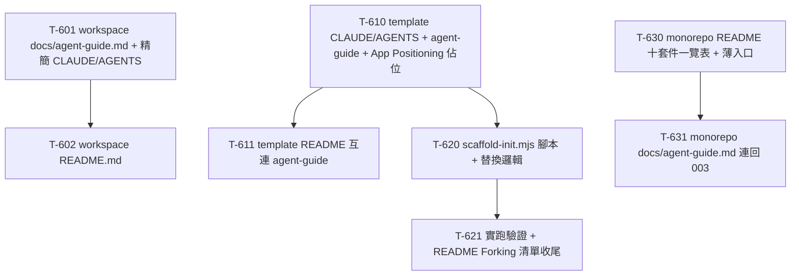

# 006 - Agent 文件入口機制與 App Scaffold Task Breakdown

> 本文件是 `006-agent-docs-entry-and-app-scaffold-plan.md` 的執行拆解，把五個範圍段落（A workspace 入口機制 /
> B template 入口機制 / C scaffold-init.mjs / D template 自身文件結構 / E 框架 monorepo + workspace README）
> 拆成「一次一個 commit 可完成」的 task。資深架構師 review 意見放最前面，最後附依賴關係圖與「可立刻開始的第一批
> task」。
> 狀態：**已完成（8/8）**。Workspace/template 入口文件、scaffold 初始化與框架文件均已落地。

---

## 1. Review 意見

計劃方向正確、範圍收斂得宜（明確排除 auranest 那套 monorepo 特有的複製 / 配 port / fleet table / per-app CI
機制，只保留純文字 token 替換）。實地讀過 workspace 根、`appspine-app-template`、`appspine` 框架 monorepo 與
`dev_docs/003` 之後，把「與現況不符的事實」「要先釘死的技術決策」「依賴順序」「邊界情況」「顆粒度」逐項列出。凡
計劃留了一點彈性的地方，這裡直接定案，供 T-6xx task 敘述套用。

### 1.1 與現況不符 / 需先對齊的事實

- **`CLAUDE.md` / `AGENTS.md` 逐字重複屬實，但行數是 41 行不是 41 行「一模一樣」的模糊描述**：兩份檔案
  `d:\Source\Private\appspine\CLAUDE.md` 與 `AGENTS.md` 皆為 **41 行、內容 byte-identical**（第一行都是
  `# appspine — Workspace Guide`）。計劃正文寫「41 行一模一樣」屬實，可放心把整份內容原封不動搬進
  `docs/agent-guide.md`。注意這 41 行本身就是本 workspace CLAUDE.md（見本 repo 根 `CLAUDE.md`）的內容——
  搬移時「原封不動」指的是這 41 行，不要順手改寫。

- **`APP_NAME` 已經存在、README 步驟 3 也已經寫好了**：計劃 C 節表格說「`.env.example` 的 `APP_NAME`……fork 時
  必須換」，語氣像是要新增。實際上 004 的 T-101 已經把 `APP_NAME=appspine-app-template` 寫進
  `appspine-app-template/.env.example`（含三行說明註解），且 `README.md` 的「Forking this template」清單
  **第 3 步已經是** `Set APP_NAME in .env`，並已註明「MCP server 名稱來自 `backend/package.json` 的 `name`，
  不是 env var」。所以 scaffold 腳本要做的是「替換既有的 `APP_NAME=appspine-app-template` 這一行的值」，
  **不是新增**這個 key。此點影響 C 節 replaceInFile 規則的 pattern（用 `/^APP_NAME=.+$/m` 對既有行做替換）。

- **README「Forking this template」現有清單是 6 步、不是計劃摘述的 5 項**：`appspine-app-template/README.md`
  第 96–104 行的實際清單為：(1) Use this template 建 repo、(2) 改 `backend/package.json` + `frontend/package.json`
  的 `name`、(3) 設 `APP_NAME`（含 MCP name 說明）、(4) 加 Prisma model + `Permission` enum、(5)
  `pnpm -C backend prisma:migrate`、(6) `pnpm -C backend schema:docs`。scaffold 腳本自動化的是 (2)(3) 加上
  README/CLAUDE/AGENTS 標題與 `app-config.ts`；跑完後印的 checklist 就是把 (2)(3) 拿掉、留下 (4)(5)(6)。
  task 敘述要以這 6 步的實際文字為準。

- **`frontend/package.json` 的 `name` 確認是 `"studio-admin"`**（`appspine-app-template/frontend/package.json`
  第 2 行），沿用 blank_shadcn_app 原名、從未改過。**`backend/package.json` 的 `name` 確認是 `"@app/backend"`**
  （第 2 行，泛用預設值）。兩者都要被 scaffold 替換。注意 frontend 是裸字串 `studio-admin`，backend 是 scoped
  `@app/backend`，pattern 不同（見 1.2）。

- **`app-config.ts` 的實際欄位值與 auranest 不同字面**：`appspine-app-template/frontend/src/config/app-config.ts`
  現值為 `name: "Studio Admin"`、`copyright: \`© ${currentYear}, Studio Admin.\``、
  `meta.title: "Studio Admin - Modern Next.js Dashboard Starter Template"`、`meta.description:` 一段很長的
  blank_shadcn_app 行銷文案。**注意 title 不是純 "Studio Admin"，是帶後綴的長字串**；auranest 的 pattern 假設
  `title: "AuraNest App"` 是純值，appspine 這裡 title 帶後綴，replaceInFile 的 pattern 要對整行處理（見 1.2），
  否則 `expectedCount` 檢查會 0 命中而 fail。

- **`.github/workflows/e2e.yml` 是自足的、且已有 path filter + `hashFiles` 守門**：計劃 C 節說「template 已自帶
  `.github/workflows/e2e.yml`，fork 出去原封不動繼承，不用 path filter」。實際檔案（004 的 T-406 產出）
  **本身就已經有 path filter**（`on.pull_request.paths` / `on.push.paths` 列 `backend/** frontend/** e2e/**` 等）
  與 `jobs.e2e.if: ${{ hashFiles('e2e/package.json') != '' }}` 守門，且所有 URL 都由 `.env` 的
  `BACKEND_PORT`/`FRONTEND_PORT` 組出、沒有寫死值需要 fork 時替換。**結論：scaffold 腳本完全不用碰 e2e.yml，
  它 fork 後即可用。** 計劃「不用 path filter」的措辭略不精確（它其實有 path filter，只是那個 path filter 對
  「整個 repo 就是一個 app」的情境天然正確，不需調整）——task 敘述採「不碰 e2e.yml」而非「因為沒有 path filter
  所以不用改」。

- **`docs/data-dictionary.md` 由 `pnpm -C backend schema:docs` 重新產生屬實**：`backend/package.json` 有
  `"schema:docs": "dotenv -e ../.env -- ts-node scripts/gen-data-dictionary.ts"`；現檔頂端寫「Auto-generated
  from Prisma schema on 2026-06-30. Do not edit manually」。scaffold 腳本**不自己碰**這支產出（呼應計劃「跑完
  token 替換後在 checklist 提示執行」），只在 printChecklist 印 `pnpm -C backend schema:docs`。

- **`appspine` 框架 monorepo 確認「完全沒有文件」**：根目錄只有 `.npmrc / .gitignore / tsconfig.base.json /
  package.json / biome.json / pnpm-workspace.yaml / pnpm-lock.yaml`（見 `appspine/` glob），**沒有 README.md、
  沒有 CLAUDE.md/AGENTS.md、沒有 docs/**。`packages/` 下確實是十個套件：`audit-log / auth / common / e2e-kit /
  frontend-shell / health-check / m2m-api-key / mcp-server / metadata-schema / rbac`。

- **十個套件的 `package.json` 全部沒有 `description` 欄位**：逐一檢查（`node -e` 讀每個 package.json）——十個
  套件的 `description` **全部為空**。**唯一有 README 的是 `frontend-shell`**（`packages/frontend-shell/README.md`，
  由 005 相關工作產出，內容是 shell primitive 的設計/整合說明）。**結論：E-2 的「套件一覽表」十個套件的一行描述
  全部要從頭寫**（不能從 package.json description 撈，只能從 003 文件 / 各套件原始碼語意人工歸納）。這點放大了
  E-2 的內容量，呼應計劃「內容量大、獨立拆 task」的判斷——本文件把 E-2 進一步拆成「骨架 + 一覽表」與
  「agent-guide 開發慣要點」兩個 task（見 1.5）。

- **框架 monorepo 的 build/test 指令已存在於根 `package.json`**：`appspine/package.json` 有
  `build: pnpm -r run build`、`typecheck: pnpm -r run typecheck`、`test: pnpm -r run test`、`lint: biome check .`、
  以及 changeset 流程 `changeset / version-packages / release`。E-2 的 README「怎麼 build/test」有現成指令可寫，
  不用杜撰。

- **workspace 根目錄沒有 `docs/`、沒有 `README.md`**：`docs/**` glob 無命中、根 `*.md` 僅 CLAUDE.md/AGENTS.md
  （其餘都在 node_modules）。所以 A 節要**新開** `docs/` 目錄，E-1 要**新增** README.md，兩者都是從無到有。

- **`appspine-app-template/scripts/` 目前不存在**：glob `appspine-app-template/scripts/**` 無命中。C 節的
  `scripts/scaffold-init.mjs` 是新開目錄 + 新檔。

### 1.2 技術方案要先釘死的決策

- **【scaffold-init.mjs 的 CLI 介面定案】**：計劃寫呼叫方式為
  `node scripts/scaffold-init.mjs --name ... --display-name ...`，但沒定「兩個參數各自對應哪些替換」。定案
  （供 T-620~T-621 直接套用），比照 auranest 但精簡：

  - **`--name <kebab-case>`**（必填）：業務系統的技術識別名（kebab-case，例：`hr-portal`）。用於
    `frontend/package.json` 的 `name`、`backend/package.json` 的 `name`（backend 加 `@app/` 或直接用裸名——
    見下一點）、`.env` 的 `APP_NAME`、README/CLAUDE/AGENTS 標題。
  - **`--display-name <string>`**（必填）：人類可讀顯示名（例：`HR Portal`）。用於 `app-config.ts` 的
    `name`/`copyright`/`meta.title`。
  - **`--description <string>`**（選填）：一句話描述，用於 `app-config.ts` 的 `meta.description`；未給時 fallback
    成 `${displayName}`（不要留 blank_shadcn_app 那段行銷文案）。
  - **`--dry-run`**（選填）：只印計劃、不寫檔（比照 auranest）。
  - 用 `validateName()` 檢查 `--name` 符合 `/^[a-z0-9]+(-[a-z0-9]+)*$/`（沿用 auranest `validateShortName` 的
    正則），不符合就 `fail()`。**不接受**位置參數去算 `apps/<name>` 目標路徑（appspine 是多 repo，目標永遠是
    腳本自己所在的 repo 根，即 `path.resolve(__dirname, '..')`）。

- **【backend package name 的替換策略定案】**：現值是 scoped 的 `@app/backend`。定案：**替換成 `@app/<name>`
  的 scoped 形式**（保留 `@app/` scope，只換 `backend` → `<name>`），pattern 用
  `/"name": "@app\/backend"/`，`expectedCount: 1`。理由：backend 是純內部私有包（`"private": true`），保留一致的
  `@app/` scope 讓所有 fork 的 backend 命名一致、也避免與 npm 公開命名空間衝突；MCP server 名稱來自
  `npm_package_name`（即這個值），換成 `@app/<name>` 後 MCP 名稱自然帶上業務系統名。frontend 現值是裸
  `studio-admin`，定案替換成裸 `<name>`（pattern `/"name": "studio-admin"/`，`expectedCount: 1`）。

- **【scaffold 必須複用 auranest 的 `replaceInFile` + `expectedCount` 失敗即報錯機制】**：直接把
  `auranest/scripts/scaffold-app.mjs` 的 `readText`（CRLF 正規化為 LF、記住原 EOL 還原）/ `writeText` /
  `replaceInFile`（逐條 rule 檢查 `match count === expectedCount`，不符就 `fail()`）/ `fail()` 幾個 helper 原樣
  搬進 `scaffold-init.mjs`（這些與 monorepo 無關、是純檔案 token 替換工具）。**拿掉** auranest 的
  `walkTemplate` / `getUsedBackendPorts` / `findFreePortBase` / `shouldExclude` / `fs.cpSync` /
  `updateRootReadme`（fleet table）/ `writeCiWorkflow` / `writeEnvLocal`——這些全是 monorepo 複製 + 配 port +
  per-app CI 的邏輯，appspine 明確不採用。**保留** `applyReplacements`（改成 appspine 的欄位）與 `printChecklist`
  （改成 appspine 的 (4)(5)(6) 手動步驟）。

- **【App Positioning 佔位段落格式定案】**：B 節在 `docs/agent-guide.md` 放一個 `## App Positioning` 段落，body
  是 scaffold 可替換的 TODO 佔位。比照 auranest 的 `replaceInFile` rule（pattern
  `/## App Positioning\n\n[\s\S]*?\n\n---/`），定案佔位初始內容為：

  ```
  ## App Positioning

  <!-- TODO(scaffold): Fill in this app's positioning after running scaffold-init.
       Describe the business domain and the core modules this system owns. -->

  ---
  ```

  scaffold 執行時把 `<!-- TODO(scaffold): ... -->` 換成帶 `--name` 的版本（`Fill in the "App Positioning"
  for <name> ...`）。**App Positioning 段落只在 `docs/agent-guide.md` 一份**（CLAUDE.md/AGENTS.md 是薄入口、
  不含此段），所以 scaffold 對 App Positioning 只改一個檔一次（呼應計劃 C 節表格）。CLAUDE.md/AGENTS.md 的標題
  各改一次（兩份都要換 `# ` 標題行）。

- **【三處 `docs/agent-guide.md` 用同名但內容三份不同、彼此不複製】**：計劃已定「檔名三處統一」。這裡補一句
  釘死：workspace 的 agent-guide 講 workspace 目錄結構與絕對規則（就是現有 41 行搬過去）；template 的 agent-guide
  講「業務系統 repo 自己」的技術棧 / `@appspine/*` 用法 / 慣例連結 + App Positioning 佔位；框架 monorepo 的
  agent-guide 講套件開發慣例要點 + 連回 003。**三份不得互相 `複製整段`，只用連結互指**（避免重演 CLAUDE.md/
  AGENTS.md 逐字重複的老問題）。

- **【入口檔案的精簡內容格式定案】**：CLAUDE.md 與 AGENTS.md 精簡後**兩份仍逐字相同**（都指向同一個
  `docs/agent-guide.md`），但因為只剩「1 標題 + 1～2 句」，逐字相同的維護成本趨近於零、且符合各工具讀各自檔名的
  慣例，這是可接受的（消除的是「41 行實質內容重複」，不是「檔案存在兩份」）。定案內容範本（三處通用，只有標題與
  少量措辭不同）：

  ```
  # <repo> — Agent Guide

  This is a pointer file. See [docs/agent-guide.md](../../docs/agent-guide.md) for the full guide.
  ```

- **【E-1 workspace README 與 agent-guide 不重複】**：README 給人類 30 秒看懂三個子目錄（`dev_docs/` /
  `appspine/` / `appspine-app-template/`）分別是什麼、連到 `docs/agent-guide.md` 與 `dev_docs/`；agent-guide 是
  搬過去的 41 行工作規則。README **不重貼**絕對規則清單，只連過去。

### 1.3 依賴順序 review

- 計劃「執行順序」框架大致正確（A / E-1 可先做；B → C；E-2 獨立平行）。逐項確認與微調：
  - **A（workspace 入口機制）自成一組**：新開 `docs/agent-guide.md`（搬 41 行）+ 精簡 CLAUDE.md/AGENTS.md，
    一個 commit 即可。無前置依賴。
  - **E-1（workspace README）依賴 A**：因為 README 要連到 `docs/agent-guide.md`，該檔要先存在連結才不是死連。
    嚴格說也可平行（連結指向即將存在的路徑），但為避免 commit 落地時出現指向不存在檔案的連結，**建議 E-1 排在
    A 之後**。若要極致平行，A 與 E-1 也可合成一個 commit（量都不大），本文件仍分開以便獨立 review。
  - **B（template 入口機制）自成一組、無前置依賴**：新增 template 的 CLAUDE.md/AGENTS.md + docs/agent-guide.md
    （含 App Positioning 佔位）。與 A/E-1 平行。
  - **C（scaffold-init.mjs）依賴 B**：腳本要替換的 App Positioning 佔位、CLAUDE/AGENTS 標題必須先由 B 建立。
    這是計劃明講的唯一硬依賴，正確。C 本身可再拆（見 1.5）：先出腳本 + 替換邏輯，再實跑驗證 + 更新 README
    checklist 分工。
  - **D（template 自身文件結構）幾乎完全併入 B**：計劃自己說「D 大概率折進 B」。D 唯一獨立於 B 的動作是
    「README.md 補一句與 agent guide 互相連結」，這個小改可以併進 B 的 commit，或單獨一個 tiny commit。本文件
    把它作為 B 的一個子 task（T-611），不另開章節。
  - **E-2（框架 monorepo 補文件）與 A/B/C/E-1 全無依賴、可平行**：但內容量最大（十個套件描述從頭寫 + agent-guide
    要點 + README build/test），拆成兩個 task。

### 1.4 邊界情況 / 風險

- **CRLF / LF**：本 workspace 在 Windows 上（見環境），現有 `.md` 與 `app-config.ts` 等檔可能是 CRLF。scaffold
  的 `replaceInFile` 必須沿用 auranest 的 `readText`（正規化為 LF 跑 pattern、寫回時還原原 EOL），否則 `^...$`
  的 `/m` pattern 會被 `\r` 破壞、`expectedCount` 命中數對不上而誤 fail。這是最容易踩的回歸點，T-620 要明確採用。
- **`app-config.ts` 的 title 帶長後綴**：如 1.1 所述，title 現值是 `"Studio Admin - Modern Next.js Dashboard
  Starter Template"`。replaceInFile 的 title rule 要用「對整行替換」的 pattern（例
  `/title:\s*"[^"]*"/` 搭 `expectedCount: 1`，或精確匹配整段字面），**不要**假設 title 是純顯示名。同理
  description 現值是長行銷文案，用 `/description:\s*\n?\s*"[\s\S]*?"/` 這類能跨行匹配的 pattern（現檔
  description 值跨兩行），T-620 要實測 `expectedCount` 命中數。
- **scaffold 只跑一次、且是破壞性替換**：腳本沒有「偵測是否已跑過」的機制。若對已改過名的 repo 再跑一次，
  `expectedCount` 會因為找不到原始 `studio-admin`/`@app/backend`/`appspine-app-template` 而 fail——這其實是
  **期望行為**（fail-loud 防止重複執行搞砸），T-620 的敘述要把「二次執行會 fail 是刻意的」寫清楚，不要被誤當
  bug 修掉。
- **`APP_NAME` 值本身也是 template 名 `appspine-app-template`**，跟根 README/CLAUDE 標題、docker/其他檔可能出現
  同字串。scaffold 對 `APP_NAME` 用 `/^APP_NAME=.+$/m`（只匹配該 env 行），**不要**用全域字串替換
  `appspine-app-template`（會誤傷 README 裡指向上游 template 的說明文字、e2e.yml 的 secret 命名等）。逐檔逐行
  精確替換，不做跨檔全域 replace。
- **agent-guide 連結指向 app repo 沒有的 `dev_docs/`**：template 的 agent-guide 要引用
  `_archive/dev_docs-20260803/framework/002-app-dev-conventions.md` 的慣例，但 fork 出去的 app repo **沒有 `dev_docs/`**（那在 workspace
  根）。B 節（T-610）要用「摘要關鍵慣例 + 指回上游 `appspine` workspace 的 dev_docs GitHub 連結」處理，不要放
  相對路徑連結（會是死連）。計劃 B 節表格已提示「app repo 自己沒有 dev_docs」，task 敘述要落實成 GitHub 絕對連結
  或就地摘要。
- **E-2 套件描述的正確性**：十個套件描述從頭寫，若寫錯（例如把 `metadata-schema` 說成產生 CRUD tool——那是
  003 明確不採用的機制）會誤導後人。T-631 撰寫時每個描述要對照 003 文件既有語意（003 對每個套件都有「直接搬/
  小改搬/不採用」的說明可據以歸納），避免臆測。

### 1.5 顆粒度

- 大部分 task 控制在單一 commit。刻意拆分的地方：
  - **C（scaffold）拆成 T-620（腳本 + 替換邏輯，可 dry-run 驗證）與 T-621（實跑一次真的 fork 場景驗證 +
    README「Forking this template」清單改成去掉已自動化項）**。理由：前者純寫程式、可用 `--dry-run` +
    `expectedCount` 檢查自證；後者要在一份乾淨 template 副本上實跑、驗證產出正確並收尾 README，牽涉「跑起來」
    與文件收尾，邊界不同、分開好回溯。
  - **E-2 拆成 T-630（monorepo 骨架：README 十套件一覽表 + build/test + CLAUDE/AGENTS 薄入口）與 T-631
    （`docs/agent-guide.md` 開發慣要點 + 連回 003）**。理由：README 一覽表是「盤點型」內容（十個套件描述從頭寫，
    量大且獨立可驗證），agent-guide 是「慣例型」內容（要點 + 連結）；兩者受眾與內容性質不同，且 README 是人類入口、
    agent-guide 是 agent 入口，分開比塞一個 commit 好 review。
  - **D 併入 B**：D 只剩「README 補一句互連」的 tiny 改動，作為 B 的 T-611 子 task，不另立章節。
- 若嫌 A 與 E-1 太碎可併一個 commit；E-2 兩個 task 若一次做完也可併——但分開對 review 與回溯更友善，維持拆分。

---

## 2. 完整 Task Breakdown

編號規則：`T-6xx`（006 系列）。`T-60x` workspace 入口機制與 README（A/E-1）；`T-61x` template 入口機制（B/D）；
`T-62x` scaffold-init.mjs（C）；`T-63x` 框架 monorepo 文件（E-2）。所有 task 均已完成。

### A / E-1 — workspace 端入口機制與 README

- [x] **T-601** workspace：新增 `docs/agent-guide.md`（搬入現有 41 行）+ 精簡 `CLAUDE.md`/`AGENTS.md`
      _依賴：無_
      說明：在 workspace 根新開 `docs/` 目錄，新增 `docs/agent-guide.md`，把目前 `CLAUDE.md`（＝`AGENTS.md`，
      兩份 byte-identical、各 41 行，第一行 `# appspine — Workspace Guide`）的完整內容原封不動搬過去（標題可保留
      `# appspine — Workspace Guide` 或改為 `# appspine Workspace — Agent Guide`，內容不動）。接著把
      `CLAUDE.md` 與 `AGENTS.md` 兩份各自改成 1.2 定案的薄入口範本（標題 + 一句
      `See [docs/agent-guide.md](../../docs/agent-guide.md) for the full guide.`）。兩份精簡後仍逐字相同（可接受，見
      1.2）。此 task 完成後 workspace 不再有 41 行實質內容重複，`docs/agent-guide.md` 是唯一原始來源。

- [x] **T-602** workspace：新增根目錄 `README.md`（面向人類，連到 agent-guide 與 dev_docs）
      _依賴：T-601_
      說明：在 workspace 根新增 `README.md`，面向人類、30 秒看懂本目錄：說明「這是本地 workspace 不是單一 git
      repo」，列三個子目錄 `dev_docs/`（規劃文件）、`appspine/`（框架套件 monorepo）、`appspine-app-template/`
      （業務系統 template）各自是什麼，並連到 `docs/agent-guide.md`（agent 工作規則）與 `dev_docs/`（規劃文件
      索引）。**不重貼**絕對規則清單（那在 agent-guide），只連過去（見 1.2）。內容與 `docs/agent-guide.md` 不重複
      （README = 結構導覽，agent-guide = 工作規則）。

### B / D — template 端入口機制與自身文件結構

- [x] **T-610** template：新增 `CLAUDE.md`/`AGENTS.md`（薄入口）+ `docs/agent-guide.md`（含 App Positioning 佔位）
      _依賴：無_
      說明：在 `appspine-app-template/` 新增 `CLAUDE.md` 與 `AGENTS.md`（皆為 1.2 定案的薄入口範本，標題如
      `# appspine-app-template — Agent Guide`，指向 `docs/agent-guide.md`），並在既有的 `appspine-app-template/docs/`
      目錄（目前只有 `data-dictionary.md`）新增 `docs/agent-guide.md`。agent-guide 內容面向「業務系統 repo 自己」：
      技術棧（Next.js+shadcn 前端 / NestJS+Prisma 後端）、預先接好的 `@appspine/*` 套件用法概述（可參照
      `README.md` 的「What's included」清單）、關鍵開發慣例（新增 CRUD 模組流程、命名慣例）——因為 app repo
      沒有 `dev_docs/`，這些用**就地摘要 + 指回上游 `appspine` workspace `_archive/dev_docs-20260803/framework/002-app-dev-conventions.md`
      的 GitHub 絕對連結**帶到（不要放相對路徑死連，見 1.4）。文末放 1.2 定案的 `## App Positioning` 段落 +
      TODO 佔位（scaffold 之後會替換）。agent-guide 用連結指回 `README.md` 的 quick start，不重貼步驟。

- [x] **T-611** template：`README.md` 補一句與 agent guide 互相連結（D 節收尾）
      _依賴：T-610_
      說明：在 `appspine-app-template/README.md`（現有面向人類的 quick start，內容不動）補一句指向
      `docs/agent-guide.md`（例如在開頭「See the appspine workspace CLAUDE.md ...」那段附近，加「for
      agent/AI-assisted development, see `docs/agent-guide.md`」）。落實計劃 B/D 節「README 與 agent guide 分工、
      互相連結」，量小、可與 T-610 併一個 commit，本文件分開以清楚對應 D 節。

### C — scaffold-init.mjs

- [x] **T-620** template：新增 `scripts/scaffold-init.mjs`（CLI + token 替換邏輯，`--dry-run` 可驗證）
      _依賴：T-610_
      說明：新開 `appspine-app-template/scripts/` 目錄，新增 `scaffold-init.mjs`。從
      `auranest/scripts/scaffold-app.mjs` **原樣搬** `fail` / `readText`（CRLF→LF 正規化 + 還原原 EOL，見 1.4）/
      `writeText` / `replaceInFile`（`expectedCount` 失敗即報錯）helper；**不搬** `walkTemplate` /
      `getUsedBackendPorts` / `findFreePortBase` / `shouldExclude` / `fs.cpSync` / `updateRootReadme` /
      `writeCiWorkflow` / `writeEnvLocal`（monorepo/配 port/CI 專用，appspine 不採用，見 1.2）。
      實作 1.2 定案的 CLI：`--name`（kebab，`validateName` 正則）、`--display-name`、`--description`（fallback
      `displayName`）、`--dry-run`。`targetDir = path.resolve(__dirname, '..')`（腳本自己所在的 repo 根，不接受
      位置參數算 `apps/<name>`）。`applyReplacements` 規則（每條帶 `expectedCount`，失敗即 `fail`）：
      - `frontend/package.json`：`/"name": "studio-admin"/` → `"name": "<name>"`（見 1.1/1.2）
      - `backend/package.json`：`/"name": "@app\/backend"/` → `"name": "@app/<name>"`（保留 scope，見 1.2）
      - `.env.example`：`/^APP_NAME=.+$/m` → `APP_NAME=<name>`（替換既有行，不新增；不要全域替換
        `appspine-app-template` 字串，見 1.4）
      - `frontend/src/config/app-config.ts`：`name` / `copyright`（`© ${currentYear}, <display-name>.`）/
        `meta.title` / `meta.description` 四條，title/description 用「整行/跨行」pattern 應對長後綴與長文案
        （見 1.4）
      - `README.md`：標題行 `/^# appspine-app-template$/m` → `# <name>`
      - `CLAUDE.md` / `AGENTS.md`：各自標題行 → `# <name> — Agent Guide`
      - `docs/agent-guide.md`：標題行 → `# <name> — Agent Guide`；App Positioning 佔位
        `/## App Positioning\n\n[\s\S]*?\n\n---/` → 帶 `<name>` 的 TODO 版本（見 1.2）
      用 `--dry-run` + 各 rule 的 `expectedCount` 自證命中數正確。此 task 不改 README 的「Forking this template」
      清單（那是 T-621）。

- [x] **T-621** template：實跑 scaffold 驗證 + 更新 `README.md`「Forking this template」清單為手動殘留步驟
      _依賴：T-620_
      說明：在一份乾淨的 template 副本（scratch 目錄複製一份，不動原 repo）上實跑
      `node scripts/scaffold-init.mjs --name demo-app --display-name "Demo App"`，確認七個檔案的 token 都被正確
      替換、`expectedCount` 全數命中、無 fail；同時驗證「對已跑過的 repo 再跑一次會因找不到原始 token 而 fail」
      是刻意的 fail-loud 行為（見 1.4），把這點寫進腳本頂端註解或 README。接著更新
      `appspine-app-template/README.md` 的「Forking this template」章節：把現有 6 步（見 1.1）改成「跑
      `node scripts/scaffold-init.mjs --name ... --display-name ...` 自動完成 name/APP_NAME/標題/app-config 替換」
      + 保留手動殘留步驟（(4) 加 Prisma model + `Permission` enum、(5) `pnpm -C backend prisma:migrate`、(6)
      `pnpm -C backend schema:docs`、以及填 `docs/agent-guide.md` 的 App Positioning）。`printChecklist` 印出的
      內容與這份殘留清單一致。

### E-2 — appspine 框架套件 monorepo 補齊文件

- [x] **T-630** appspine monorepo：新增根 `README.md`（十套件一覽表 + build/test）+ 薄入口 `CLAUDE.md`/`AGENTS.md`
      _依賴：無_
      說明：在 `appspine/` 根新增 `README.md`，面向人類：說明這是 `@appspine/*` 共用套件 monorepo（pnpm
      workspace，`packages/*`）、與 `appspine-app-template` 的相依方向（template 消費這些套件），以及一張
      **十個套件一覽表**（`audit-log / auth / common / e2e-kit / frontend-shell / health-check / m2m-api-key /
      mcp-server / metadata-schema / rbac`，每個一行描述）。**十個套件的 `package.json` 都沒有 `description`
      欄位、只有 `frontend-shell` 有 README**（見 1.1），所以每行描述要從頭寫、對照 `dev_docs/003` 各套件語意
      歸納（避免臆測，見 1.4/1.5——例如 mcp-server 是「tool 註冊機制，不自動產生 CRUD tool」、metadata-schema
      是「DMMF 衍生 schema/scope catalog」）。build/test 段落用根 `package.json` 現成指令：`pnpm build`（`-r run
      build`）、`pnpm typecheck`、`pnpm test`、`pnpm lint`（`biome check .`）、changeset 發版流程
      （`pnpm changeset` / `version-packages` / `release`）。同時在 `appspine/` 根新增 `CLAUDE.md` 與 `AGENTS.md`
      薄入口（1.2 範本，指向 `docs/agent-guide.md`）。

- [x] **T-631** appspine monorepo：新增 `docs/agent-guide.md`（開發慣要點，連回 dev_docs/003）
      _依賴：T-630_
      說明：在 `appspine/` 新開 `docs/` 目錄，新增 `docs/agent-guide.md`，走「薄文件、連結為主」（計劃 E 節
      定案）：只放套件開發慣例**要點**——新增套件的標準流程、套件間相依方向（`common` 是底層、`auth`→`common`、
      `rbac`→`auth`、`m2m-api-key`→`rbac`、`mcp-server`→`m2m-api-key`+`auth` 等，可濃縮自 003「下一步建議」的
      依序清單）、release/版本策略（changeset patch/minor、發布到 GitHub Packages）。細節決策**用連結指回**
      `_archive/dev_docs-20260803/framework/003-shared-package-reuse-plan.md`（app repo 外的 workspace，用 GitHub 絕對連結或說明「見 appspine
      workspace 的 dev_docs/003」，見 1.4），**不整段摘要複製 003**。README（T-630）連到本檔作為 agent 入口。

---

## 3. 依賴關係圖



無跨組依賴：A/E-1（T-601→T-602）、B/D（T-610→T-611）、C（T-610→T-620→T-621）、E-2（T-630→T-631）四條鏈彼此
獨立平行，唯一跨組硬依賴是 C 依賴 B（T-620 需要 T-610 建立的 App Positioning 佔位與 CLAUDE/AGENTS 標題可替換）。

---

## 4. 可以立刻開始的第一批 task（不依賴任何未完成 task）

四條鏈的根 task 皆無前置依賴，可立刻平行開工：

- **T-601** workspace `docs/agent-guide.md` + 精簡 CLAUDE.md/AGENTS.md（A 鏈根）
- **T-610** template CLAUDE.md/AGENTS.md + agent-guide + App Positioning 佔位（B/C 鏈根）
- **T-630** appspine monorepo README 十套件一覽表 + 薄入口（E-2 鏈根，內容量最大，可最早起跑）

接著：T-602 待 T-601；T-611 與 T-620 待 T-610，T-621 待 T-620；T-631 待 T-630。整套 006 與 005 主題不同、互不
依賴，可任意交錯排序。
