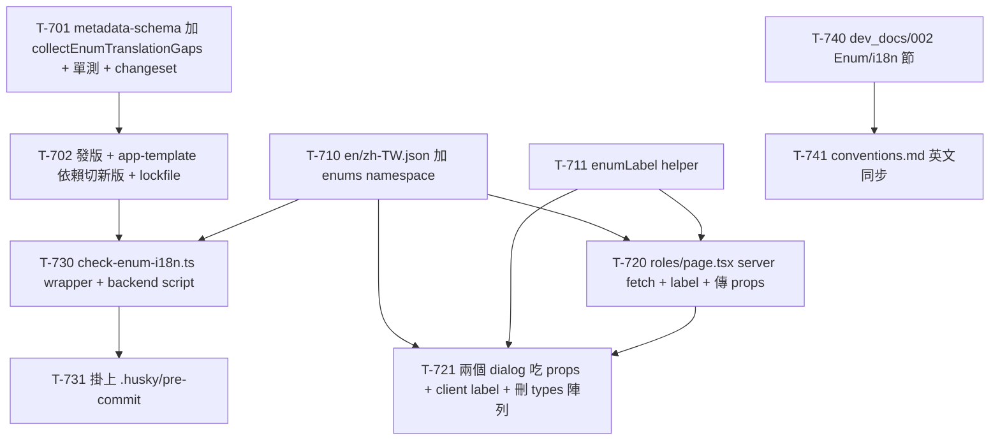

# 007 - Enum i18n 機制 Task Breakdown

> 本文件是 `007-enum-i18n-mechanism-plan.md` 的執行拆解，把該計劃的四個範圍段落
> （A 前端改吃 `/metadata/schema` / B 獨立 `enums` namespace + 補翻譯 / C 共用套件 export + 每個 app 的
> wrapper 腳本 + pre-commit 掛載 / 文件產出）拆成「一次一個 commit 可完成」的 task。資深架構師 review 意見放
> 最前面（含計劃文末三個「待確認事項」的定案），最後附依賴關係圖與「可立刻開始的第一批 task」。
> 狀態：**已完成（10/10）**。`appspine` 與 `appspine-app-template` 的 enum i18n 機制、檢查與文件均已落地。

---

## 1. Review 意見

計劃方向正確、對「不重蹈 auranest『每個 app 複製貼上 enum 清單 + 翻譯』覆轍」的立場收斂得宜（enum 值來源走
runtime、翻譯放獨立 namespace、漏翻譯用 fail-loud gate 擋、邏輯核心放共用套件）。實地讀過
`appspine/packages/metadata-schema/`、`appspine-app-template/backend/prisma/schema/`、
`frontend/src/i18n/`、`frontend/messages/*.json`、roles 頁面與其 `_components/`、`.husky/`、以及兩個 repo 的
`package.json` 之後，把「與現況不符的事實」「要先釘死的技術決策」「三個待確認事項的定案」「依賴順序」「邊界情況」
「顆粒度」逐項列出。凡計劃留了彈性或假設與現況有出入的地方，這裡直接定案，供 T-7xx task 敘述套用。

### 1.1 與現況不符 / 需先對齊的事實

實地查證後，計劃的核心技術前提**大多屬實**，但 i18n 檔案結構的描述與現況有一處關鍵 drift，另有數處計劃寫作時
的舊快照已被後續工作（005/006/Z01）推進，task 敘述一律以下列實際狀況為準：

- **`MetaService.buildMeta()` 回傳 `enums: EnumMeta[]` 屬實、且確實可在 DI 環境外 `new` 出來用**：
  `appspine/packages/metadata-schema/src/meta.service.ts` 第 46–84 行，`buildMeta()` 回傳的 `SchemaMeta` 含
  `enums: EnumMeta[]`（每個 `EnumMeta` 有 `name` 與 `values: EnumValueMeta[]`，`EnumValueMeta` 有 `name` /
  `documentation`）。`MetaService` 雖標了 `@Injectable()`，但**沒有 constructor 相依**，所以
  `new MetaService()` 完全可行——`backend/scripts/gen-data-dictionary.ts` 第 12 行
  `new MetaService().buildMeta()` 就是這樣用的（`schema:docs` 已在 Z01 實際跑過、CI 也綠了），證實這個 class
  可被任何 build-time 腳本直接呼叫，不需要跑起 NestJS app。`MetaService` 也確實從 `src/index.ts` export
  （`export * from './meta.service'`）。**計劃 A/C 節的技術前提成立**。

- **三個 enum 與其值完全屬實，但 `Permission` 不住在 `role.prisma`、住在 `base.prisma`**：逐檔查證：

  | Enum | 檔案 | 值（依 schema 定義順序） |
  |---|---|---|
  | `PermissionPolicy` | `backend/prisma/schema/role.prisma` L12–16 | `DENY_ALL` / `READ_ALL` / `ALLOW_ALL` |
  | `Permission` | `backend/prisma/schema/base.prisma` L12–24 | `USERS_READ` / `USERS_CREATE` / `USERS_UPDATE` / `USERS_DELETE` / `API_KEYS_READ` / `API_KEYS_CREATE` / `API_KEYS_DELETE` |
  | `AuditAction` | `backend/prisma/schema/audit-log.prisma` L20–24 | `CREATE` / `UPDATE` / `DELETE` |

  值與計劃列的完全一致。**關鍵補充**：`Permission` 是「不由任何 `@appspine/*` 套件出貨、由每個 app 自己在
  `base.prisma` 定義並隨 CRUD 模組成長」的 app 專屬 enum（base.prisma 註解自己講明）。這正好強化計劃的立場——
  正因為 `Permission` 是 app 自己長出來的，「翻譯要跟得上」的 gate 才有價值；也代表檢查機制**必須讀該 app 自己
  的 DMMF**（而非套件內建一份清單）才抓得到 app 專屬 enum，`buildMeta()` 讀的正是消費端 app 的 DMMF，符合需求。

- **【關鍵 drift】翻譯檔不是「每個 namespace 一個 JSON 檔」，而是「每個 locale 一個 JSON 檔、namespace 是檔內
  頂層 key」**：計劃 B 節寫「新增一個獨立的 `enums.json`……比照現有 `roles.json`/`users.json` 之類的 namespace
  檔案結構」。**這個假設與現況不符**——`frontend/messages/` 底下只有兩個檔：`en.json` 與 `zh-TW.json`，**沒有**
  per-namespace 的 `roles.json`/`users.json`。現有 namespace（`common` / `auth` / `users` / `roles` /
  `apiKeys` / `nav` / `breadcrumb`）是**每個 locale JSON 檔裡的頂層 key**。所以「新增 `enums` namespace」的正確
  動作是：**在既有 `en.json` 與 `zh-TW.json` 各自新增一個頂層 `"enums"` key**，不是新開一個 `enums.json` 檔。
  task 敘述一律以此為準（見 T-710）。

- **`src/i18n/messages.ts` 是「整檔 import」，新增 namespace 不需要動它**：`messages.ts` 內容為
  `import en from "../../messages/en.json"` / `import zhTW from "../../messages/zh-TW.json"`，
  `export const allMessages = { en, "zh-TW": zhTW }`，`export type Messages = typeof en`。它**整份 import 整個
  JSON**，不是「逐 namespace 列 import 清單」。所以在 JSON 裡加一個 `enums` 頂層 key 之後，`Messages` 型別會
  **自動**帶上 `enums`，`messages.ts` **一行都不用改**。（這回答了規劃時的疑問「是不是 messages.ts 裡有寫死的
  import 清單、要改什麼」——答案是：不是清單、不用改。）

- **i18n 的 `t()` 只吃「namespace → key → string」兩層扁平結構，enum key 必須是扁平 dotted key**：
  查證兩處實作——
  - server：`frontend/src/i18n/server.ts` 的 `getTranslations(namespace)` 內部 `nsMessages[key]`，回傳
    `(key) => (typeof val === "string" ? val : undefined) ?? key`。
  - client：`@appspine/frontend-shell` 的 `useTranslations(namespace)`（`packages/frontend-shell/src/i18n/index.tsx`
    L56–70）回傳 `(key) => nsMessages[key] ?? key`；且 `I18nProvider` 的 `messages` prop 型別是
    `Record<Locale, Record<string, Record<string, string>>>`——**只支援兩層**（namespace → key → **string**）。

  兩邊都把「namespace 底下的值」當**扁平的 `key → string`** 查。因此 `enums` namespace 的內容**必須是扁平的
  dotted key**：`"enums": { "PermissionPolicy.DENY_ALL": "拒絕全部", "Permission.USERS_READ": "讀取使用者", ... }`，
  **不能**用巢狀（`{ "PermissionPolicy": { "DENY_ALL": ... } }`，巢狀會讓 `nsMessages[key]` 拿到物件、被
  `typeof val === "string"` 判掉、回傳 raw key，且違反 `I18nProvider` 的兩層型別）。這剛好與計劃 B 節「key path
  統一是 `<EnumName>.<VALUE>`」一致——把整條 `PermissionPolicy.DENY_ALL` 當**單一扁平 key**即可，不要拆巢狀。

- **roles 頁面已經不是「扁平清單、無搜尋分頁」了（005 之後的推進）**：計劃背景與 005 的 T-515 都把 roles
  頁面描述成「扁平清單、無搜尋/分頁、直接顯示原始字串」。實地讀 `roles/page.tsx` 發現它**已經**用了
  `@appspine/frontend-shell` 的 `ListSearchForm` / `ListPagination` / `SortableColumnHeader`，且靜態文字已全面
  走 `getTranslations("roles")` / `getTranslations("common")`。005 的 i18n 基礎設施（`getTranslations` server
  helper、`useTranslations` client hook、`messages/*.json`）**已經落地可用**。所以本計劃**不需要**再建任何 i18n
  基礎設施，只需在既有機制上加一個 `enums` namespace + 改渲染點。**唯獨 enum 值本身仍在顯示原始字串**（見下一點）。

- **確切顯示原始 enum 字串的渲染點（共 6 處、3 個檔）**：
  - `roles/page.tsx`（Server Component）**L111** `<TableCell>{role.permissionPolicy}</TableCell>`——policy 直接
    顯示原始字串（`DENY_ALL`）。
  - `roles/page.tsx` **L112–119** `role.permissions.map((permission) => <Badge>{permission}</Badge>)`——每個
    permission badge 顯示原始字串（`USERS_READ`）。
  - `roles/_components/create-role-dialog.tsx`（`"use client"`）**L87** `<SelectItem>{policy}</SelectItem>`
    （policy 下拉選項）、**L99** checkbox label `{permission}`。
  - `roles/_components/role-row-actions.tsx`（`"use client"`）**L120** `<SelectItem>{policy}</SelectItem>`、
    **L142** checkbox label `{permission}`。

  page.tsx 兩處是 server（用 `getTranslations`），兩個 dialog 四處是 client（用 `useTranslations`）——本計劃兩種
  路徑都要覆蓋。

- **寫死陣列 `PERMISSION_OPTIONS` / `PERMISSION_POLICIES` 在 `roles/types.ts`，只被兩個 dialog 消費**：
  `roles/types.ts` L15–30 定義 `PERMISSION_POLICIES`（3 值）與 `PERMISSION_OPTIONS`（7 值），且註解自己承認
  「Not fetched at runtime... Keep in sync manually」。grep 確認**只有** `create-role-dialog.tsx` 與
  `role-row-actions.tsx` 兩個檔 import 這兩個陣列（`page.tsx` 用的是實際 role 資料、不用這兩個陣列）。所以計劃
  A 節「前端不寫死 enum 值清單」的實際改動面 = 這兩個 dialog 的選項來源，加上刪掉 `types.ts` 的兩個陣列。
  同一份 `types.ts` 註解也已明白指出「M2M scope catalog 是不同的、衍生的 `resource:action` 格式，不是這些 enum
  成員」——這直接支撐待確認事項 Q2 的定案（見 1.3）。

- **`GET /metadata/schema` 對「登入的 JWT 使用者」可讀，roles 頁面 server 端 fetch 行得通**：
  `meta.controller.ts` 掛 `@UseGuards(JwtOrApiKeyGuard, ScopeGuard)` + `@Scopes('metadata:read')`，註解寫明
  「Readable by any logged-in JWT user, or by an M2M API key with the `metadata:read` scope」。依 002 的 guard
  慣例，`ScopeGuard` 只限制 API Key 呼叫者、JWT 使用者不受 scope 限制。roles 頁面本來就是 admin-only、server
  端 `apiFetch` 會帶上使用者 JWT，因此 server 端 fetch `/metadata/schema` 可行，**不需要**新增任何後端 API
  （呼應計劃 A「不需新開發任何 API」）。task 敘述採 server-side fetch（見 1.2）。

- **pre-commit hook 現況與計劃描述不同：目前跑的不是 `tsc --noEmit`/`biome check`，而是 `generate:presets` +
  `lint-staged`**：`.husky/pre-commit` 實際內容為
  ```
  cd frontend
  npm run generate:presets
  git add src/lib/preferences/theme.ts
  npm exec -- lint-staged
  ```
  （`lint-staged` 設定在 `frontend/package.json`：`"*.{js,ts,jsx,tsx}": ["biome check --write --no-errors-on-unmatched"]`）。
  所以計劃 C 節「比照現有 `tsc --noEmit`/`biome check` 掛在 pre-commit」的措辭不精確——pre-commit 目前**沒有**
  獨立的 `tsc --noEmit` 步驟，biome 是透過 `lint-staged` 跑的，而且整個 hook 一開頭就 `cd frontend`。enum 檢查
  是**後端**腳本（讀 backend DMMF + 前端 JSON），因此要新增為一個**在 `cd frontend` 之前**執行的 top-level 步驟
  （見 1.2 的掛載定案），不能塞進 `lint-staged`（那是 per-file、且已 `cd frontend`）。

- **`@appspine/metadata-schema` 目前發布版本是 0.1.3、app-template 依賴 `^0.1.2`、`publishConfig` 已補齊**：
  `packages/metadata-schema/package.json` 現版本 `0.1.3`、`private: false`、已有
  `publishConfig.registry: https://npm.pkg.github.com`（Z01 問題 J 已對 10 個套件全部補上）。
  `appspine-app-template/backend/package.json` 依賴 `"@appspine/metadata-schema": "^0.1.2"`（`^0.1.2` 已能吃到
  0.1.3）。**所以新增一個 export 就是一次新版發布**——要走 Z01 問題 D 的完整流程（changeset → version →
  `pnpm release` 發到 GitHub Packages → 改 backend 依賴 range → 重新產生 lockfile），不能只「加 export」就當
  完成，否則 template 端根本吃不到新函式（template 已不是 `file:` 依賴、是正式 registry 版本，見 [Z01-ci-cd-fork-readiness-fixes.md](Z01-ci-cd-fork-readiness-fixes.md) 問題 D）。

- **conventions.md / 002 的落點已存在，結構明確**：`appspine-app-template/docs/conventions.md` 已存在
  （002 已搬過去），有 `## Standard Flow for Adding a New CRUD Module`（步驟 1 Backend–Schema、步驟 5
  Frontend–i18n）；`_archive/dev_docs-20260803/framework/002-app-dev-conventions.md` 對應有「## 新增 CRUD 模組標準流程」（第 1 步 Backend -
  Schema、第 5 步 Frontend - i18n）。兩份都要加「Enum / i18n 慣例」一節並在第 1 步補提醒（見 T-740/T-741）。
  注意 002 開頭已有「之後修改本文件時，記得同步檢查 conventions.md 是否也要更新」的機制，兩份要同步但各自
  自包含（中文/英文、不整段複製）。**另注意**：002 檔案當天剛加過 Theming/Icon/元件放置的前端 bullet（與本
  enum-i18n 無關的另一件事），撰寫時不要被那段干擾、也不要動它。

- **monorepo 目前沒有單元測試 harness**：`appspine/package.json` 有 `test: pnpm -r run test`，但**沒有任何套件
  定義 `test` script**（只有 `e2e-kit` 有 Playwright spec，不是單元測試）。002/測試規範說「共用套件需要單元測試、
  CI 跑過才能發版」，但現況並未落實。這對 T-701 有影響（見 1.5 顆粒度與 1.3 決策）。

### 1.2 技術方案要先釘死的決策

- **【`collectEnumTranslationGaps` 的簽章與回傳定案】**：計劃給的示意簽章是
  `collectEnumTranslationGaps(meta, dictionaries): string[]`。定案為（供 T-701 直接實作）：
  ```ts
  export interface EnumTranslationGap {
    locale: string;                     // 'en' | 'zh-TW' | ...
    key: string;                        // `${EnumName}.${VALUE}`，例如 'PermissionPolicy.DENY_ALL'
    kind: 'missing' | 'orphaned';       // missing=schema 有但翻譯缺；orphaned=翻譯有但 schema 已無
  }
  export function collectEnumTranslationGaps(
    meta: Pick<SchemaMeta, 'enums'>,
    dictionaries: Record<string, Record<string, unknown>>, // locale -> 該 locale 的 enums namespace 扁平物件
  ): EnumTranslationGap[];
  ```
  - 期望的 key 由 `meta.enums` 展開成所有 `${enum.name}.${value.name}` 的笛卡兒集合。
  - 對**每一個** locale 的 `enums` 字典比對：期望 key 不在字典 → 一筆 `missing`；字典裡有、但不在期望集合 →
    一筆 `orphaned`。
  - 回傳結構化陣列（不是純字串），讓呼叫端自行決定要 fail（`missing`）還是只警告（`orphaned`，見 Q3 定案）。
    這比計劃的 `string[]` 更好用，且純函式、零 side-effect、易單元測試。放 `metadata-schema/src/` 新檔（例如
    `enum-i18n.ts`）並從 `index.ts` re-export。

- **【wrapper 腳本 `check-enum-i18n.ts` 的形狀定案】**：比照 `gen-data-dictionary.ts` 的薄 wrapper 模式：
  ```
  import { MetaService, collectEnumTranslationGaps } from "@appspine/metadata-schema";
  // 讀 ../../frontend/messages/en.json 與 zh-TW.json 的 "enums" 頂層 key
  // meta = new MetaService().buildMeta()
  // gaps = collectEnumTranslationGaps(meta, { en: en.enums ?? {}, "zh-TW": zhTW.enums ?? {} })
  // 有任何 kind==='missing' → 印清單 + process.exit(1)；orphaned → 印警告但不 fail
  ```
  路徑用 `path.resolve(__dirname, "../../frontend/messages/*.json")`。**這是純靜態檢查**（讀 DMMF + 讀 JSON），
  `Prisma.dmmf` 在 `prisma generate` 後即為靜態資料、**不需要 DB 連線**，適合放 pre-commit。腳本隨 template
  fork 到每個新 repo（與 `gen-data-dictionary.ts` / `scaffold-init.mjs` 同性質，是「隨 repo 出貨」的一部分）。
  在 `backend/package.json` 新增 script `"check:enum-i18n": "dotenv -e ../.env -- ts-node scripts/check-enum-i18n.ts"`
  （沿用 `schema:docs` 的 `dotenv -e ../.env -- ts-node` 形狀以求一致；即使不連 DB，帶著 dotenv 無害且與既有
  腳本一致）。

- **【pre-commit 掛載點定案】**：在 `.husky/pre-commit` 的**最前面、`cd frontend` 之前**加一行：
  ```
  pnpm -C backend run check:enum-i18n
  ```
  （husky hook 從 repo 根執行，`pnpm -C backend` 可正確定位；擺在 `cd frontend` 之前才不會被 cd 影響工作目錄。）
  Hook 是 fail-loud：`check:enum-i18n` 非零 exit 會中止整個 commit（呼應計劃「不做印警告放行」、以及 002
  「禁止 `--no-verify` 略過 hook」）。**不要**塞進 `frontend` 的 `lint-staged`（那是 per-file、且針對前端檔）。

- **【enum 值來源：server 端 fetch、由 page 傳 props 給 dialog】**：計劃 A 說「前端改吃 `/metadata/schema`」，
  但沒定「誰 fetch」。定案：**在 `roles/page.tsx`（Server Component）用 `apiFetch<SchemaMeta>("/metadata/schema")`
  取回 `enums`，篩出 `PermissionPolicy` 與 `Permission` 的 `values`，以 props 傳進 `<CreateRoleDialog>` 與
  `<RoleRowActions>`**（這兩個 client dialog 目前是自己 import 寫死陣列）。理由：app 既有慣例是 server component
  用 `apiFetch` 抓資料、client 元件吃 props（roles/page.tsx 本來就是這樣抓 `/roles`），server fetch 也天然帶上
  JWT、且避免在 client 再打一次 API。dialog 的 props 型別用 `readonly string[]`（enum 值字串陣列），順序沿用
  DMMF 回傳順序（＝schema 定義順序，UI 顯示穩定）。fetch 完成後**刪除** `roles/types.ts` 的
  `PERMISSION_OPTIONS` / `PERMISSION_POLICIES`（連同其「Keep in sync manually」註解一起清掉——那正是要消滅的
  漂移源）。

- **【`enums` namespace 的翻譯字典結構定案】**：在 `en.json` / `zh-TW.json` 各加一個頂層 `"enums"` key，內容為
  扁平 dotted key（見 1.1）：
  ```jsonc
  "enums": {
    "PermissionPolicy.DENY_ALL": "...", "PermissionPolicy.READ_ALL": "...", "PermissionPolicy.ALLOW_ALL": "...",
    "Permission.USERS_READ": "...", "Permission.USERS_CREATE": "...", "Permission.USERS_UPDATE": "...",
    "Permission.USERS_DELETE": "...", "Permission.API_KEYS_READ": "...", "Permission.API_KEYS_CREATE": "...",
    "Permission.API_KEYS_DELETE": "...",
    "AuditAction.CREATE": "...", "AuditAction.UPDATE": "...", "AuditAction.DELETE": "..."
  }
  ```
  三個 enum 全數列入（含目前無 UI 的 `AuditAction`，呼應計劃 D「適用範圍：所有 Prisma enum」）。en 值可直接用
  現有原始字串的人類可讀化（例如 `DENY_ALL` → `Deny all`），zh-TW 給繁中翻譯。

- **【`enumLabel` helper 定案：泛型 + 建構 key 時 cast，同時吃 server/client 的 `t`】**：計劃建議放
  `frontend/src/lib/i18n/enum-label.ts`。定案簽章：
  ```ts
  export function enumLabel<T extends (key: any) => string>(t: T, enumName: string, value: string): string {
    return t(`${enumName}.${value}` as Parameters<T>[0]);
  }
  ```
  用泛型 + `as Parameters<T>[0]` 的理由（**這是唯一容易踩到的型別坑**）：`getTranslations("enums")` 回傳的
  `t` 型別是 `(key: keyof Messages["enums"] & string) => string`（**字面 union 的窄 key**），而 enum 值是從
  `role.permissionPolicy: string` / `permission: string` **動態**組出來的，型別是寬 `string`，直接
  `t(\`Permission.${value}\`)` 會因為 key 不是字面 union 而**型別不過**。泛型 + cast 讓同一個 helper 能同時吃
  server 的窄 `t` 與 client 的寬 `t`（`useTranslations` 回傳 `(key: string) => string`），呼叫端不用各自 cast。
  helper 放 template 端 `frontend/src/lib/i18n/enum-label.ts`（app 專屬、依賴 app 的 i18n）。

### 1.3 計劃「待確認事項」三題定案

計劃文末列了三個 task breakdown 前要拍板的問題，逐一定案（供 task 敘述直接引用）：

- **Q1：檢查腳本失敗時要不要印出「目前哪些 `<EnumName>.<VALUE>` 缺翻譯」的完整清單？**
  **定案：要，印完整清單、依 locale 分組。** `collectEnumTranslationGaps` 本來就回傳結構化 gap 陣列（key 已
  算出），wrapper 只是把 `kind==='missing'` 的項目分組印出，成本趨近於零、DX 收益高，且符合 fail-loud 的精神
  「擋下來的同時告訴人怎麼修」。輸出格式例：`[enums] missing 'zh-TW' key: Permission.ORDERS_READ`（每行一筆，
  方便直接照著補）。**落實在 T-730。**

- **Q2：`Permission` 衍生的 M2M API Key `resource:action` scope 字串，要不要跟 `enums` 共用 namespace？**
  **定案：不共用，分開處理、本計劃不納入 scope 字串的翻譯。** 證據：`MetaService.deriveScopes()`
  （meta.service.ts L95–99）是從 model 的 `dbTable` 名稱動態產生 `users:read` / `users:write` / `users:*`，
  回傳在 `availableScopes: string[]`，**與 `Permission` enum 是兩套完全不同的機制**（一個是 model×action 衍生的
  字串、一個是 Prisma enum 成員）；`roles/types.ts` 的註解也明講兩者是「different, derived format」。key 形狀
  （`users:read` 帶冒號 vs `Permission.USERS_READ` 帶點）與生命週期都不同，硬塞同一個 namespace 只會混淆兩個
  catalog。`enums` namespace **只涵蓋 Prisma enum 值**。scope 字串目前在 api-keys 頁面照原樣顯示、可接受；若
  日後真要翻譯 scope，另立機制（未來獨立工作項目），不在本計劃範圍。**此決策寫進 T-740 的慣例文件，避免後人
  誤把 scope 塞進 `enums`。**

- **Q3：`collectEnumTranslationGaps` 要不要順便偵測「翻譯有、schema 已無」的孤兒 key？**
  **定案：偵測、但只警告不 fail（`missing` 才 fail）。** `collectEnumTranslationGaps` 一律回傳 `missing` 與
  `orphaned` 兩類（見 1.2 簽章）；wrapper 對 `missing`（schema 有值卻沒翻譯——**會讓使用者看到原始 enum 字串的
  真 bug**）`process.exit(1)` 擋 commit，對 `orphaned`（死 key，執行期無害）只印警告、不擋。理由：fail-loud
  應瞄準真正的使用者可見缺陷，不因無害的殘留 key 擋住無關的 commit；但仍主動提示清理、避免字典長期腐化。這也
  與計劃「孤兒偵測是加分項、非核心」的定位一致——核心（missing gate）與加分（orphan 警告）用同一支函式一次做掉、
  但嚴重度分級。**落實在 T-701（函式回傳兩類）+ T-730（wrapper 分級處理）。**

### 1.4 依賴順序 review

計劃「下一步」把工作分成 A / B / C / 文件四塊。實際依賴關係（含跨 repo 硬依賴）如下：

- **共用套件鏈（C 的核心）有一條跨 repo 硬依賴**：`T-701`（appspine 加 `collectEnumTranslationGaps` export +
  changeset）→ `T-702`（發版 + 改 backend 依賴 range + 重新產生 lockfile）→ `T-730`（template 的 wrapper 腳本
  `import { collectEnumTranslationGaps } from "@appspine/metadata-schema"`）。**wrapper 必須等新版發布並被
  template 安裝到，才能 typecheck / 執行**（template 吃的是正式 registry 版本、非 `file:`，見 [Z01-ci-cd-fork-readiness-fixes.md](Z01-ci-cd-fork-readiness-fixes.md) 問題 D），
  這是本計劃唯一的跨 repo 硬依賴，排序時務必 T-702 先於 T-730。
- **翻譯字典（B）可最早、獨立開工**：`T-710`（en.json / zh-TW.json 加 `enums` namespace）不依賴任何東西，且
  它是 `T-720`/`T-721`（渲染）與 `T-730`（gate）的共同前置——**應排在最前面**。
- **`enumLabel` helper（`T-711`）無依賴**，但被 `T-720`/`T-721` 使用，宜早做。
- **渲染改動（A+B 交會）**：`T-720`（roles/page.tsx：server fetch + server 端 label）依賴 `T-710`+`T-711`；
  `T-721`（兩個 dialog：改吃 props + client 端 label + 刪 `types.ts` 陣列）依賴 `T-710`+`T-711`+`T-720`
  （因為 dialog 的 enum 值 props 由 `T-720` 的 page fetch 傳入）。**A 與 B 在這兩個檔交會，按 005 的教訓「同一
  檔避免改兩次」，把該檔的『改選項來源(A)』與『改 label(B)』合併在同一個 commit 完成**（見 1.5）。
- **檢查 gate（C 的落地）**：`T-730`（wrapper）依賴 `T-702`（export 已發版）+ `T-710`（翻譯已存在，否則 wrapper
  一跑就 fail）；`T-731`（pre-commit 掛載）依賴 `T-730`。
- **文件（文件產出）**：`T-740`（002）/ `T-741`（conventions.md）反映最終定案，無程式硬依賴，可最後做或平行；
  但內容要與 1.2/1.3 的定案一致，建議排在機制大致成形後。

### 1.5 邊界情況 / 風險

- **跨 repo 發版忘了收尾**：這是最大的回歸點。若只做 `T-701`（加 export）卻沒做 `T-702`（發版 + bump range +
  lockfile），`T-730` 的 wrapper 會 import 到 template 尚未安裝的新版函式而編譯失敗。Z01 問題 D 已示範完整流程
  （補 `publishConfig`→changeset→`pnpm release`→改 range→重新 `pnpm install` 產 lockfile）；`metadata-schema`
  的 `publishConfig` 已於 Z01 問題 J 補齊，本輪只需走 changeset→release→bump→lockfile。發版後 backend 依賴
  由 `^0.1.2` 改為新版下限（新增 export 屬 additive，建議 minor bump，例如 0.1.3 → **0.2.0**、range 改
  `^0.2.0`；若團隊偏好沿用 Z01 的 patch 風格則 0.1.4、range `^0.1.4` 亦可，二擇一皆可，T-702 敘述採 minor）。
- **`enums` 巢狀 vs 扁平寫錯**：若有人把 `enums` 寫成巢狀（`{ PermissionPolicy: { DENY_ALL: ... } }`），現行
  `t()`（server/client 皆是 `nsMessages[key]`）會查到物件、回傳 raw key，畫面看似「沒翻譯」卻不報錯，很難 debug。
  T-710 必須採**扁平 dotted key**（見 1.1/1.2），且 T-730 的檢查邏輯是用「`enums[\`${EnumName}.${VALUE}\`]`
  是否存在且為字串」判定，天然會把巢狀寫法判成 missing、fail-loud 擋下，形成雙重保險。
- **動態 key 的型別坑**：如 1.2 所述，server `getTranslations("enums")` 的 `t` 是窄字面 key 型別，動態組 key 會
  型別不過；務必透過 `enumLabel`（泛型 + cast）呼叫，不要在 page/dialog 直接 `t(\`Permission.${x}\`)`。
- **`AuditAction` 目前無 UI，但翻譯與檢查都要涵蓋**：呼應計劃 D 與 002「Prisma `///` 註解所有 enum 必填、不分
  現在有沒有 UI」的精神。T-710 的 `enums` 字典要含 `AuditAction.*` 三個 key，否則 T-730 的 gate 會 fail。這是
  刻意行為（在 schema 定義當下就要求翻譯），不是 bug。
- **pre-commit 只在有 `.env` 時能跑 `dotenv -e ../.env`**：`check:enum-i18n` 沿用 `dotenv -e ../.env`，若開發
  者本機沒有 `.env`（README 要求 `cp .env.example .env`）dotenv 會找不到檔。實務上本機開發一定有 `.env`
  （dev server 也靠它），但 T-730 敘述要註明「腳本本身不需 DB 連線、只是沿用 dotenv 形狀」，避免有人誤以為
  pre-commit 需要起 DB。若要更保險可讓腳本對缺 `.env` 寬容（dotenv 找不到檔不致命），T-730 可選擇性處理。
- **`/metadata/schema` 的 `enums` 一定含 app 專屬 `Permission`**：因為 `buildMeta()` 讀的是**消費端 app 自己**
  的 DMMF（Prisma client 在 app 內 generate），所以 app 後來新增的 enum 值會自動出現在回應裡——這正是計劃 A
  想要的「schema 改完、prisma generate 一跑，前端清單自動跟上」。T-720 篩 enum 時用 `name === 'PermissionPolicy'`
  / `'Permission'` 精確比對，找不到時要 fail-loud（而非默默給空陣列），避免 API 形狀變動被無聲吞掉。
- **CRLF / JSON 尾逗號**：本 workspace 在 Windows（見環境），`en.json`/`zh-TW.json` 可能是 CRLF；純加 key、由
  biome/lint-staged 格式化即可，不涉及 pattern 比對，風險低。但 JSON**不可有尾逗號**（有些人手動加 key 容易
  漏），commit 前 lint-staged 的 biome 會抓到。

### 1.6 顆粒度

- 大部分 task 控制在單一 commit。刻意拆分/合併的地方：
  - **共用套件的「加 export」與「發版收尾」拆成 T-701 / T-702**：前者純寫程式（純函式 + 從 index re-export +
    changeset），可在 appspine repo 內獨立 typecheck 自證；後者是發版動作（version→release→改 template 依賴
    range→重新產 lockfile），跨 repo、牽涉 registry 與 token，邊界完全不同、分開好回溯（比照 005 T-516 把
    「發版收尾」獨立成 task 的做法）。
  - **roles 渲染的 A/B 交會按「檔案」拆成 T-720（page.tsx）/ T-721（兩個 dialog）**，而不是按 A/B 拆——因為
    A（改選項來源）與 B（改 label）會**改到同一批 dialog 檔**，按 005 的教訓「同一檔避免改兩次」，把單一檔的
    A+B 動作合在同一 commit。page.tsx 只有 server 顯示（無選項來源問題）故自成一 task；兩個 dialog 同時吃
    props(A) + label(B) + 刪 types 陣列，合成一個 task。
  - **wrapper 腳本（T-730）與 pre-commit 掛載（T-731）拆開**：前者是可獨立手動 `pnpm -C backend run
    check:enum-i18n` 驗證的腳本，後者只改 `.husky/pre-commit` 一行但會影響所有後續 commit 的行為（一旦掛上、
    翻譯沒補齊就 commit 不了），分開讓「腳本正確性」與「gate 生效」兩件事各自可回溯。
  - **文件 T-740（002）/ T-741（conventions.md）拆兩個**：一中一英、兩個檔、兩個 repo（dev_docs 在 workspace、
    conventions.md 在 template），比照 002 既有「兩份同步但各自自包含」的機制分開 commit。
- **單元測試的顆粒度取捨**：`collectEnumTranslationGaps` 是純函式、又是「壞掉會影響所有 fork」的共用套件邏輯，
  依 002 測試規範最該有單元測試。但現況 monorepo **沒有任何單元測試 harness**（1.1 末點）。定案：T-701 附一支
  最小單元測試並為 `metadata-schema` 補上測試 runner（建議 `vitest`，加 `test` script 讓 `pnpm -r run test`
  帶得到）——這會是 repo 第一支單元測試，屬合理投資；若團隊決定暫不引入 runner，退而求其次以 T-730 在真實 app
  跑一次（含刻意漏一個翻譯驗證會 fail）作為功能驗證。T-701 敘述以「加 vitest + 一支測試」為預設，並註明此取捨。

---

## 2. 完整 Task Breakdown

編號規則：`T-7xx`（007 系列）。`T-70x` 共用套件（`metadata-schema` export + 發版）；`T-71x` 翻譯字典與 helper
（B 的基礎）；`T-72x` roles 頁面渲染（A+B 交會）；`T-73x` 檢查 gate（C 落地）；`T-74x` 文件產出。所有 checkbox
皆已完成並回填為 `[x]`。

### 共用套件層 — `@appspine/metadata-schema`（C 的核心邏輯 + 發版）

- [x] **T-701** appspine：`metadata-schema` 新增 `collectEnumTranslationGaps()` export（＋單元測試＋changeset）
      _依賴：無_
      說明：在 `appspine/packages/metadata-schema/src/` 新增檔案（例如 `enum-i18n.ts`），實作 1.2 定案的
      `collectEnumTranslationGaps(meta: Pick<SchemaMeta,'enums'>, dictionaries: Record<string, Record<string,unknown>>): EnumTranslationGap[]`
      與 `EnumTranslationGap` 介面（`{ locale, key: '<EnumName>.<VALUE>', kind: 'missing' | 'orphaned' }`）：
      期望 key 由 `meta.enums` 展開成所有 `${enum.name}.${value.name}`；對每個 locale 字典比對，schema 有但字典
      缺 → `missing`，字典有但 schema 無 → `orphaned`（見 1.3 Q3——一支函式同時回傳兩類，嚴重度由呼叫端分級）。
      判定「字典有該 key」的條件是「該扁平 key 存在且值為 `string`」（巢狀寫法會被判 missing，見 1.5）。純函式、
      無 side-effect、不讀檔、不碰 DMMF（DMMF 由呼叫端經 `buildMeta()` 提供）。從 `src/index.ts` re-export
      （`export * from './enum-i18n'`）。附**單元測試**：為 `metadata-schema` 補上 `vitest`（新增 `test` script
      讓根 `pnpm -r run test` 帶得到，見 1.6）、涵蓋「完整無缺→空陣列」「缺一個 locale 的一個 key→一筆 missing」
      「字典多一個已刪值→一筆 orphaned」三情境。附 changeset（additive export，建議 minor，見 1.5）。此 task
      **只在 appspine repo 內**完成，`pnpm -C packages/metadata-schema typecheck` + `pnpm -r run test` 自證。

- [x] **T-702** appspine + template：發布 `metadata-schema` 新版並把 app-template 依賴切到新版
      _依賴：T-701_
      說明：走 Z01 問題 D 的發版流程（`publishConfig` 已於 Z01 問題 J 補齊，本輪略過該步）：在 `appspine` 跑
      `pnpm changeset version`（依 T-701 的 changeset bump 版本，例如 0.1.3 → 0.2.0）、`pnpm build`、
      `pnpm release`（發布到 `npm.pkg.github.com`，需 `write:packages` token）。接著在 `appspine-app-template`：
      把 `backend/package.json` 的 `"@appspine/metadata-schema": "^0.1.2"` 改成新版下限（例如 `^0.2.0`），在
      repo 根重新 `pnpm install` 產生更新後的 `pnpm-lock.yaml`（若 `--trust-lockfile`/`minimumReleaseAge` 情境
      套用，比照 Z01 問題 F 的最終做法）。驗收：template `pnpm -C backend typecheck` 能 resolve 到
      `collectEnumTranslationGaps`。**此 task 是 T-730 wrapper 能編譯/執行的前置硬依賴**（template 吃正式
      registry 版本、非 `file:`，見 [Z01-ci-cd-fork-readiness-fixes.md](Z01-ci-cd-fork-readiness-fixes.md) 問題 D / 本文件 1.4）。若 `write:packages` token 未就緒，此 task 與
      Z01/005 T-516 同屬外部阻塞，須先補權限。

### 翻譯字典與 helper — B 的基礎

- [x] **T-710** template：`en.json` / `zh-TW.json` 新增 `enums` namespace（三個 enum 全數翻譯）
      _依賴：無_
      說明：在 `appspine-app-template/frontend/messages/en.json` 與 `zh-TW.json` **各自新增一個頂層 `"enums"`
      key**（**不是**新開 `enums.json` 檔——現況是每 locale 一檔、namespace 為檔內頂層 key，見 1.1），內容為
      **扁平 dotted key**（見 1.2 定案，**不可巢狀**，見 1.5）：涵蓋 `PermissionPolicy.{DENY_ALL,READ_ALL,ALLOW_ALL}`、
      `Permission.{USERS_READ,USERS_CREATE,USERS_UPDATE,USERS_DELETE,API_KEYS_READ,API_KEYS_CREATE,API_KEYS_DELETE}`、
      `AuditAction.{CREATE,UPDATE,DELETE}` 共 13 個 key（含目前無 UI 的 `AuditAction`，呼應計劃 D，見 1.5）。
      en 給人類可讀化字串、zh-TW 給繁中翻譯。`src/i18n/messages.ts` **不需改動**（整檔 import、`Messages` 型別
      自動帶上 `enums`，見 1.1）。此 task 純加 JSON key、可獨立完成，是後續渲染與 gate 的共同前置。

- [x] **T-711** template：新增 `enumLabel()` helper
      _依賴：無_
      說明：在 `appspine-app-template/frontend/src/lib/i18n/enum-label.ts` 新增 1.2 定案的泛型 helper
      `enumLabel<T extends (key: any) => string>(t: T, enumName: string, value: string): string`，內部
      `return t(\`${enumName}.${value}\` as Parameters<T>[0])`。用泛型 + cast 讓它能同時吃 server
      `getTranslations("enums")` 的窄字面 key `t` 與 client `useTranslations("enums")` 的寬 `t`，並解掉「動態組
      key 型別不過」的坑（見 1.2/1.5）。可附一行註解說明 cast 的 why（動態 enum 值 vs 字面 key 型別）。

### roles 頁面渲染 — A（改吃 runtime）＋ B（改 label）交會

- [x] **T-720** template：`roles/page.tsx` server 端 fetch `/metadata/schema` + enum label 化 + 傳 props 給 dialog
      _依賴：T-710, T-711_
      說明：改 `frontend/src/app/(main)/dashboard/(admin)/roles/page.tsx`（Server Component），一個 commit 內：
      (1)【A】新增 `const meta = await apiFetch<SchemaMeta>("/metadata/schema")`（`SchemaMeta` 型別可自
      `@appspine/metadata-schema` import 或於前端 mirror 一個最小型別；`/metadata/schema` 對登入 JWT 使用者可讀，
      見 1.1），從 `meta.enums` 篩出 `name === 'PermissionPolicy'` 與 `'Permission'` 的 `values`（找不到要
      fail-loud，見 1.5），把兩組 enum 值字串陣列（`readonly string[]`）分別以 props 傳入 `<CreateRoleDialog>`
      （L46）與每個 `<RoleRowActions role={...}>`（L124）。
      (2)【B】把顯示原始字串的兩處改用 `enumLabel`：新增 `const tEnum = await getTranslations("enums")`，L111
      `{role.permissionPolicy}` → `{enumLabel(tEnum, "PermissionPolicy", role.permissionPolicy)}`；L112–119 的
      permission badge `{permission}` → `{enumLabel(tEnum, "Permission", permission)}`。
      此 task 不刪 `types.ts` 的陣列（那在 T-721，因為 dialog 還沒改成吃 props 前不能刪）。驗收：roles 列表的
      policy/permission 顯示繁中（預設 locale zh-TW），切 en 顯示英文。

- [x] **T-721** template：兩個 role dialog 改吃 props enum 值 + client 端 label + 刪除 `types.ts` 寫死陣列
      _依賴：T-710, T-711, T-720_
      說明：改 `roles/_components/create-role-dialog.tsx` 與 `role-row-actions.tsx`（皆 `"use client"`），一個
      commit 內：
      (1)【A】兩個元件改成從 props 接收 `policyOptions: readonly string[]` 與 `permissionOptions: readonly string[]`
      （由 T-720 的 page 傳入），取代 `import { PERMISSION_OPTIONS, PERMISSION_POLICIES } from "../types"`；
      `.map()` 的來源改成 props。
      (2)【B】選項 label 改用 `enumLabel`：新增 `const tEnum = useTranslations("enums")`；
      create-role-dialog.tsx L87 `{policy}` → `{enumLabel(tEnum, "PermissionPolicy", policy)}`、L99 `{permission}`
      → `{enumLabel(tEnum, "Permission", permission)}`；role-row-actions.tsx L120 / L142 同法替換。（`<SelectItem>`
      /`<Checkbox>` 的 `value` 仍送原始 enum 字串給 FormData/後端，**只有顯示文字** label 化，不動送出的值。）
      (3) 刪除 `roles/types.ts` 的 `PERMISSION_OPTIONS` / `PERMISSION_POLICIES` 兩個陣列與其「Keep in sync
      manually」註解（漂移源清除，呼應計劃 A/設計目標 1）。驗收：兩個 dialog 的下拉/checkbox 選項來自 runtime
      `/metadata/schema`、label 顯示翻譯；`tsc --noEmit` 通過（確認沒有殘留 import 到已刪陣列）。

### 檢查 gate — C 落地

- [x] **T-730** template：新增 `backend/scripts/check-enum-i18n.ts` wrapper + backend `check:enum-i18n` script
      _依賴：T-702, T-710_
      說明：在 `appspine-app-template/backend/scripts/` 新增 `check-enum-i18n.ts`（比照 `gen-data-dictionary.ts`
      的薄 wrapper 模式，見 1.2）：`import { MetaService, collectEnumTranslationGaps } from "@appspine/metadata-schema"`
      （需 T-702 已發版並安裝），讀 `path.resolve(__dirname, "../../frontend/messages/en.json")` 與 `zh-TW.json`
      的 `"enums"` 頂層 key，`const gaps = collectEnumTranslationGaps(new MetaService().buildMeta(), { en:
      en.enums ?? {}, "zh-TW": zhTW.enums ?? {} })`。輸出/退出行為（見 1.3 Q1/Q3）：把 `kind==='missing'` 依
      locale 分組**完整印出**（每行一筆 `[enums] missing '<locale>' key: <EnumName>.<VALUE>`，方便照著補），
      有任何 missing 就 `process.exit(1)`；`kind==='orphaned'` 只印警告、不影響 exit code。在
      `backend/package.json` 新增 `"check:enum-i18n": "dotenv -e ../.env -- ts-node scripts/check-enum-i18n.ts"`。
      腳本是純靜態檢查（DMMF + JSON、不連 DB，見 1.5）。驗收：手動 `pnpm -C backend run check:enum-i18n` 在
      翻譯齊全時 exit 0；刻意從 `en.json` 移掉一個 `enums` key 後 exit 1 並印出該 key（驗證 fail-loud + 清單）。

- [x] **T-731** template：把 `check:enum-i18n` 掛上 `.husky/pre-commit`（fail-loud gate 生效）
      _依賴：T-730_
      說明：在 `appspine-app-template/.husky/pre-commit` 的**最前面、`cd frontend` 之前**加一行
      `pnpm -C backend run check:enum-i18n`（見 1.2 掛載定案；husky 從 repo 根執行，`pnpm -C backend` 定位正確、
      且擺 `cd frontend` 之前不受 cd 影響）。非零 exit 會中止 commit（fail-loud，呼應計劃 C 與 002「禁止
      `--no-verify`」）。**不要**塞進 `frontend` 的 `lint-staged`（那是 per-file、且已 `cd frontend`，見 1.1）。
      驗收：暫時漏一個翻譯 → `git commit` 被擋且印出缺的 key；補齊後 commit 正常通過。此 task 一旦落地，之後
      「新增 enum 值但沒補 `enums` 翻譯」就 commit 不了（機制生效）。

### 文件產出

- [x] **T-740** workspace：`_archive/dev_docs-20260803/framework/002-app-dev-conventions.md` 新增「Enum / i18n 慣例」節 + CRUD 流程第 1 步補提醒
      _依賴：無（建議排在機制成形後，內容需與定案一致）_
      說明：在 `_archive/dev_docs-20260803/framework/002-app-dev-conventions.md` 新增一節「Enum / i18n 慣例」，涵蓋（呼應計劃「文件產出」1）：
      (a) enum 值一律走 `GET /metadata/schema` 撈、前端不寫死陣列（呼應 A / 設計目標 1）；(b) 翻譯放獨立
      `enums` namespace、key 為**扁平** `<EnumName>.<VALUE>`（呼應 B，且註明扁平不巢狀，見 1.1）；(c) pre-commit
      會 fail-loud 擋沒翻譯的新 enum 值，新增 enum 時要同步補 `en.json`/`zh-TW.json` 的 `enums`（呼應 C）；
      (d) 明確寫上 1.3 Q2 的定案——M2M `resource:action` scope 字串**不**走 `enums` namespace（避免後人誤塞）；
      (e) 適用所有 Prisma enum、不分現在有沒有 UI（呼應 D，含 `AuditAction`）。並在「新增 CRUD 模組標準流程」
      第 1 步（Backend - Schema）補一句：新增的 enum 值需同步在 `enums` 補翻譯、pre-commit 會擋。注意不要動到
      當天剛加的 Theming/Icon/元件放置 bullet（見 1.1 末段）。

- [x] **T-741** template：`appspine-app-template/docs/conventions.md` 同步英文版「Enum / i18n」規則
      _依賴：T-740_
      說明：把 T-740 的規則以英文、自包含的方式同步進 `appspine-app-template/docs/conventions.md`（比照 002
      開頭「修改本文件時同步檢查 conventions.md」的機制，不整段複製、保持自包含）：新增對應的 Enum / i18n 一節，
      並在英文版「Standard Flow for Adding a New CRUD Module」第 1 步（Backend – Schema）與第 5 步（Frontend –
      i18n）補上「新增 enum 值要同步補 `enums` 翻譯、pre-commit 會 fail」的提醒。此檔隨 template fork 到每個新
      repo、是 forker 實際讀得到的版本（dev_docs 看不到）。

---

## 3. 依賴關係圖



跨 repo 硬依賴只有一條：`T-701 → T-702 → T-730`（共用套件必須先發版、template 安裝到新版，wrapper 才編得過，
見 1.4）。`T-710`（翻譯字典）是 `T-720`/`T-721`（渲染）與 `T-730`（gate）的共同前置。`T-720 → T-721` 是因為
dialog 的 enum 值 props 由 page fetch 傳入。文件鏈（`T-740 → T-741`）與程式無硬依賴，只需內容與定案一致。

---

## 4. 可以立刻開始的第一批 task（不依賴任何未完成 task）

沒有前置依賴、可立刻平行開工的：

- **T-701** appspine `metadata-schema` 加 `collectEnumTranslationGaps` export + 單元測試 + changeset（共用套件鏈
  的根，且是唯一跨 repo 硬依賴鏈的起點，宜最早起跑）。
- **T-710** template `en.json`/`zh-TW.json` 加 `enums` namespace（渲染與 gate 的共同前置，純加 JSON、最無阻力）。
- **T-711** template `enumLabel` helper（無依賴、量小、被渲染 task 使用）。
- **T-740** workspace `dev_docs/002` 的 Enum / i18n 慣例節（文件鏈的根，內容依本文件 1.2/1.3 定案即可撰寫，
  不必等程式完成）。

接著：T-702 待 T-701（發版收尾，若 `write:packages` token 未就緒則同 Z01/005 T-516 屬外部阻塞）；T-720 待
T-710+T-711，T-721 待 T-720；T-730 待 T-702+T-710，T-731 待 T-730；T-741 待 T-740。整套 007 與 005/006
主題不同、互不依賴，可任意交錯排序。
