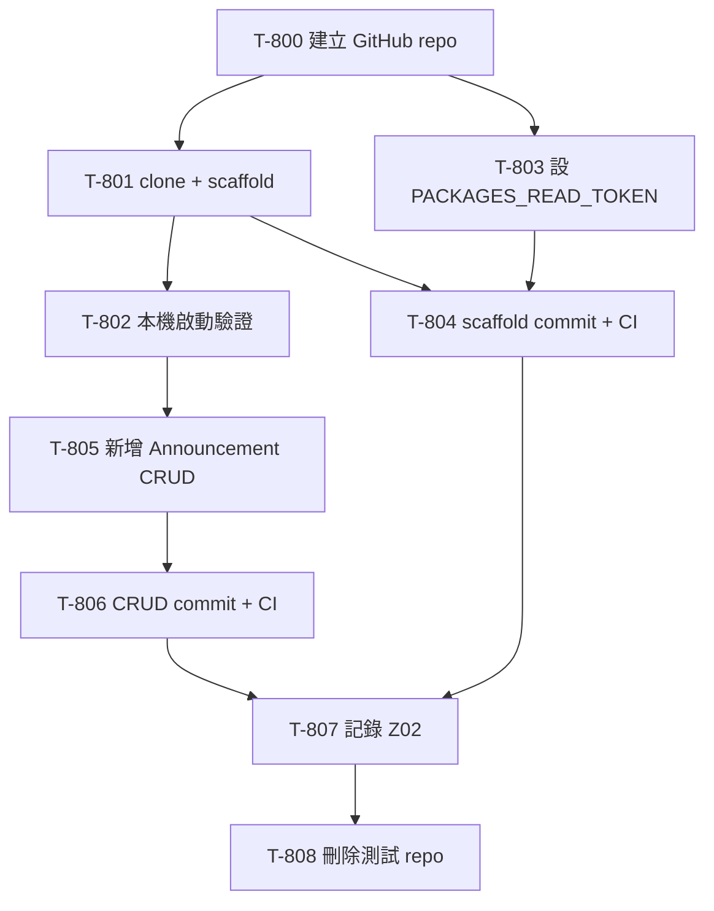

# 008 - App Template Fork 全流程驗證計劃

> 006（agent 文件入口機制 + `scaffold-init.mjs`）與 Z01（CI/CD fork readiness fixes）都已完成，`appspine-app-template` 理論上已可被 fork 成一個全新獨立 repo 並正常運作。但這件事先前沒有被完整驗證過。
>
> 本計劃的目標，是實際建立一個一次性的測試 repo，從 GitHub「Use this template」一路走到：
> 1. scaffold 完成
> 2. 本機可啟動
> 3. CI 綠燈
> 4. 依照 002 的標準流程新增一個 CRUD 模組
> 5. 再次確認 CI 綠燈
> 6. 視需要記錄新問題，最後刪除測試 repo

## 背景

`appspine-app-template` 的 README 已有「Forking this template」段落，但先前只驗過局部片段：

- `scaffold-init.mjs --dry-run` 曾驗過 token replacement
- template 自己 repo 內的 CI 曾修到可綠燈
- README 內的本機啟動步驟曾各自跑過

但還沒有完整驗證過這條真實路徑：

1. 在 GitHub 用 template 建出一個全新的 private repo
2. clone 到本機 `apps/<name>/`
3. 跑 scaffold
4. 設 repo secret
5. 本機跑起來
6. push 後 CI 綠燈
7. 在 fork 出來的 repo 內新增真實 CRUD 模組
8. 再跑一次 CI

另外，Z01 已指出 `PACKAGES_READ_TOKEN` 是 repo-level secret，新 repo 不會自動繼承，這是最容易被忽略的 fork 風險點。

## 驗證範圍

### A. 建立測試 repo

| 項目 | 決策 |
|---|---|
| GitHub 組織 | `appspine` |
| repo 型態 | `private` |
| repo 名稱 | `smoke-test-app` |
| scaffold `--name` | `smoke-test-app` |
| scaffold `--display-name` | `Smoke Test App` |
| 建立方式 | `gh repo create appspine/smoke-test-app --template appspine/appspine-app-template --private` |
| 本機 clone 位置 | `D:\Source\Private\appspine\apps\smoke-test-app\` |
| repo 性質 | disposable，一次性驗證後刪除 |

### B. Scaffold 驗證

依 README 的 forking flow：

1. 建 repo
2. clone 到本機
3. 執行：
   `node scripts/scaffold-init.mjs --name smoke-test-app --display-name "Smoke Test App"`
4. 驗證以下檔案內容已替換：
   - `frontend/package.json`
   - `backend/package.json`
   - `.env.example`
   - `README.md`
   - `CLAUDE.md`
   - `AGENTS.md`
   - `docs/agent-guide.md`
   - app config 相關內容

### C. 本機啟動與 Secret 驗證

需驗證：

- `pnpm install`
- `docker compose up -d db`
- `pnpm -C backend prisma:migrate`
- `pnpm -C backend prisma:seed`
- `pnpm dev`
- `GET http://localhost:3900/health`

另外要驗證：

- 新 repo 是否能正確設置 `PACKAGES_READ_TOKEN`
- push 後 GitHub Actions 是否能正常安裝 `@appspine/*` private packages

### D. CI 驗證

至少要做兩次：

1. scaffold commit push 後驗一次
2. CRUD commit push 後再驗一次

目標 workflow：`.github/workflows/e2e.yml`

### E. CRUD 驗證

依 [002-app-dev-conventions.md](../topics/002-app-dev-conventions.md) 的標準流程，新增一個 `Announcement` CRUD 模組。

欄位：

- `title: string`
- `body: text`
- `publishedAt: datetime`

需覆蓋：

1. Prisma schema + migration
2. enum / i18n
3. backend module / controller / service
4. MCP tool
5. frontend API
6. frontend admin 頁面
7. sidebar / breadcrumb / locale
8. typecheck
9. E2E
10. `schema:docs`
11. code review mindset 檢查
12. commit + push + CI

### F. 問題記錄與清理

若驗證過程發現：

- template 文件有落差
- framework / template 有新 bug
- CI / local flow 有新的操作坑

則補記到 `Z02-app-template-fork-validation.md`。

最後刪除：

- GitHub repo `appspine/smoke-test-app`
- 本機 clone `D:\Source\Private\appspine\apps\smoke-test-app\`

但刪除前仍需再次明確確認。

## 重要限制

1. `PACKAGES_READ_TOKEN` 需要使用者提供真實值。
2. T-808 刪 repo / 刪本機 clone 前，要再向使用者確認一次。
3. 若本機某步跑不起來，必須明確記錄「未執行 / 需使用者補做」。
4. 若發現 bug 要修：
   - `smoke-test-app` 自己的 CRUD / scaffold 問題，commit 進 `smoke-test-app`
   - `appspine-app-template` 或 `appspine` 的真正上游問題，commit 要進對應 repo，不可混進 `smoke-test-app`

## 依賴關係

## 預期產出

- `smoke-test-app` 測試 repo
- 一份可勾選、可回填實際結果的 task breakdown
- 明確結論：
  - fork flow 是否真的可行
  - CI 是否真的可綠燈
  - 002 的 CRUD 流程是否有落差
  - 是否需要開 Z02 記錄新問題

