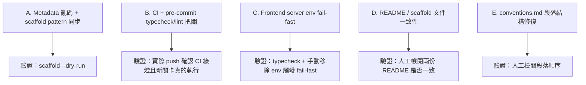

# 009 - App Template 品質改善計劃

> `appspine/smoke-test-app` fork 驗證(見 [008](008-app-template-fork-validation-plan.md)、
> [Z02](Z02-app-template-fork-validation.md))已證實 `appspine-app-template` 可以正常 fork、啟動、
> 過 CI。驗證完成後另外做了一輪針對 template 本身的品質審查,收集到 16 項可改善候選,並逐項評估過
> 「值不值得排時間做」。
>
> 本計劃只納入審查後判定為**必要**或**建議做**的項目(見下方「範圍」),目標是把 template 修到:
> 1. fork 出去的 app 不會帶著亂碼/殘留品牌字串
> 2. typecheck/lint 真的有機制在把關,不是只寫在文件裡
> 3. README 與 scaffold 產出的文件彼此一致、不會誤導新團隊
>
> 執行方式待定(可能由 Codex 執行),因此 task breakdown 必須寫得足夠獨立、可被沒有這次對話上下文的
> 執行者直接照著做。

## 背景

品質審查涵蓋 `appspine-app-template` 的 root scripts、README(s)、env 範例、CI workflow、Husky
hook、`package.json` scripts/dependencies、`docs/conventions.md`、frontend config、server API
helpers,共找到 16 項候選,審查後分成四級:

- 🔴 必要(2 項):真的是 bug,或安全網缺口,修法成本低。
- 🟡 建議做(4 項):真的有風險或會誤導,但成本也低。
- 🟢 可做可不做(7 項):價值有限,或屬於「有餘力再做」的順手項目,不納入本計劃,留在 backlog。
- ⚪ 不追蹤(3 項):不算真正的待辦項,不納入本計劃。

本計劃只處理 🔴 與 🟡,共 6 項。🟢 與 ⚪ 的完整清單與理由不再複製一份,已隨本次轉換一併結束追蹤。

## 範圍

### A. Frontend App Metadata 修復(對應原判定 🔴 #1)

- 檔案:`appspine-app-template/frontend/src/config/app-config.ts`
- `APP_CONFIG` 的 copyright 文字含有亂碼字元 `穢`(應為版權符號),meta description 在
  `fully customizable` 前也有一段標點符號亂碼。
- 預設 app identity 仍是上游 dashboard starter 的 `Studio Admin` 品牌殘留,應改為中性的 appspine
  template 預設值。
- `scripts/scaffold-init.mjs` 目前的字串替換規則是照著這些「已經壞掉」的字串寫的,修 metadata 的同時
  必須同步更新 `scaffold-init.mjs` 的 pattern,否則 scaffold 會失效。

### B. CI 與本機 pre-commit 的 typecheck/lint 把關(對應原判定 🔴 #4)

- 檔案:`appspine-app-template/.github/workflows/e2e.yml`、`appspine-app-template/.husky/pre-commit`
- `docs/conventions.md` 明文要求「`tsc --noEmit` 必須在每次 commit 前通過」,但目前:
  - CI(`e2e.yml`)從未明確執行過 root `pnpm typecheck`、root `pnpm check`、
    `pnpm -C backend check:enum-i18n`、`pnpm -C e2e typecheck`。
  - 本機 `.husky/pre-commit` 只跑 `check:enum-i18n`、`generate:presets`、`lint-staged`;
    `lint-staged` 只對 staged 檔案跑 `biome check --write`,從未跑過 `tsc --noEmit`。
- 需要在 CI 補一個 static-checks 關卡(可以是獨立 job,或 E2E 之前的步驟),並明確決定 pre-commit
  hook 要不要一起補 `tsc --noEmit`,或至少把「typecheck 只在 CI 把關」寫清楚。

### C. Frontend Server 環境變數 fail-fast(對應原判定 🟡 #2)

- 檔案:`appspine-app-template/frontend/src/server/api-client.ts`、
  `appspine-app-template/frontend/src/server/auth-actions.ts`
- 兩處在 `NEXT_PUBLIC_API_URL` 缺漏時會 fallback 回 `http://localhost:3900`,違反「原始碼不寫死
  host/port」的慣例,且在正式環境漏設環境變數時不會明確失敗。
- 改用一個會在缺漏時直接丟例外的 helper(例如 `readRequiredEnv()`),localhost 預設值只留在
  `.env.example` 和文件裡。

### D. README / scaffold 文件一致性(對應原判定 🟡 #8、#11)

- `appspine-app-template/README.md` 的「Adding a new CRUD module」段落目前指向 appspine workspace
  才有的 `_archive/dev_docs-20260803/framework/002-app-dev-conventions.md`——fork 出去的 repo 不會帶這個資料夾,連結對 forker
  來說是死的。應改指向 app repo 自己的 `docs/conventions.md`。
- `appspine-app-template/frontend/README.md` 是上游 `blank_shadcn_app` 留下的樣板文件,教讀者跑獨立
  `npm install`,和 root README 真正的 pnpm workspace + Docker + backend 流程互相矛盾,且從未被
  `scaffold-init.mjs` 處理過。需要刪除、精簡成純 frontend 專屬說明,或是納入 scaffold 的替換清單。

### E. `docs/conventions.md` 文件結構修復(對應原判定 🟡 #12)

- `## Comments & Documentation` 標題底下直接空接 `## Enum / i18n`,自己沒有內容;真正屬於
  Comments & Documentation 的內容(英文註解規則、Prisma `///` doc comment 要求、
  `docs/data-dictionary.md` 自動產生說明)反而錯落在 Enum/i18n 段落之後。
- 需要把內容搬回自己的標題底下,緊接在標題之後、Enum/i18n 段落之前。

## 不在本計劃範圍內

- 🟢 可做可不做的 7 項(FRONTEND_PORT 未被 dev script 吃到、Prisma migration 命名提醒、Husky
  npm/pnpm 混用、root check 涵蓋不全、local-auth 首次登入措辭、root package.json 名稱未改、缺
  `engines` 欄位)——留在既有的 backlog 認知裡,團隊有餘力可挑著做,不列入本次 task breakdown。
- ⚪ 不追蹤的 3 項(`@shadcn/react` 依賴確認、CI concurrency group、本機 ignore 檔案觀察)——判定
  不值得當作待辦項,不再提及。

## 重要限制

1. 所有修改只落在 `appspine-app-template` 這個 template repo,不影響任何已經 fork 出去的業務系統
   repo。
2. 每一項修正都要有明確的驗證方式(例如:改完 A 之後跑一次
   `node scripts/scaffold-init.mjs --dry-run --name smoke-test-app --display-name "Smoke Test App"`
   確認 scaffold 仍然匹配;改完 B 之後要實際 push 確認 CI 真的執行了新加的檢查步驟)。
3. Task breakdown 的撰寫要假設執行者(可能是 Codex,也可能是另一個 agent)沒有這次對話的隱性
   上下文,每個 task 都要給足夠的檔案路徑、指令、驗證步驟,可以獨立照做。
4. 這次修改不新增功能、不做預防性重構——只處理範圍 A~E 列出的具體問題,不要在修的過程中順手擴大
   範圍。

## 依賴關係

A、B、C、D、E 五個範圍彼此獨立,沒有互相依賴,可以平行進行或依任意順序處理。

## 預期產出

- `_archive/dev_docs-20260803/app-template/009-task-breakdown.md`:可勾選、可回填實際執行結果的任務清單。
- `appspine-app-template` 內對應範圍 A~E 的修正 commit(s)。
- 若執行過程中發現本計劃未預期的新問題,依既有慣例另開一份 Z 系列記錄文件。

