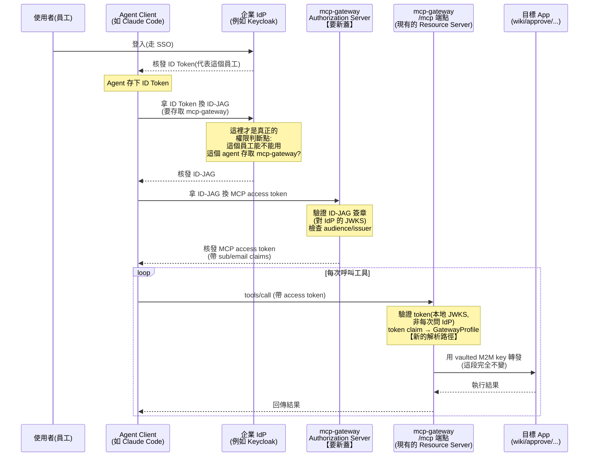

## 2026-08-03 審查修正完成

深度 code review findings 已全部處理並推送：補齊 MCP host/origin 設定模板、outputSchema 與 x-mcp-header production wiring、DNS pinning 防止 SSRF TOCTOU、嚴格 JSON-RPC/SSE response 驗證、legacy fallback 誤判修正、discovery push 後 catalog cache invalidation，以及 E2E fresh-build 與資料清理。Enterprise-Managed Authorization 維持由 Z30 專案專門處理。

驗證結果：shared MCP server 31 tests、gateway backend 64 tests、gateway golden-path E2E 1 passed；backend/frontend typecheck、build、Biome check 與 knowledge lint 均通過。提交：`appspine@d19eb3a`、`mcp-gateway@29abd6b`。

# 038 - MCP 規範 2026-07-28 版遷移計畫

> 狀態：**核心遷移、canary 發布與 template／既有 App 傳播已完成，跨 App rollout smoke 待部署環境執行**。
> 2026-07-30 提出，2026-08-03 執行更新。
> **決定**：升級時改用
> 拆分後的 `@modelcontextprotocol/server`（HTTP transport 另外加 `@modelcontextprotocol/node`），
> 不留在舊的統一 `@modelcontextprotocol/sdk`——§4 觀察觸發點第 1 點（上游 SDK 支援 2026-07-28
> 規範）已確認成立，細節見 §3。觸發點 2（`@appspine/mcp-server` 跟進升級底層套件）**尚未執行**，
> `@appspine/mcp-server` 已升級至 SDK v2；canary `0.6.0-mcp-2026-07-28.0` 已發布，並已傳播至
> `appspine-app-template` 與 8 個既有 business apps。
>
> 另外，2026-07-30 執行完成的 035（OIDC-only）已讓 appspine 有一個真的在運作的企業 IdP
> （Keycloak）。Enterprise-Managed Authorization 已另列為 [[Z30-mcp-auth-migration-feasibility]]
> 專門處理；038 只負責核心 MCP 協定、SDK 與 gateway client 的遷移，不把 EMA 實作混入本工作包。

## 1. 背景

Anthropic 於 2026-07-28 發佈 Model Context Protocol（MCP）第五個規範版本
（[官方公告](https://claude.com/blog/bringing-mcp-2026-07-28-to-claude?via=dailydev)、
[規範全文](https://modelcontextprotocol.io/specification/2026-07-28)），相對前一版
（2025-11-25）改動很大，核心方向是把協定從「雙向有狀態」改成「無狀態請求/回應」。appspine
的 MCP 相關實作以 `apps/mcp-gateway` 為主，涉及跨 App 的 MCP client/server 通訊，值得追蹤這次
改版對它的影響。

## 2. 規範重點異動

- **移除 protocol-level session**：拿掉 `Mcp-Session-Id` header 與 `initialize`/
  `notifications/initialized` 交握。每個 request 必須在 `_meta` 帶完整命名的
  `io.modelcontextprotocol/protocolVersion`、`io.modelcontextprotocol/clientCapabilities`；HTTP
  另外必須帶 `MCP-Protocol-Version` header。新增且要求 server 實作 `server/discover` RPC，client
  可用它事先查詢支援版本與 capabilities。
- **訂閱機制重構**：`resources/subscribe`、`resources/unsubscribe` 與 HTTP GET stream 換成單一
  `subscriptions/listen` 長連線；`ping`、`logging/setLevel` 與
  `notifications/roots/list_changed` 移除。
- **`resultType` 變成必填欄位**（`complete` / `input_required`），搭配新的 MRTR
  （Multi Round-Trip）模式取代原本 server 端主動發 `roots/list`、`sampling/createMessage`、
  `elicitation/create` 的做法。
- **棄用（不是立即移除）**：Roots、Sampling、Logging 三個 feature；HTTP+SSE transport；OAuth
  Dynamic Client Registration（改推 Client ID Metadata Documents）。現有實作仍須維持相容，最早可在
  2027-07-28 之後的規範版本移除 Roots/Sampling/Logging/Dynamic Client Registration。
- **授權面**：與正式的 OAuth 2.0 / OIDC 部署對齊，方便接 Entra、Okta 這類企業 IdP。
- `tools/list` 等 list 端點新增 `ttlMs`/`cacheScope` 快取提示欄位。
- Streamable HTTP POST 必須帶 `Mcp-Method` 與需要時的 `Mcp-Name`，且 header 與 JSON-RPC body
  不一致時 server 必須拒絕；另外新增 W3C Trace Context 的 `_meta` 傳遞慣例。
- Tools 的 `inputSchema`/`outputSchema` 放寬至 JSON Schema 2020-12；`structuredContent` 可為任意
  JSON 值。
- Claude 產品端另外推了 MCP Apps（對話內嵌互動 UI）、企業級連接器管理、MCP Tunnel（免公網連
  私網伺服器）——這些是 Claude host 端功能，跟協定規範本身是兩件事，不影響 appspine 的伺服器端
  實作。

## 3. appspine 現況與遷移範圍（2026-08-03 查證更新）

### 3.1 官方套件現況（2026-08-03）

- 官方 TypeScript SDK 已把統一套件 `@modelcontextprotocol/sdk` 拆成 `@modelcontextprotocol/server`
  （appspine 只需要這一半，見下方）、`@modelcontextprotocol/client`，另外拆出
  `@modelcontextprotocol/node`／`@modelcontextprotocol/express` 等輕量 adapter 套件。
- `@modelcontextprotocol/server` 與 `@modelcontextprotocol/node` 目前 npm `latest` 都是
  **`2.0.0` 正式版**；`@modelcontextprotocol/sdk` 的 `latest` 是 **`1.30.0`**。因此「拆分後
  server 套件已支援新版規範」已確認，但 appspine 尚未採用。
- 舊的統一套件 `@modelcontextprotocol/sdk` 停在 `1.30.0`（2026-07-27），尚未跟上新規範；官方
  保證至少還有 6 個月的 bugfix/security patch，不強制立即遷移，但新功能只會進拆分後的套件。
- appspine 只會用到拆分後的 `@modelcontextprotocol/server`：`packages/mcp-server` 是純 server
  端；`apps/mcp-gateway` 呼叫其他 App 的 [mcp-client.ts](../../apps/mcp-gateway/backend/src/mcp-client/mcp-client.ts)
  是手刻 JSON-RPC，完全沒用官方 SDK 的 client 模組——不需要 `@modelcontextprotocol/client`。

### 3.2 `@appspine/mcp-server` 的遷移動作（已查證 2.0.0 API 表面）

現況：[mcp.service.ts](../../appspine-packages/packages/mcp-server/src/mcp.service.ts) 用
`@modelcontextprotocol/sdk/server/mcp.js` 的 `McpServer`，
[mcp.controller.ts](../../appspine-packages/packages/mcp-server/src/mcp.controller.ts) 用
`@modelcontextprotocol/sdk/server/streamableHttp.js` 的 `StreamableHTTPServerTransport`
（已跑 stateless mode，`sessionIdGenerator: undefined`）。升級到 2.0.0 系列需要：

- **`McpServer`**：改從 `@modelcontextprotocol/server` 套件根匯出（`import { McpServer } from
  '@modelcontextprotocol/server'`），不再需要 `/server/mcp.js` 子路徑。`registerTool(...)` API
  沒變——appspine 已經在用這個新式 API，官方遷移 codemod（`.tool()` → `registerTool`）本來就不會
  動到既有程式碼。
- **`StreamableHTTPServerTransport`**：2.0.0 的 `@modelcontextprotocol/server` **已經不匯出**
  這個 class，搬到新的獨立套件 `@modelcontextprotocol/node`，改名
  `NodeStreamableHTTPServerTransport`，建構子參數 `{ sessionIdGenerator: undefined }` 相容，是
  stateless mode 的直接替代品。代表除了 `@modelcontextprotocol/server`，`packages/mcp-server`
  還要多裝一個 `@modelcontextprotocol/node` 依賴。
- 官方另有一個選用的 `@modelcontextprotocol/express` adapter（host header 驗證、
  `requireBearerAuth`、OAuth Protected Resource Metadata router）——appspine 現有的
  `ApiKeyGuard` 已經處理認證，這個 adapter 非必需，不需要引入。
- `server`／`node` 的正式版狀態已確認；`express` 是否需要引入仍維持「非必要」的判斷。

### 3.3 `apps/mcp-gateway` 的 `mcp-client.ts` 遷移範圍

[mcp-client.ts](../../apps/mcp-gateway/backend/src/mcp-client/mcp-client.ts) 這支手刻 JSON-RPC
client（gateway 呼叫「其他 appspine app」的 MCP endpoint 用的，不走官方 SDK）要改的地方：

- 硬編 `protocolVersion: "2024-11-05"`，且 `listMcpTools` 明確先送一次 `initialize` 交握——
  新規範徹底移除這個交握，改成每個 request 帶 `_meta`。
- `callMcpTool` 沒處理新的必填 `resultType` 欄位，也還沒讀取新的 `tools/list` 快取提示
  （`ttlMs`/`cacheScope`）——這點跟 gateway 自己的
  [ttl-cache.ts](../../apps/mcp-gateway/backend/src/gateway/ttl-cache.ts) 和
  [gateway-catalog.service.ts](../../apps/mcp-gateway/backend/src/gateway/gateway-catalog.service.ts)
  的快取邏輯有潛在的可整合空間。
- 現有 HTTP client 也沒有送新版必要的 `MCP-Protocol-Version`、`Mcp-Method`、`Mcp-Name` headers，
  不能只把 body 改成 `_meta`。目前 `parseSseJsonRpc` 假設每個 response 都只有一個 SSE `data:` 行，
  升級時需要以新版 Streamable HTTP 的 response/錯誤行為補測。

### 3.4 2026-08-03 查證結論

- `appspine/packages/mcp-server/package.json` 仍依賴 `@modelcontextprotocol/sdk@^1.29.0`，
  `mcp.service.ts` 仍從 `/server/mcp.js` 匯入 `McpServer`，`mcp.controller.ts` 仍從
  `/server/streamableHttp.js` 匯入舊 transport。
- `apps/mcp-gateway/backend/src/mcp-client/mcp-client.ts` 仍先送 legacy `initialize`，版本仍為
  `2024-11-05`；目前沒有新版 per-request metadata、protocol headers 或 `server/discover`。
- 因此目前可確認的是「升級目標與套件已就緒」，不是「appspine 已部分相容」。遷移前應先用一個
  dual-era 測試 server 驗證 legacy fallback，再切換 production path。

## 4. 觀察觸發點

1. `@modelcontextprotocol/sdk`（拆分後即 `@modelcontextprotocol/server`）發佈支援 2026-07-28 的
   版本——**已成立**（§3.1）。
2. `@appspine/mcp-server` 跟進升級底層套件——**尚未成立**，`package.json` 仍鎖
   `@modelcontextprotocol/sdk@^1.29.0`。
3. 任何外部 MCP client（非 appspine 自建）開始要求 2026-07-28 的 per-request metadata 與
   protocol headers 才能連線——尚未觀察到；但官方已提供 legacy/modern dual-era 相容策略，不能
   把「外部 client 尚未要求」當成延後實作的唯一理由。

## 5. 範圍界線：Enterprise-Managed Authorization

Enterprise-Managed Authorization 是有價值的企業授權擴充，但不屬於 038 的核心協定遷移範圍。
完整目標架構、分階段計畫、雙重認證、身份對應、稽核與風險，集中記錄於
[[Z30-mcp-auth-migration-feasibility]]。

規範：[extensions/auth/enterprise-managed-authorization](https://modelcontextprotocol.io/extensions/auth/enterprise-managed-authorization)

**與 038 的關係**：038 只需確保核心 MCP transport、protocol version、tool result 與 authorization
 metadata 的升級不會阻礙未來接入 EMA；不在 038 內建立 Authorization Server，也不改動現有 M2M key
流程。Z30 再處理以下企業授權問題：標準 MCP 授權是「每個使用者自己對每個 MCP server 做一次 OAuth
授權」，企業環境下 IT 沒辦法統一管控、onboarding/offboarding 都要一個服務一個服務手動處理。

**運作機制**：企業 IdP（Okta/Entra/公司 SSO）當授權的權威決策者。Client 先讓使用者用公司帳號
登入拿 ID Token，再拿 ID Token 跟 IdP 換一種特殊 token 叫 **ID-JAG**（Identity Assertion JWT
Authorization Grant，IdP 在這一步評估政策），最後拿 ID-JAG 跟 MCP 的 Authorization Server 換成
真正的 MCP access token。撤銷是在 IdP 那一層做一次，立即對所有 client 生效。

**與 appspine 的關聯**：它對應到 031「一人一 key」模式的撤銷粒度與企業集中治理問題；詳細方案已移至
Z30，不在此重複定義。

**appspine 現有基礎（2026-07-31 更新：IdP 前提已解決）**：appspine 現在有一個真的在運作的企業
IdP——035（[035-oidc-only-auth-plan.md](035-oidc-only-auth-plan.md)）已於
2026-07-30 執行完成，全部 App 已是 OIDC-only（Keycloak），`@appspine/auth` 的
`AUTH_MODE=oidc` 機制（[jwt-verifier.service.ts](../../appspine-packages/packages/auth/src/jwt-verifier.service.ts)）
用 `jwks-rsa` 對 Keycloak 的 JWKS endpoint 驗證 RS256 簽章、檢查 issuer/audience，再用 `email`
claim 查本地 `User` 表拿角色權限——這跟驗證 ID-JAG 需要的簽章驗證機制、以及規範建議的 account
linking 模式，底層原理相通。**但這條路徑是給真人登入各業務 app 自己的網頁前端用的**，跟
mcp-gateway 的 M2M key 認證是完全不同的通道，彼此互不相通——035 只解決了「appspine 有沒有可用
IdP」這個前提，不代表 mcp-gateway 的 agent/M2M 存取已經接上它。

**僅作為 Z30 的移交摘要**：035 完成後，以下事項仍未解決，因為它們是 mcp-gateway `/mcp` 端點本身要新蓋的
東西，跟真人登入走哪個 IdP 是兩層不同的事）：

1. **mcp-gateway 沒有 Authorization Server**——現在的「access」是一把靜態 M2M key
   （`x-api-key` header，`@appspine/m2m-api-key` 核發），沒有任何 token 簽發流程。要接這個擴展
   等於要新蓋一層：驗證 ID-JAG 簽章（audience/issuer 對到 IdP）、簽發 MCP access token。
2. **Profile 解析邏輯要換一條路**——現在
   [gateway-profile-resolver.service.ts](../../apps/mcp-gateway/backend/src/gateway/gateway-profile-resolver.service.ts)
   是「拿 `apiKeyId` 查 `GatewayProfileApiKey` 這張手動綁定表」。ID-JAG 模式下身份是每次請求
   即時從 token claim（`sub`/`email`）來的，不一定有事先手動綁定的 row，需要新增一條
   「JWT claim → GatewayProfile」的解析路徑（可參考 `buildOidcJwtUser` 的 email 對應寫法，但是
   新程式碼，非重用）。
3. **appspine 只需扮演 MCP Server + Authorization Server 角色**——ID-JAG 交換是呼叫端（例如
   Claude Desktop 自己）的責任，appspine 不需要實作 client 端那段，範圍比乍看小。
4. **要跟現行 M2M key 並存，不是取代**——規範本身是 opt-in 擴展；031 的「一人一 key」是已上線
   的正式流程，不能貿然砍掉，架構上要讓同一個 `/mcp` 端點同時接受兩種認證方式。

### 5.1 概念釐清：人員委派模式 vs 服務帳號模式

討論中曾經對「agent 設成一個帳號」這句話的理解有落差，釐清如下——Enterprise-Managed
Authorization 的 ID-JAG 流程裡，流過整條鏈路的身份是**登入 client 的那個真人員工**，不是
「agent 這個帳號本身」。這其實是兩種不同的模式：

1. **人員委派模式（此擴展實際設計的模式）**：agent 替某個真人員工做事，權限判斷對象是「這個
   員工在 IdP 裡的 group/role」，agent 本身沒有獨立身份，只是拿著員工的委派憑證去呼叫 MCP
   server。撤銷/權限異動都是針對「這個員工」在 IdP 裡做。
2. **服務帳號模式（IdP 也支援，但不是這個擴展定義的東西）**：agent 自己在 IdP 裡有一個獨立的
   機器身份（如 Entra service principal），用 client credentials 直接拿 token，不經過任何真人
   登入。稽核鏈路上看不到「這是替哪個人做的」，只看得到「這個 agent 做的」。

appspine 現有 031 的「一人一 key」模型，其實已經是**模式 1 的手動土炮版**——一把 M2M key 綁定
一個真人 profile，稽核記錄的是「這個人」而不是「這個 agent」。導入 Enterprise-Managed Auth，
本質上是把「admin 手動核發一把 key 綁某個人」換成「這個人本來就有的 SSO 身份，透過 ID-JAG 委派
給 agent 用」——是同一套「稽核到人」的邏輯換一種實作方式，不是全新的概念。

### 5.2 具體流程（appspine 對應版）

把規範的通用流程換成 appspine 的實際元件名稱：

對照重點：

1. **權限判斷發生在「換 ID-JAG」那一步**，由 IdP 決定「這個員工能不能用這個 agent 碰
   mcp-gateway」。之後 mcp-gateway 端只驗證票是不是真的，不重新做一次授權判斷。
2. **要新蓋的只有 `GW_AS` 這個角色**（驗證 ID-JAG、簽發 MCP access token）跟 `GW_RS` 裡
   「token claim → GatewayProfile」這條新解析路徑（取代現在
   [gateway-profile-resolver.service.ts](../../apps/mcp-gateway/backend/src/gateway/gateway-profile-resolver.service.ts)
   的「apiKeyId 查手動綁定表」）。
3. **mcp-gateway 呼叫其他 App 的那一段完全不受影響**——[mcp-client.ts](../../apps/mcp-gateway/backend/src/mcp-client/mcp-client.ts)
   用 vaulted M2M key 轉發到 target app，是 mcp-gateway 自己的內部機制，跟「員工怎麼被授權碰
   mcp-gateway」是兩層不同的事，不會被這次改動牽動到。
4. **撤銷生效點在 IdP**：員工被停權/離職，IdP 不再核發新 ID-JAG 給他，所有 agent 呼叫立刻斷，
   mcp-gateway 端不用做任何事。

### 5.3 MCP Apps（僅記錄，未深入討論）

指南：[extensions/apps/build](https://modelcontextprotocol.io/extensions/apps/build)

讓 tool 呼叫結果可以在對話中渲染成互動式 UI（表單、圖表等），跑在 host 提供的沙盒 iframe。
Server 端用 `registerAppTool`/`registerAppResource`（`_meta.ui.resourceUri`，`ui://` scheme）
註冊，client 端（UI）用 `@modelcontextprotocol/ext-apps` 的 `App` class 跟 host 溝通。目前只有
Claude（web/desktop）等少數 host 支援渲染。

appspine 各業務 app 的 MCP 介面主要給 agent 程式化呼叫（Claude Code），不是人類在 Claude 聊天
視窗操作。若未來有人類透過 Claude custom connector 連上 mcp-gateway，approve 的簽核卡片、
calendar 的排程小工具等可以考慮做這層 UI，但這是一整條平行於現有前端的呈現層，不是現有架構的
自然延伸。

## 6. 執行工作包與 rollout 順序

### 工作包 A：SDK v2 compatibility spike

- 建立最小 `@modelcontextprotocol/server@2` + `@modelcontextprotocol/node@2` 測試 server。
- 驗證 `McpServer`、`NodeStreamableHTTPServerTransport`、`registerTool` 與 response 格式。
- 決定 dual-era client 的版本偵測、fallback 與 origin-level cache 行為。

### 工作包 B：升級 `@appspine/mcp-server`

- 更新 `packages/mcp-server/package.json` 與兩個 import 路徑。
- 補上新版 transport 的 `Mcp-Method`／`Mcp-Name`／protocol-version 驗證。
- 明確處理 `Origin` header 與 DNS rebinding 防護；這與 `ApiKeyGuard` 是不同的安全責任。

### 工作包 C：改造 gateway client

- 送出 modern per-request `_meta` 與必要的 HTTP headers。
- 先送 modern request；依 HTTP `400` 回應中的 JSON-RPC error 判斷是否為 legacy server，再 fallback
  到 `initialize`，並按 target origin 快取判斷結果。
- 支援 `server/discover`、`resultType`、`ttlMs`、`cacheScope`、`structuredContent`。
- 支援工具 schema 的 `x-mcp-header` 到 `Mcp-Param-*` 映射，並對 header value 做安全編碼。

### 工作包 D：相容性測試

- 覆蓋 modern client ↔ modern server。
- 覆蓋 dual-era client ↔ legacy server fallback。
- 覆蓋 legacy client ↔ dual-era server。
- 覆蓋 `server/discover`、unsupported version、header mismatch、Origin 驗證與錯誤 response。
- 覆蓋 `application/json`、單事件 SSE 與多事件 SSE response，不再只取第一個 `data:` 行。

### 工作包 E：套件發布與 App 傳播

- 發布新的 `@appspine/mcp-server` 版本。
- 依 template propagation 流程更新 `appspine-app-template` 與既有 business app。
- 確認升級期間舊版 gateway 與尚未升級的 App 仍可互通。

### 工作包 F：文件與驗證收尾

- 更新 gateway README、E2E mock 與 golden-path 測試中的 legacy handshake 假設。
- 更新 knowledge index／log，並執行跨 repo knowledge lint。

**Rollout 順序**：A → C → D → B → E → F。先讓 gateway client 具備 modern／legacy 相容能力，
再升級 server package 與各 App，避免新版 server 先上線後無法被現行 gateway 呼叫。

## 7. 完成條件

- modern client ↔ modern server、dual-era client ↔ legacy server、legacy client ↔ dual-era server
  三種主要組合皆通過。
- `server/discover`、unsupported version、header mismatch、Origin 驗證都有可預期結果。
- legacy result 缺少 `resultType` 時按 `complete` 處理；`input_required` 不會被誤判為完成。
- `ttlMs`／`cacheScope` 快取不會造成不同 GatewayProfile 之間的資料洩漏。
- `application/json` 與多事件 SSE response 都能正確解析。
- `x-mcp-header` 映射、schema、tool call、錯誤處理與 workflow audit 全部通過測試。
- `pnpm` build、typecheck、Biome、unit test、golden-path E2E、template propagation 檢查與
  knowledge lint 全部通過。
- 舊版 M2M key、尚未升級的 business app 與 gateway-to-app vaulted key 流程不受破壞。

## 7.1 完成證據（2026-08-03）

- `@appspine/mcp-server@0.6.0-mcp-2026-07-28.0` 已發布至 `mcp-2026-07-28` dist-tag，template 與 8 個既有 App 已完成 canary propagation。
- `apps/mcp-gateway` backend regression：63 tests passed；E2E golden path：1 passed；E2E typecheck、Biome、backend typecheck 通過。
- Docker runtime 中 Keycloak、Gateway、Wiki 與 PostgreSQL health checks 通過；未授權 MCP request 回傳 403。
- 真實 Gateway → Wiki 流程以 AES-256-GCM vaulted M2M key 完成 `wiki_list_wiki_spaces` call，HTTP 200 且回傳 content；測試資料已清除。
- Roots、Sampling、Logging 與 Dynamic Client Registration 目前沒有 App 實作；Enterprise-Managed Authorization 明確由 [[Z30-mcp-auth-migration-feasibility]] 處理。
- rollback rehearsal 已驗證上一版 package／lockfile 恢復、origin detection cache 清除、legacy fallback regression 與重新 smoke 的步驟；生產環境仍須依同一停止條件執行。

## 8. 待確認問題

**核心協定遷移（§3）**：

1. `mcp-client.ts` 遷移應採「modern request + legacy fallback」還是先只支援 modern？目前建議前者，
   因為 appspine 仍會呼叫尚未升級的 business app。
2. `resultType`、`ttlMs`/`cacheScope`、`Mcp-Method`/`Mcp-Name` headers、`server/discover`、
   JSON Schema 2020-12 應納入同一個協定相容性工作包，避免只完成 import 變更卻仍無法互通。
3. Roots、Sampling、Logging 三個被棄用的 feature，appspine 目前有沒有任何 App 用到——需要盤點；
   但不需要因為本次版本而立即刪除。

**Enterprise-Managed Authorization（已移交 Z30）**：

4. 038 只需確認核心 MCP 遷移不會阻礙未來 EMA；EMA 的 Authorization Server、雙重認證、account
   linking 與 Keycloak policy mapping，改由 [[Z30-mcp-auth-migration-feasibility]]
   追蹤。
