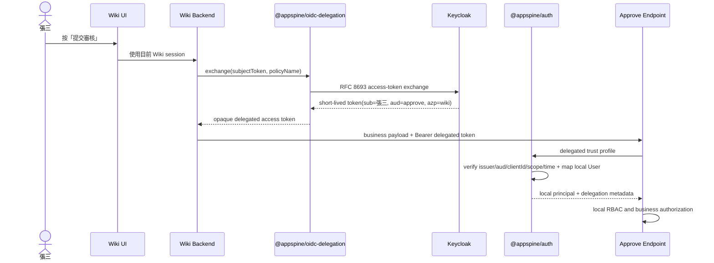

# 042 - `@appspine/oidc-delegation` 共用身分委派套件計畫

> 狀態：**已完成（29/29）**。`@appspine/auth@6.1.0` 與 `@appspine/oidc-delegation@0.2.0` 已
> 正式發布並經乾淨 fixture 驗證；§16 完成定義與 §17.2 執行 gate 已逐項核對，無未解項。
> 實作順序、變更範圍、依賴與驗收見
> [log.md](../log.md)。
>
> **2026-08-07 深度 code review 修正已完成、尚未重新發布**：原始 29 項交付仍維持完成；
> review 發現的 TTL 契約、Keycloak client 最小權限、嚴格 `email_verified`、future `iat`、
> per-policy circuit breaker、bounded/redacted rejection log、啟動設定驗證、RFC token response、
> JIT audit、CI tested-image promotion 與文件漂移，均已在 source 修正並建立 changeset。正式 registry
> 版本仍是 `@appspine/auth@6.1.0`／`@appspine/oidc-delegation@0.2.0`；未經另一次人工發布授權不
> 自動發版。修正明細與驗證證據見 [log.md](../log.md) §6。
>
> 第一個安全驗證場景是 `wiki → approve`，但 042 **不實作** Wiki 的「提交審核」按鈕、
> `KnowledgeDocumentChangeRequest` 或文件發布流程；這些業務功能仍由
> [[Z31-document-governance-workflow-plan]] 負責。042 只交付可供 Z31 使用的身分委派能力與
> 真實 Keycloak client policy 證據。
>
> **2026-08-06 獨立 Opus 覆核後已修訂**：找出 2 項 Critical（delegated 路徑會被現有
> `@appspine/auth` JIT provisioning 邏輯自動建帳號並發預設角色，與 §11「Wiki-only user 必須
> 403」直接矛盾；`subjectToken` 未綁定本次請求已驗證的 bearer，source app 可能被當作 token
> laundering oracle）與 10 項 Major（含與 040 §2.3 的 audience mapper 機制衝突、遺漏
> `@appspine/m2m-api-key` 的既有 Guard 鏈、`buildOidcJwtUser()` 重構風險、clock skew 容忍度
> 未定義等）。全部已併入本版，完整覆核記錄見 §18。
>
> **2026-08-06 T-16610 真實 Keycloak 26.2.5 disposable POC 已證實上述 token laundering
> 疑慮確實可利用**：在忠實複製 appspine 當時 `fullScopeAllowed: true` 現況的環境下，
> `chat` 簽發的 subject token 能被 `wiki` 成功交換成 `approve` 的合法 delegated
> token，Keycloak 完全不擋。outbound sanity check（§2 決策 13、§8）因此從建議的
> defense-in-depth 改列為**強制的主要控制**；§17.2 gate 9 已同步修訂。完整證據見
> [log.md](../log.md) §4「T-16610」。

## 1. 背景與問題

appspine 的每個 business app 都有自己的 OIDC audience、RBAC 與本地 User 資料。使用者登入
Wiki 時，Wiki 能驗證「張三是誰」；但當 Wiki backend 代表張三呼叫 Approve 時，Approve 必須
仍然辨識原始使用者，而不是只看到 Wiki service account。

現有機制不能安全完成這件事：

- 使用者 JWT 只能交給原 audience；把 Wiki token 原封不動轉送給 Approve 會破壞 audience
  boundary，亦與 040 已完成的 `azp` hardening 衝突。
- M2M API key 適合 service account，不適合代表任意人類使用者。
- `requesterId`、`X-User-Id` 或自訂 signed header 都會另造一套身分協定，且容易被偽造、重放或
  錯誤稽核。
- **已評估並排除：讓瀏覽器直接對 target app 走一次獨立 OIDC 登入**（Wiki 前端多接一個 approve
  provider 或 silent auth，取得 `aud=approve, azp=approve` 的正規 token 後直接呼叫 approve
  API）。此法不破壞 audience boundary、不需要升級 Keycloak、不需要新 package，複雜度遠低於
  Token Exchange。排除理由是 **payload integrity**：業務 payload（例如
  `ownerDepartmentId`、revision reference、requester identity）必須由 source backend 主導組裝
  並驗證，不能交給瀏覽器直接對 target app 送出未經 source backend 檢查的請求（見 §11）；此外
  存在二次登入／consent 的 UX 成本與跨 App CORS 設定成本。

因此需要使用標準 OAuth 2.0 Token Exchange，讓 source backend 以目前使用者的 access token
換取只供 target app 使用的短效 access token。

## 2. 審查後決策摘要

1. 建立 backend-only 的 `@appspine/oidc-delegation`；第一版不提供 frontend helper。
2. 套件提供 provider-neutral 的「具名交換政策」與錯誤 contract；第一個、也是第一版唯一的
   provider adapter 是 Keycloak Standard Token Exchange V2。
3. 呼叫端只能傳入 `subjectToken` 與預先註冊的 `policy` 名稱。`sourceApp`、raw audience 與 raw
   scopes 不得成為每次呼叫可任意指定的參數。
4. `source client` 由 backend 持有的 confidential-client credential 決定；每個 source app
   擁有自己的最小權限 credential，不建立中央 delegation service。**「最小權限」須為獨立的
   delegation 專用 confidential client**（例如 `wiki-delegation`），而非沿用 Wiki 前端登入用的
   OIDC client——沿用登入 client 會讓「持有 wiki 登入 secret」等同「可代任意持有 wiki token
   的使用者鑄造 approve token」。T-16610 需先實測獨立 client 是否可行（見 §10、§17.2）；不可行
   時必須在 §12.2 明確記錄此項殘餘風險，不得沉默沿用登入 client。
5. `@appspine/oidc-delegation` 負責 outbound exchange、provider adapter、安全錯誤與測試 fake；
   **inbound JWT 驗證、local User mapping、principal、Guard 與 RBAC 整合由 `@appspine/auth`
   擁有**。兩個 package 不互相依賴。
6. 一般登入 token 與 delegated token 使用不同 trust profile。delegated profile 只能由指定
   endpoint 明確啟用，不能全域放寬 040 的 `azp === OIDC_AUDIENCE` 規則。
7. Keycloak delegated token 的 requester client 以 `azp` 表示；provider-neutral inbound contract
   正規化為 `clientId`，其他 provider 可使用 RFC 9068 的 `client_id`。`act` 不是第一版授權依據。
8. Approve 從驗證後的 principal 取得 requester；request body 不接受 `requesterId` 或
   `actingUserId`。
9. Token exchange 只提供 transport-level delegation capability；Approve 自己的 local RBAC、
   resource ownership 與 self-approval 規則仍是最終業務授權。
10. 目前 [`dev-infra/docker-compose.yml`](dev-infra repo docker-compose.yml) 使用 Keycloak 26.0；
    042 將升級至至少 26.2 並設定 Standard Token Exchange V2，這是實作前置條件，不另拆 infra
    plan。
11. 042 以真實 `wiki → approve` client policy 做整合測試，但不修改兩個 App 的業務程式碼；
    package core 內不得出現 Wiki、Approve、文件異動 endpoint 或業務 scope 常數。
12. **delegated 路徑預設不 JIT provisioning。** `@appspine/auth` 現行 `buildOidcJwtUser()` 找不到
    local user 時會呼叫 `provisionOidcUser()` 無條件建帳號並指派預設角色（一般登入靠 Keycloak
    per-client access check 擋掉未授權使用者，delegated 流程完全繞過這道閘門）。
    `DelegatedOidcTrustProfile` 新增 `provisioning: 'never' | 'jit'`，**預設 `never`**：找不到
    active local user 一律回**統一不透明 401**（與現行 `buildOidcJwtUser()` 對「查無 local
    account」既有的 401 慣例一致，且與 §13 的「delegated 身分映射錯誤一律統一 401」對齊；
    403 保留給下一步 PermissionGuard／RBAC 對「身分已確認但權限不足」的判斷，見 §9 步驟 9、
    §11），不自動建立帳號。開啟 `jit` 需 profile 明確 opt-in，且必須有對應 provisioning audit
    事件（見 §9、§11）。
13. **`subjectToken` 必須是本次 inbound request 中已由 `@appspine/auth` 驗證通過的 bearer**，
    不得來自 request body、header 或任何 caller 可控來源；outbound adapter 送出前**必須**對其做
    非授權性 sanity check（decode 後確認 `azp`/`client_id` 等於本 app 的
    `subjectTokenIssuerClientId` 才送出，
    不符即本地 fail closed）。此檢查不構成授權判斷（§8 的「opaque credential」原則不變），
    且**不是可選的 defense-in-depth**：T-16610 已用真實 Keycloak 26.2.5 證實，只要
    `fullScopeAllowed: true` 與 audience-resolve 的 baseline 現況存在（見 §10、040 §2.3），
    Keycloak Standard Token Exchange V2 的 audience-based 保護對「用別的 app 簽發的 token
    冒充自己的 subject token」完全無效。2026-08-07 起正式 delegation client 已收斂為
    `fullScopeAllowed: false`，但 outbound sanity check 仍是 mandatory control，兩層不得互相
    取代（見 §8 完整證據）。
14. **Approve 的 audience 來源必須是專屬 delegation client scope 上的 hardcoded audience
    mapper**，不得依賴 `roles` client scope 的 audience-resolve mapper 或
    `fullScopeAllowed: true`——後者正是 [[040-oidc-audience-azp-hardening-plan]] §2.3
    列為建議收斂對象的機制。042 若依賴它，會與 040 第二階段（關閉 `fullScopeAllowed`）互相
    衝突（見 §10）。
15. Delegation scope 採統一命名空間 `<targetApp>:<resource>:<action>`；inbound 驗證除比對
    `requiredScopes` 外，對符合此命名空間但未列入 policy 的 scope 一律拒絕，命名空間外的
    scope（`openid`/`profile`/`email` 等）忽略（見 §9）。
16. Delegated token 的 TTL 必須由三層一致執行：Keycloak 的 delegation client 簽發 120 秒、
    outbound policy 以 `maxExpiresInSeconds=120` 拒絕任何過長 provider response、target app 再以
    `maxTokenAgeSeconds=120` 驗證 JWT lifespan/age。三者是相互獨立的縱深防禦；任一層不一致都
    fail closed，不得把 inbound 檢查當成允許 IdP 簽發過長 token 的補償機制（見 §10、§17.2）。

## 3. 目標與非目標

### 3.1 目標

- 讓一個 backend 安全地以目前使用者身分呼叫另一個 app。
- 保留 external subject，並由 target app 建立自己的 local principal、RBAC 與 audit context。
- 將 source client、target audience、delegation scope 與 token lifetime 限制在明確政策內。
- 讓錯誤 audience、錯誤 caller、scope escalation、token replay 與 secret/token 洩漏能被測試與觀測。
- 以真實 Keycloak 及 `wiki → approve` policy 驗證 package，而不是只做 mock unit test。
- 為 Z31 提供穩定、可發版安裝的 backend package 與 `@appspine/auth` delegated trust profile。

### 3.2 非目標

- 不建立中央 user service 或中央 delegation service。
- 不取代 `@appspine/auth` 的一般 OIDC 登入驗證。
- 不用 API key 或 service account 冒充人類使用者。
- 不在 package 內決定業務 App 的 permission、資料 ownership 或 workflow policy。
- 不在 042 實作 Wiki、Approve 或 `KnowledgeDocumentChangeRequest` 的業務功能。
- 不建立 Wiki/Approve 共用資料模型、共用 Prisma schema 或直接資料庫存取。
- 不在第一版支援 refresh token、offline access、token cache、`resource` parameter、DPoP 或 mTLS。
- 不為了證明 abstraction 同時實作第二個 IdP adapter。

## 4. 信任模型與名詞

```text
subject token       使用者登入 source app 後取得的 access token
external subject    IdP 內的使用者，由 issuer + sub 唯一識別
source client       發起 exchange 的 confidential OIDC client，例如 wiki
target audience     delegated token 唯一可使用的 resource server，例如 approve
delegation policy   source backend 預先註冊的 audience、scopes、TTL 安全設定
delegated token     IdP 換發、只供 target app 使用的短效 bearer access token
local principal     target app 依既有 User mapping 建立的 app-local JwtUser
```

Keycloak V2 的第一個實測預期為：

```text
sub = 原始使用者
aud = approve
azp = wiki
scope contains approve:knowledge-document-change:submit
```

`azp = wiki` 是正常結果，不能套用一般登入 token 的 `azp = approve` 規則。inbound delegated
profile 應將 `azp` 正規化為 `clientId`；若未來 provider 使用 RFC 9068 `client_id`，則讀取
`client_id`。兩者同時存在但值不一致時 fail closed。`act` 只保留為可選診斷資訊，第一版不以它
識別 source client 或授權。

## 5. Wiki ↔ Approve 的耦合邊界

`wiki → approve` 是一條刻意建立、最小化的信任關係，不是任意 app mesh：

| 邊界 | 允許 | 禁止 |
|---|---|---|
| Keycloak policy | `wiki` 只能交換 `approve` audience 與核准提交 scope | 任意 source、audience 或 scope |
| 042 package | 以具名 policy 執行交換 | hardcode Wiki/Approve/文件異動語意 |
| Wiki integration | 依賴一個窄的 Approve façade | import Approve service、schema 或 workflow internals |
| Approve integration | 接受 immutable revision reference 與 delegated principal | 讀 Wiki DB、保存文件正文、接受 body requesterId |
| 核准結果 | transaction 完成後以 outbox event 或固定 relay 通知 | 在 Approve transaction 內同步呼叫 Wiki |
| callback | 固定、部署時設定並驗證的 destination | request body 提供任意 callback URL |

042 本身只驗證前兩列。後四列由 Z31 實作與驗收。這個切法讓安全政策明確 allowlist
`wiki → approve`，但 package、認證框架與兩個 app 的資料模型不互相耦合。

## 6. 參考架構



瀏覽器不得取得 delegated token 或 source client secret。`subjectToken` 是**本次 inbound request
中已由 `@appspine/auth` 驗證通過的 bearer**（見 §2 決策 13）——不是從 NextAuth session 或任何
其他持久化存放位置讀出；040 §1.3 已記錄 Wiki 前端刻意不把 access token 放進瀏覽器可讀的
session，Wiki backend 也不應把它另外存進自己的 session store。Wiki backend 收到已驗證的
inbound bearer 後立即執行 exchange，並立即呼叫 target app。

## 7. Package 邊界與依賴方向

### 7.1 `@appspine/oidc-delegation` 負責

- 具名 delegation policy registry 與 fail-fast configuration validation
- provider-neutral outbound exchange interface
- Keycloak Standard Token Exchange V2 adapter
- timeout、response validation、安全錯誤分類與 redacted observability
- access-token-only response contract
- fake provider、HTTP fixture 與 testing export
- backend package 文件與 provider configuration guide

### 7.2 `@appspine/auth` 負責

- delegated JWT signature、algorithm、issuer、audience 與 time claim 驗證
- `azp`／`client_id` 到 normalized `clientId` 的 fail-closed mapping
- required scopes、allowed source clients 與 maximum token age 驗證
- external identity 到 local User 的既有 mapping 與 JIT 規則
- local `JwtUser`、delegation metadata、Guard/decorator、RBAC 與 audit context 整合
- 一般登入 trust profile 的完整回歸保護

### 7.3 明確依賴方向

```text
source app  ──depends on──> @appspine/oidc-delegation
target app  ──depends on──> @appspine/auth

@appspine/oidc-delegation  X  @appspine/auth
```

兩個 package 不互相 import。OIDC/JWT 標準 claims 是兩邊的邊界契約，不另外建立一個同時綁住
outbound provider adapter 與 inbound auth framework 的 shared runtime model。

### 7.4 與既有 `@appspine/m2m-api-key` Guard 鏈的邊界

Approve 現有業務 endpoint 一律掛 `@UseGuards(JwtOrApiKeyGuard, PermissionGuard, ScopeGuard)`；
`JwtOrApiKeyGuard`（`@appspine/m2m-api-key`）是 OR 語意的複合 guard——沒有 `X-Api-Key` header
時回傳 `false`（非 throw）並 fallback 到 `@appspine/auth` 的 `JwtAuthGuard`。Delegated Guard
**不得**被加成這條 OR-chain 的第三個分支：

- delegated 驗證必須是獨立、AND 語意的具名 Guard（例如 `DelegatedAuthGuard`），只掛在明確標註
  `@DelegatedProfile(...)` 的 endpoint 上；忘記標註的一般 endpoint 打 delegated token 必須
  401（見 §9）。
- `ScopeGuard` 既有的 `@Scopes()` 是針對 API key 的 scope 機制，命名慣例
  （例如 `approve-leave-requests:read`）與 delegation scope（`approve:knowledge-document-change:submit`，
  見 §2 決策 15）不同、也不是同一套驗證邏輯，兩者不得混用或互相假設對方已檢查。
- T-16600 baseline 需盤點 `@appspine/m2m-api-key` 現況並補進本節依賴圖；T-16930 需定案
  delegated Guard 與既有 OR-chain 的具體組合方式。

## 8. Outbound API 定稿方向

呼叫端只能選擇已註冊政策：

```ts
type ExchangeDelegatedTokenInput = {
  subjectToken: string;
  policy: string;
};

type DelegatedAccessToken = {
  accessToken: string;
  tokenType: "Bearer";
  expiresInSeconds: number;
};

interface OidcDelegationClient {
  exchange(input: ExchangeDelegatedTokenInput): Promise<DelegatedAccessToken>;
}
```

Source backend 在啟動時註冊政策：

```ts
{
  policies: {
    "submit-knowledge-document-change": {
      targetAudience: "approve",
      requestedScopes: ["approve:knowledge-document-change:submit"],
      maxExpiresInSeconds: 120,
    },
  },
}
```

使用方式：

```ts
const delegated = await oidcDelegation.exchange({
  subjectToken: currentUserAccessToken,
  policy: "submit-knowledge-document-change",
});
```

安全語意：

- `source clientId`、client secret 與 token endpoint 來自 provider configuration，不接受 call-site
  覆寫；token endpoint 預設必須 HTTPS，HTTP 只允許隔離開發環境明確 opt-in。
- `targetAudience`、`requestedScopes` 與 maximum TTL 只存在於 server-side policy registry；未知 policy
  必須在啟動或呼叫時 fail closed，provider response 的 `expires_in` 超過 policy maximum 時不得
  回傳 token。
- **`subjectToken` 必須是本次 inbound request 中已由 `@appspine/auth` 驗證通過的 bearer**（見
  §2 決策 13），不得是 request body、header 或任何其他 caller 可控來源提供的字串。這是縱深防禦
  的第一道——若 source backend 把「請求帶來的任意 bearer」不加分辨地餵進 `exchange()`，且該
  bearer 恰好是別的 app 簽發、audience 又涵蓋自己時（見 040 §1.3 的跨 App `aud` 現況），
  就可能把別的 app 的 token「洗」成合法 delegated token，讓 040 剛堵上的跨 App 重放以標準
  協定重新打開一條通道。
- `subjectToken` 必須是 access token，不接受 ID token；adapter 必須驗證其 token type（見 §9
  的型別檢查）。
- **outbound adapter 在送出交換請求前，必須對 `subjectToken` 做一次非授權性 sanity check**：
  decode（不驗簽）後確認 `azp` 或 `client_id` 屬於 source app 自己的 client id，不符即本地
  fail closed，不送出交換請求。**這道檢查是強制的主要控制，不是可選的縱深防禦**——
  T-16610 已用真實 Keycloak 26.2.5（disposable realm）驗證：Keycloak Standard Token
  Exchange V2 的實際防線是「requester client 必須在 subject token 的 `aud` 內」（錯誤碼
  `access_denied: Client is not within the token audience`），**不是**「subject token 的
  `azp` 必須等於 requester」。用一個忠實複製目前 appspine 現況（`fullScopeAllowed: true` ×
  `roles` scope 的 audience-resolve mapper，見 §10、T-16600 baseline）的 disposable realm
  重現：當某使用者對 `wiki` 也有 client role（如同真實環境的 `dev-user`／`dev-admin` 對多個
  App 都有權限）時，`chat` 簽發給該使用者的 token 的 `aud` 會自動包含 `wiki`——此時
  `wiki`（作為 requester）**成功**用這張 `chat` 簽發的 token 換到了 `approve` 的 delegated
  token（`azp` 正確顯示為 `wiki`，`sub` 仍是原使用者）。把同一個 issuing client 的
  `fullScopeAllowed` 關掉、`aud` 重新收斂為窄集合後，同一組請求才被 Keycloak 拒絕。
  **結論：Keycloak 側的 audience-based 保護，只有在 `fullScopeAllowed` 收斂已執行時才有效。
  T-16600 baseline 與 042 原始交付當下仍是 `fullScopeAllowed: true`，因此當時 Keycloak 本身
  完全不能防止 source backend 把別的 app 簽發的 token 洗成 delegated token；
  outbound sanity check 不能只當作 defense-in-depth 順手加。2026-08-07 已將正式
  `wiki-delegation` 收斂為 `fullScopeAllowed: false` 並移除非必要 scopes，現在由 realm 最小
  權限與 package sanity check 形成兩層獨立控制。**
  （T-16610 的完整 claim/policy 證據見 [log.md](../log.md) §4「T-16610 baseline」。T-16710
  原始重測曾因 `wiki-delegation` 沒有 `access` client role 而得到附帶保護；2026-08-07 已改成
  明確的 `fullScopeAllowed: false`、窄 default/optional scopes，並保留 outbound sanity check
  為強制控制，完整說明見 [log.md](../log.md) §4「T-16710」與 §6。）
- Keycloak request 固定要求 access token；不得要求 refresh token、`offline_access` 或 `resource`。
- response 若包含 refresh token，adapter 必須拒絕且不得把該值寫入 log。
- 第一版不做跨 request cache，不自動無限重試；timeout 與暫時性失敗交由業務層以相同 idempotency
  key 重試整個提交動作（此 idempotency 契約由 Z31 承接，見 §12.3）。
- access token 對 source app 視為 opaque credential；source 不以未驗證 decode 結果做**授權**
  判斷（上述 sanity check 只用於誤用防護，不作為信任依據）。
- outbound exchange 須有併發／速率上限與失敗熔斷；業務層重試迴圈或攻擊者濫用不得無限制打向
  Keycloak token endpoint（避免觸發 Keycloak client brute-force detection 連帶鎖住一般登入）。

### 8.1 Nest wiring 形狀（T-16630 凍結）

```ts
// source app module (e.g. wiki backend)
@Module({
  imports: [
    OidcDelegationModule.forRoot({
      provider: 'keycloak',
      tokenEndpoint: process.env.OIDC_DELEGATION_TOKEN_ENDPOINT,
      sourceClientId: process.env.OIDC_DELEGATION_CLIENT_ID, // 'wiki-delegation'，見 T-16620
      sourceClientSecret: process.env.OIDC_DELEGATION_CLIENT_SECRET,
      // 使用者實際登入、拿到 subject token 的 client——刻意與上面的 sourceClientId 不同。
      // T-17000 用真實 Keycloak 實測時，把這個欄位誤設成 sourceClientId（誤以為兩者同一個）
      // 會讓每一次真實交換都因 outbound sanity check fail closed；已修正為必要的獨立欄位。
      subjectTokenIssuerClientId: process.env.OIDC_LOGIN_CLIENT_ID, // 'wiki'
      requestTimeoutMs: 5000, // T-16620 凍結值，T-16830 依真實延遲覆核
      policies: {
        'submit-knowledge-document-change': {
          targetAudience: 'approve',
          requestedScopes: ['approve:knowledge-document-change:submit'],
          maxExpiresInSeconds: 120,
        },
      },
    }),
  ],
})
export class AppModule {}

// usage
constructor(private readonly oidcDelegation: OidcDelegationService) {}
const delegated = await this.oidcDelegation.exchange({ subjectToken, policy: 'submit-knowledge-document-change' });
```

`./testing` export：`FakeOidcDelegationProvider` 與
`createSuccessFixture()`／`createDenyFixture()`／`createTimeoutFixture()`／
`createMalformedFixture()`，不需要真實 Keycloak 即可跑 source app 的單元測試。

## 9. Inbound delegated trust profile

`@appspine/auth` 應新增獨立 delegated module/profile，而不是修改一般 `OidcStrategy` 使其同時接受
兩種 token。概念設定如下：

```ts
type DelegatedOidcTrustProfile = {
  expectedIssuer: string;
  allowInsecureHttp?: boolean; // isolated development only; HTTPS is the default requirement
  requiredAudience: string;
  additionalAllowedAudiences: readonly string[];
  allowedClientIds: readonly string[];
  requiredScopes: readonly string[];
  delegationScopeNamespace: string;
  maxTokenAgeSeconds: number;
  clockToleranceSeconds: number;
  provisioning?: "never" | "jit"; // omitted resolves to "never"
};
```

> `requiredAudience` + `additionalAllowedAudiences` 取代原本單一 `allowedAudiences: string[]`。
> 只用一個陣列容易被實作成「token aud 與 allowlist 有交集即通過」，這樣一張
> `aud=[]`或`aud=[其他被允許的 app]`但根本不含 `approve` 的 token 會被誤判通過。正確語意見
> 下方步驟 3：`requiredAudience` 必須存在於 token 的 audience 集合，且該集合必須是
> `{requiredAudience} ∪ additionalAllowedAudiences` 的子集。`clockToleranceSeconds` 與
> `provisioning` 為新增欄位，理由見下方步驟 2a／8 與 §2 決策 12。profiles 與
> `OIDC_JWKS_URL` 於 module boot 時驗證並複製為 immutable 設定；issuer/JWKS 預設必須 HTTPS，
> HTTP 僅能由所有 profiles 明確標示為隔離開發環境。

驗證順序至少包含：

1. Bearer token 存在且格式正確。
2. JWT algorithm allowlist、簽章、issuer、`exp`、`nbf` 與 `iat` 有效，容忍度為
   `clockToleranceSeconds`（T-16620 凍結數值，建議 5–10 秒，且須遠小於 TTL）。120 秒 TTL 比
   一般登入的 300 秒對時鐘漂移更敏感，未定義容忍度會讓 Keycloak／app 容器間的正常時鐘誤差
   間歇性地把合法 delegated token 判為 `future nbf` 或 over-age。
2a. **Token 型別檢查**：驗證 header/claim 標示為 access token（Keycloak 慣例或 RFC 9068
   `typ: at+jwt`），明確拒絕 ID token、refresh token 或其他型別；即使 outbound 側已依 §8
   拒絕非 access token 的回應，inbound 側仍須獨立檢查，不依賴 outbound 已過濾為唯一防線。
3. audience 語意：`requiredAudience` 存在於 token 的正規化 audience 集合中，**且**該集合是
   `{requiredAudience} ∪ additionalAllowedAudiences` 的子集；不得只驗「包含某個合法 app」。
   若 provider 必須加入技術 audience，必須逐一列入 `additionalAllowedAudiences` 並附實測理由，
   不能 wildcard。
4. `azp` 或 `client_id` 正規化成 `clientId`，且在 source allowlist；兩者衝突或都缺失時拒絕。
5. `issuer + external sub` 存在；不得把外部 `sub` 直接當成 target app 的 local `User.id`。
6. delegation scope 檢查：`requiredScopes` 全部存在；且任何符合 `delegationScopeNamespace`
   pattern（見 §2 決策 15 的 `<targetApp>:<resource>:<action>` 命名空間）但未列入
   `requiredScopes` 的 scope 一律拒絕；命名空間外的 scope（`openid`/`profile`/`email` 等）忽略。
7. `exp - iat` 與 token age 不超過 `maxTokenAgeSeconds`（同樣套用 `clockToleranceSeconds`）。
8. **依 `provisioning` 欄位分流**（見 §2 決策 12）：
   - `provisioning: 'never'`（預設）：僅查詢既有 local User（依 verified email 對應），
     **不呼叫** `provisionOidcUser()` 或任何建立帳號的路徑；查無 active local user 時回**統一
     不透明 401**（不是 403——403 保留給步驟 9 的 PermissionGuard／RBAC，見 §2 決策 12 的
     用語澄清），不建立任何資料列。
   - `provisioning: 'jit'`：需 profile 明確 opt-in，沿用既有 verified-email/JIT 規則建立 local
     User，且必須額外發出 provisioning audit 事件（見 §12.1、§13）。
   - 兩種情況都不得重跑或繞過步驟 1–7 的 cryptographic verifier。
9. 執行 target app 自己的 PermissionGuard、resource ownership 與 self-approval 檢查。

**與現有 `buildOidcJwtUser()` 的重構邊界**：`@appspine/auth` 目前的
`buildOidcJwtUser()`（`jwt-verifier.service.ts`）第一行即呼叫 `assertAuthorizedParty(payload)`
（040 引入的 `azp === OIDC_AUDIENCE` 檢查），delegated token 的 `azp=wiki` 必然無法通過這個
檢查，因此「共用現有 mapping」不能靠直接呼叫 `buildOidcJwtUser()` 達成。實作必須從中抽出一個
**不含任何 `azp` 邏輯**的 `mapVerifiedIdentityToLocalPrincipal(email, name)`，讓：

- `buildOidcJwtUser()` = `assertAuthorizedParty()` + 呼叫該 mapper，**簽名與行為完全不變、不得
  新增任何可選參數去跳過 `assertAuthorizedParty`**（例如 `skipAuthorizedParty?: boolean` 這類
  參數是明確禁止的反模式——一個預設值寫錯或未來某處誤傳 `true`，040 剛修好的跨 App 重放漏洞
  就會原封不動重新出現，而且 `buildOidcJwtUser()` 既有的無參數呼叫測試測不出來）；
- delegated verifier 完成上方步驟 1–7 後才呼叫 `mapVerifiedIdentityToLocalPrincipal`；
- T-16940 需新增一條測試斷言：`buildOidcJwtUser()` 沒有任何呼叫方式可以跳過
  `assertAuthorizedParty()`。

成功後的 principal 應保留最小 delegation metadata：

```ts
{
  issuer,
  externalSubject,
  sourceClientId,
  audience,
  scopes,
}
```

`JwtUser.sub` 仍是 target app 的 local User ID，供既有 `resolveActingUserId()` 使用；**audit
store 可保存上述 source/correlation metadata（含 `externalSubject`），但應用程式 log／metric／
trace 不得輸出 `externalSubject` 或 email**（見 §13）——兩者用途不同，不可混為一談：audit
是有存取控管、供事後追查的持久記錄，log/trace 是維運可觀測性資料，外洩風險與存取範圍不同。
兩種輸出都不得保存 token 本體或完整 raw claims。

Delegated Guard 必須由 endpoint 上的具名 profile 明確啟用，且不得掛進 `JwtOrApiKeyGuard` 的
OR-chain（見 §7.4）。一般 `/auth/me` 與其他既有 endpoint 仍走 040 的一般登入 trust profile，並
拒絕 `azp=wiki, aud=approve` 的 delegated token。

**錯誤回應不得洩漏身分映射細節**：現行 `buildOidcJwtUser()` 對「缺 email claim」「email 未驗證」
「查無 local account」回傳內容不同的 401 訊息，在 delegated 流程中這些差異可能被 source app
或使用者用來探測「某 email 在 target app 是否存在／是否停用」。Delegated 路徑一律回傳統一、
不透明的 401 body（僅帶 correlation ID），細分原因只寫入 server log。

### 9.1 Nest wiring 形狀（T-16630 凍結）

```ts
// target app module (e.g. approve backend) — existing AuthModule import unchanged
@Module({
  imports: [
    AuthModule.forRoot({ /* 既有設定，不變 */ }),
    DelegatedAuthModule.forFeature({
      profiles: {
        'submit-knowledge-document-change': {
          expectedIssuer: process.env.OIDC_ISSUER,
          requiredAudience: 'approve',
          additionalAllowedAudiences: [],
          allowedClientIds: ['wiki-delegation'], // 見 T-16620
          requiredScopes: ['approve:knowledge-document-change:submit'],
          delegationScopeNamespace: 'approve:',
          maxTokenAgeSeconds: 120,
          clockToleranceSeconds: 10,
          provisioning: 'never',
        },
      },
    }),
  ],
})
export class AppModule {}

// controller usage — DelegatedAuthGuard 是獨立 AND 語意 guard，不進 JwtOrApiKeyGuard 的 OR-chain（見 §7.4）
@DelegatedProfile('submit-knowledge-document-change')
@UseGuards(DelegatedAuthGuard, PermissionGuard)
@Post('knowledge-document-change-requests')
submit(@CurrentDelegatedUser() user: JwtUser) { /* Z31 業務邏輯，042 不實作 */ }
```

未配置 `DelegatedAuthModule` 的既有 consumer（目前所有 8 個業務 App）啟動行為完全不變。

## 10. Keycloak Provider 與 realm 要求

042 將目前 Keycloak 26.0 升級到至少 26.2，並使用 Standard Token Exchange V2。實作前先以
disposable realm 留下實測證據，再修改正式 dev realm export。

第一個 policy 必須具備：

- **requester 建議採獨立的 `wiki-delegation` confidential client**，而不是沿用 Wiki 前端登入用
  的 client（見 §2 決策 4）。T-16610 需實測：subject token 由 `wiki` 簽發、requester 是
  `wiki-delegation` 時 Keycloak V2 是否接受，以及此時 `azp` 的實際值。若不可行才 fallback 為
  同一 client，且必須在 §12.2 明確記錄「登入 secret 洩漏＝可鑄造 approve token」的殘餘風險。
- requester client 是 authenticated confidential client，且只為它啟用 Standard Token Exchange。
- 只有指定 requester 的 subject token 可被交換；**必須實測確認以其他 client（例如 `chat`）
  簽發的 subject token 交由 `wiki`／`wiki-delegation` 執行交換會被拒絕**（見 §2 決策 13、
  §17.2）——這條測試是 outbound sanity check 之外唯一能證明 Keycloak 側確實限制了 requester
  的證據，其他 requester client 也不可沿用同一條 policy。
- `audience=approve` **必須來自專屬 delegation client scope 上的 hardcoded audience mapper**
  （作為 optional scope 指派給 requester client，由 `scope=approve:knowledge-document-change:submit`
  觸發），**不得依賴 `roles` client scope 的 audience-resolve mapper 或
  `fullScopeAllowed: true`**。後者正是 [[040-oidc-audience-azp-hardening-plan]] §2.3 認定為
  `aud` 過寬根因、建議收斂關閉的機制；若 042 依賴它，會與 040 第二階段互相衝突（一方要求關閉、
  另一方要求保留）。T-16710 需追加驗收：關閉 `fullScopeAllowed` 後 exchange 仍可成立。
- `approve:knowledge-document-change:submit` 是明確的 delegation scope，指派為 requester
  client 的 optional client scope。**T-16610 已用真實 Keycloak 26.2.5 證實：只要 delegation
  scope 以獨立 optional client scope 形式指派，Keycloak V2 對 `scope` 參數的預設驗證即會在
  exchange request 出現任何未指派的 scope 時整請求拒絕（`invalid_scope`）**，不需要另外設定
  「downscope assertion enforcement」類 client policy——原先假設需要額外 client policy 是
  過度保守的推測，已修正。
- `wiki-delegation` 使用 client-specific `access.token.lifespan=120`，不修改 realm 一般登入的
  `accessTokenLifespan`；outbound 與 inbound 也各自以 120 秒為硬上限。若 Keycloak 無法維持這個
  client-specific TTL，正向交換應由 outbound fail closed，並視為部署 blocker，不再把 300 秒
  token 交給 target app 後才補救。
- 不要求 refresh token、offline access 或 provider experimental delegation/impersonation feature。
- `sub`、`aud`、`azp`、`client_id`、`scope`（**完整字串**，用於定案 §2 決策 15 的命名空間與
  T-16620 的 scope allowlist）、`iat`、`exp` 的實際結果必須保存為去識別化 claim matrix；完整
  token 不進文件。

**傳輸層假設**：本計畫的 bearer 殘餘風險論述（§12.2）假設 Wiki backend ↔ Approve backend 之間
的網路是可信或已加密（TLS、service mesh mTLS 或同等機制）。042 本身不強制這一跳的傳輸加密，
若部署環境無法保證，delegated token 在明文網路上的可竊取性會遠高於 §12.2 目前的論述，須在
部署文件（T-16850）中列為前置條件並如實反映在殘餘風險章節。

## 11. 身分、scope 與業務授權

Token Exchange 證明「Wiki backend 正在代表某個已驗證使用者呼叫 Approve」，不代表該使用者
一定有權建立文件異動申請。

- Delegation scope 是 transport capability，不取代 Approve 的 permission/RBAC。
- Approve local User 仍依目前 `@appspine/auth` 的 verified-email mapping **查找**建立；外部
  `issuer + sub` 另存於 request context，不能假設 Wiki 與 Approve 的 local User ID 相同。
- **Wiki-only user 即使取得合法 delegated token，只要沒有 Approve 的本地 permission，仍必須
  被拒絕、且不能建立業務資料——這項保證的達成方式是 `provisioning: 'never'`（見 §2 決策 12、
  §9 步驟 8），即查無 active local user 時直接回統一不透明 401（多數 Wiki-only user 會停在
  這一步），而不是「先自動建帳號、再靠 RBAC 剛好沒 permission 才回 403」。極少數已有 Approve
  local User 但缺乏對應 permission 的情況，才會走到 PermissionGuard 回 403——兩者都是「拒絕」，
  差別只在哪一步擋下，不影響本項保證本身。** 現行 `@appspine/auth` 的 `provisionOidcUser()`
  找不到 local user 時會無條件
  建帳號並指派預設角色（`resolveDefaultRoleId()` → `SYSTEM_USER_ROLE`），一般登入靠 Keycloak
  per-client access check 擋掉未授權使用者，但 delegated 流程繞過這道閘門；若 §9 的
  `provisioning` 語意沒有落實，一個只有 Wiki 權限、從未被授權使用 Approve 的使用者，第一次
  觸發委派呼叫時就會被自動建立 Approve local User 並取得預設角色的所有 permission，本條保證
  將不成立。T-16920／T-17010 的驗收必須以 `provisioning: 'never'` 為前提撰寫，不得為了讓測試
  通過而改成期望 200。
- Wiki backend 產生業務 payload；瀏覽器不能自行取得 delegated token 後直接修改
  `ownerDepartmentId`、revision reference 或 requester identity。
- Z31 實作時，Approve 只依賴 delegated principal 與窄 façade，不取得 Wiki DB 或內部 service。

## 12. 安全要求與殘餘風險

### 12.1 必須防止

- caller-controlled source client、audience 或 scopes
- audience confusion 與任意 app 間交換
- scope upscoping
- delegated 路徑在 `provisioning: 'never'` 下仍自動建立 local User 或發配預設角色（見 §11）
- delegated token 進入 DB、application/proxy/APM log、trace attribute、event、audit snapshot 或錯誤回應
- client secret 進入 source control、log 或回應
- delegated endpoint 全域放寬一般 OIDC token 驗證
- 外部 `sub` 被錯當 local User ID
- ID token 或 refresh token 被當作 access token 使用（見 §9 步驟 2a）
- source app 把非本次請求、caller 可控或他 app 簽發的 subject token 送去交換（見 §8、§2 決策 13）
- delegated 錯誤回應洩漏身分映射細節，被用於使用者/帳號存在性探測（見 §9、§13）

### 12.2 Bearer token 殘餘風險

Audience restriction 無法消除 bearer token 被竊後在 TTL 內重放的風險。第一版以 server-side-only、
最小 audience/scope、120 秒上限、no cache 與全鏈 redaction 降低風險。DPoP 或 mTLS sender
constraint 是後續強化，不是 042 blocker；若日後 delegated token 會離開受控 backend 或 TTL 必須
大幅增加，應另開正式安全計畫。

**「server-side-only」不等於「已加密」**：上述論述只涵蓋 token 被竊之後的暴露面，沒有涵蓋
傳輸中被竊的難易度。若 Wiki backend ↔ Approve backend 之間的網路（叢集內 pod-to-pod、service
mesh 之外的網段等）沒有 TLS 或等效加密，任何有網路位置的第三方都能在 120 秒 TTL 內取得可
重放的 bearer，實際暴露面高於本節其餘論述的預設。見 §10「傳輸層假設」——這是本計畫對部署
環境的前置條件，非 package 本身強制。

### 12.3 由 Z31 承接的義務

以下兩項原列於 §12.1，但只有 Z31（業務層）能實作，042 本身沒有任何 task 提供驗收，故獨立
成節，避免 §16 完成定義誤導成「042 已處理」：

- **exchange retry 不得產生重複業務資料**：042 的 outbound package 不做跨 request cache、不做
  內部重試（見 §8），每次重試都是一張新 token，target 端沒有任何天生的去重依據。Z31 必須以
  穩定的 idempotency key（對齊 Z31 §6 不變條件的 `document_id + revision_id`）讓業務層重試整個
  提交動作時不建立重複資料。T-17200 的 handoff 清單須明列此 idempotency 契約與 §13 錯誤分類表
  中哪些類型可重試。
- **任意 callback URL 與其 SSRF 風險**：042 不接受 call-site 提供的 callback URL；核准結果的
  回呼／通知（§5 表格最後一列）由 Z31 以固定、部署時設定並驗證的 destination 實作。

## 13. 失敗語意與可觀測性

統一錯誤分類，不回傳 provider 原始 response：

| 類型 | 對 consumer 的語意 | 是否可重試 |
|---|---|---|
| `invalid_subject_token` | 使用者 session 失效，要求重新登入 | 否 |
| `policy_not_found` / `policy_violation` | 部署或程式設定錯誤 | 否 |
| `exchange_denied` | source/audience/scope 不被 IdP 允許 | 否 |
| `provider_unavailable` / timeout | 暫時無法提交 | 由業務層有限重試 |
| `malformed_provider_response` | provider/configuration 異常 | 否，告警 |
| inbound `invalid_token` | target 回 401，不建立資料 | 否 |
| inbound `insufficient_scope` / RBAC denied | target 回 403，不建立資料 | 否 |

允許記錄 policy name、provider、status category、latency、request/correlation ID；禁止記錄 token、
secret、完整 claims、token endpoint body、email 或 subject——**此規則適用於 application/proxy/APM
log、metric 與 trace**；已存取控管的 audit store 可依 §9 保存 `externalSubject` 等最小
delegation metadata 供事後追查，兩者不是同一件事，實作與 code review 時須明確區分輸出目的地。
對 `wrong audience/client/scope` 的拒絕要有去識別化安全事件，且必須做 rate limiting（T-16630
凍結預設值：outbound 每個 error category、inbound 每個 `(profile, category)` bucket 每分鐘最多
20 筆去識別化事件，超過後只累加 suppressed counter、每個 window 結束時輸出一筆彙總，避免被
攻擊者放大成 log flood）；
delegated 身分映射錯誤（缺 email／未驗證／查無帳號）一律回傳統一 401（見 §9），不得依錯誤類型
區分回應內容，避免成為使用者/帳號存在性探測的 side channel。metrics cardinality 上限：label
只允許 `policy`、`provider`、`category`——不得以 `sourceClientId` 或 `correlationId` 當 label
（會造成 cardinality 爆炸），這兩者只出現在個別 log 事件裡。

## 14. 測試策略

### 14.1 Package unit/contract tests

- 具名 policy lookup、未知 policy fail closed、設定啟動驗證
- Keycloak request mapping，且 call-site 無法覆寫 client/audience/scope
- access-token-only response（含 RFC `issued_token_type`）、unexpected refresh token、policy TTL、
  timeout、malformed JSON 與 OAuth error mapping
- token/secret/claims redaction regression
- fake provider 的 deterministic 成功與失敗流程
- **outbound subject token sanity check**：`subjectToken` 的 `azp`/`client_id` 不屬於本 app
  client id 時，本地 fail closed、不送出交換請求（見 §8、§2 決策 13）
- outbound 併發／速率上限與 per-policy 熔斷行為；開路拒絕不得延長 cooldown（見 §8）

### 14.2 `@appspine/auth` tests

- 一般 token：`aud=approve, azp=approve` 通過原路徑
- delegated token：`aud=approve, azp=wiki` 只在具名 delegated endpoint 通過
- 同一 delegated token 打一般 `/auth/me` 被拒絕
- wrong issuer/audience/source/scope、expired、future `nbf`/`iat`、missing/conflicting
  `azp`/`client_id` 全部拒絕
- **scalar／array `aud`、claim pollution 與型別誤用**（`aud` 含合法值但另含未列入
  `additionalAllowedAudiences` 的值 → 拒絕，見 §9 步驟 3 語意修正）
- **ID token／refresh token 當作 access token 使用 → 拒絕**（見 §9 步驟 2a）
- Keycloak payload `typ=Bearer` 與 RFC 9068 JOSE header `typ=at+jwt` 都可辨識為 access token；
  缺少 `email_verified` 與明確 `false` 一律視為未驗證
- **clock skew 邊界測試以 fake clock 執行**，不依賴系統時間；驗證 `clockToleranceSeconds`
  容忍範圍內外的行為差異（見 §9 步驟 2、7）
- **delegation scope 命名空間內未列入 policy 的 scope → 拒絕**；命名空間外 scope 被忽略（見
  §9 步驟 6）
- external subject 不等於 local User ID，verified-email mapping 與 local RBAC 仍正確
- **`provisioning: 'never'`（預設）時，查無 local user 直接回統一不透明 401，且不建立任何
  User 資料列**——需以 DB 斷言（建立前後 row count 不變）驗證，不能只驗 HTTP status（見
  §2 決策 12、§11）
- Wiki-only user 沒有 Approve permission 時得到 403（在 `provisioning: 'never'` 前提下）
- `buildOidcJwtUser()` 沒有任何呼叫方式可以跳過 `assertAuthorizedParty()`（見 §9 重構邊界）
- delegated 身分映射錯誤（缺 email／未驗證／查無帳號）回傳內容一致的統一 401（見 §9、§13）
- `provisioning: 'jit'` 建立 local User 時寫入 audit；audit failure 不阻斷登入且錯誤 log 不含底層訊息
- delegated rejection log 採 bounded、去識別化 category，不記錄底層 exception message
- **同一 delegated token 命中沒有 `@DelegatedProfile()` 的一般 endpoint → 401**，且不與
  `JwtOrApiKeyGuard` 的 OR-chain 混淆（見 §7.4、§9）

### 14.3 真實 Keycloak integration

- `wiki → approve` 交換成功，去識別化 claim matrix 符合 §4 與 §10。
- `chat → approve`、`wiki → chat` 與未註冊 scope 交換失敗。
- **以 `chat` 簽發的 subject token，交由 `wiki`／`wiki-delegation` 執行交換 → 必須失敗**（見
  §2 決策 13、§8——這是唯一能證明 Keycloak 側限制了 requester 的實測證據，若此測試不通過，
  outbound sanity check 是唯一防線，須視為 blocker 並重新審查）。
- `audience` 無法被任意新增，scope 無法 upscope；**關閉 `fullScopeAllowed` 後 exchange 仍成立**
  （見 §10、040 §2.3）。
- response 沒有 refresh token，delegated token TTL 在上限內。
- Keycloak restart 後 exchange、JWKS cache refresh **與 JWKS kid rotation** 仍可運作（不只是
  重啟恢復，見 §10）。
- 全測試 log、trace、DB fixture 與 artifact 搜尋不到 token/secret。

### 14.4 Z31 handoff contract test

042 不建立業務申請，只提供可讓 Z31 實作以下流程的證據：

```text
Wiki backend subject token
  -> named exchange policy
  -> Approve delegated trust profile
  -> local principal 是原使用者，不是 Wiki service account
  -> local RBAC 決定是否允許提交
```

## 15. 執行階段

1. **Baseline gates**：實查 Keycloak、claims、scope/downscope、TTL、package versions 與 trust boundary。
2. **Dev infra**：升級 Keycloak，建立最小 `wiki → approve` exchange policy 與可重現 smoke evidence。
3. **Outbound package**：實作 `@appspine/oidc-delegation`、Keycloak adapter、fake provider 與安全測試。
4. **Inbound auth**：在 `@appspine/auth` 新增 endpoint-scoped delegated trust profile，保持一般登入路徑不變。
5. **Security integration**：跑真實正負向、重放、scope、restart 與 leak regression matrix。
6. **Release gate**：changeset、人工確認後發布、乾淨 consumer fixture 安裝驗證。
7. **Z31 handoff**：回填正式 package 版本、policy/profile 名稱與已驗證 claims，再由 Z31 開始 Wiki/Approve
   業務實作。

完整 29 項工作見 [log.md](../log.md)。

## 16. 完成定義

- `@appspine/oidc-delegation` 有 backend-only、provider-neutral 的具名 policy contract。
- 呼叫端不能逐 request 指定 source client、raw audience 或 raw scopes。
- Keycloak V2 adapter 能以真實 `wiki → approve` policy 換發 access-token-only delegated token。
- dev-infra 使用支援 Standard Token Exchange V2 的 Keycloak 版本，realm export 可重建相同結果。
- `@appspine/auth` 擁有 inbound delegated trust profile，且與 outbound package 無 runtime dependency。
- delegated token 只在指定 endpoint/profile 通過；一般登入 trust profile 沒有被放寬；delegated
  Guard 不掛在 `JwtOrApiKeyGuard` 的 OR-chain 上（見 §7.4）。
- **`provisioning: 'never'` 為預設值；查無 active local user 時不建立任何資料列，直接回統一
  不透明 401**（見 §2 決策 12、§9、§11）——這是「Wiki-only user 必須被拒絕」保證的實際達成
  方式，而非僅靠 RBAC 剛好沒有 permission；403 保留給已有 local User 但缺乏 permission 的
  PermissionGuard 判斷。
- **outbound 側對 `subjectToken` 有 source-client sanity check，且 Keycloak 側已實測確認拒絕
  「以他 client 簽發的 subject token 執行交換」**（見 §2 決策 13、§8、§14.3）。
- **audience 來源不依賴 `fullScopeAllowed`／audience-resolve mapper**，與
  [[040-oidc-audience-azp-hardening-plan]] §2.3 的建議收斂方向相容（見 §10）。
- requester 解析成 target app local User，並保留最小 external subject/source client audit metadata。
- wrong issuer/audience/source/scope/time/claim conflict 與 local RBAC denial 都有自動化測試；
  clock skew 容忍度（`clockToleranceSeconds`）已定案並以 fake clock 測試（見 §9、§14.2）。
- scope downscope、audience filter、TTL、no-refresh-token 皆有真實 Keycloak 證據；upscope/
  downscope 證據於 baseline 階段（T-16610）取得，不延後到後續任務。
- token、secret 與完整 claims 不出現在 log、trace、DB、event、audit 或 test artifact；audit
  store 與 log/trace 的輸出邊界已在文件與程式碼中明確區分（見 §9、§13）。
- delegated 身分映射錯誤回傳統一、不透明的 401，不構成使用者/帳號存在性探測 side channel。
- package 文件說明設定、secret rotation、failure handling、殘餘 bearer risk（含傳輸層假設，
  見 §12.2）與 consumer 接法。
- 正式 package 經人工發布 gate 後可從乾淨 consumer fixture 安裝。
- 042 沒有新增 Wiki/Approve 業務程式碼、共用 schema 或直接資料庫依賴。
- Z31 已取得固定 package version、policy/profile contract、安全測試證據，以及 idempotency
  重試契約（見 §12.3）與 `act` 非授權依據的明確交接，可開始業務整合。

## 17. 已定案與執行 gate

### 17.1 已定案

- inbound Guard/verifier 由 `@appspine/auth` 擁有，不放進 `@appspine/oidc-delegation`。
- normalized source 欄位使用 `clientId`；Keycloak `azp` 與 RFC 9068 `client_id` 是 provider claim mapping。
- 第一版只有 backend package、Keycloak adapter 與 access token，不做 frontend/refresh token。
- source app 各自持有 confidential-client credential，不建立共用 delegation service；優先評估
  獨立 delegation client（見 §2 決策 4、§10）。
- Keycloak 26.2+ 升級與 realm 設定納入 042。
- 第一版只做 Keycloak adapter，不用第二個 provider 製造假 abstraction。
- 042 不實作 Wiki/Approve 業務功能；實際按鈕、申請單與發布留在 Z31。
- delegated 路徑預設 `provisioning: 'never'`，不自動建立 local User（見 §2 決策 12）。
- `subjectToken` 必須是本次 inbound request 已驗證的 bearer，outbound 側對其做 source-client
  sanity check（見 §2 決策 13）。

### 17.2 執行 gate

以下不是開放式架構問題，但必須由 baseline task 以實測數值凍結後才能寫程式：

1. 實際採用的 Keycloak patch version。
2. `wiki → approve` 的 audience mapper/client-scope/export JSON 形狀，且不依賴
   `fullScopeAllowed`／audience-resolve mapper（見 §10、040 §2.3）。
3. delegation scope 在 subject token 與 exchanged token 的實際行為，以及 downscope/upscope
   policy 證據——**須於 T-16610（baseline 階段）取得**，不得延後到後續任務才驗證。
4. 能達成且不影響一般登入的 delegated token TTL 設定位置；已定案為 delegation client-specific
   `access.token.lifespan=120`。smoke 必須斷言 JWT 與 OAuth response 都是 120 秒，outbound policy
   也必須拒絕超過 120 秒的 provider response（見 §2 決策 16、§10）。
5. 新 package 初始版本與 `@appspine/auth` bump 類型。
6. `clockToleranceSeconds` 的實際數值（見 §9 步驟 2）。
7. delegation scope 命名空間慣例（見 §2 決策 15）。
8. ~~獨立 `wiki-delegation` client 是否可行；不可行時的殘餘風險記錄方式~~ → **T-16610 已實測，
   結論：可行，但有前提**。Keycloak 只允許 requester client 交換「自己在其 `aud` 內」的
   subject token；`wiki-delegation` 預設不在 `wiki` 登入 token 的 `aud` 內，需要在 `wiki` 的
   登入 client 上額外掛一個 hardcoded audience mapper、把 `wiki-delegation` 明列為 audience
   之一，`wiki-delegation` 才能使用 `wiki` 簽發的 subject token 執行交換（已實測驗證，`azp`
   正確顯示為 `wiki-delegation`）。這是一次刻意、最小、可稽核的 audience 增加（僅多一個相關
   client），與 §10 要避免的 `fullScopeAllowed`／resolve-mapper 全域意外增加是不同性質，
   T-16710 落地時採用此法（見 §2 決策 4）。
9. ~~以 `chat` 簽發的 subject token 交由 `wiki`／`wiki-delegation` 執行交換是否被 Keycloak
   拒絕~~ → **T-16610 已實測，結論：視 `fullScopeAllowed` 而定，不是固定行為。** `fullScopeAllowed:
   false`（narrow `aud`）時 Keycloak 拒絕（`access_denied: Client is not within the token
   audience`）；但 `fullScopeAllowed: true`（T-16610 baseline 現況）且使用者對 `wiki` 也有
   client role 時，Keycloak **允許** `wiki` 用 `chat` 簽發的 token 換到 `approve` 的 delegated
   token。**因此本 gate 從「Keycloak 是否擋下」改為強制要求：outbound sanity check（§2 決策
   13、§8）必須實作為 hard fail-closed 控制，不得以任何理由標記為可選或降級為 log-only**，
   正式 `wiki-delegation` client 現已固定為 `fullScopeAllowed: false` 且移除 `roles`／
   `offline_access`；真實 smoke 同時驗證 Keycloak 拒絕 chat-issued subject token，package 的
   outbound sanity check 仍維持強制 hard fail，避免未來 realm 漂移後只剩單一防線。

任一 gate 無法滿足 §10 的安全條件時，停止 042，不得以 wildcard audience、移除 scope 檢查或放寬
一般 JWT 驗證作為替代方案。

## 18. 審查記錄

**第一輪（2026-08-06，Opus 獨立覆核，讀完整份 plan／task-breakdown／040／Z31，並實查
`@appspine/auth`、`@appspine/m2m-api-key` 現有程式碼）**：找出 2 項 Critical、10 項 Major、
11 項 Minor、3 項 Nitpick，以及 1 項範疇/務實性缺口。全部已併入本版：

- **Critical 1**：delegated 路徑會經現行 `provisionOidcUser()` 自動建帳號並發預設角色，與
  §11「Wiki-only user 必須被拒絕」矛盾 → 已改為 `provisioning: 'never'` 預設值，查無 local
  user 直接拒絕、不建立資料（§2 決策 12、§9 步驟 8、§11、§12.1；**實作階段已將確切 HTTP
  status 從初版的 403 修正為統一不透明 401**，與 §9／§13 的「delegated 身分映射錯誤統一 401」
  對齊，403 保留給 PermissionGuard 的 RBAC 判斷，見 D 組實作記錄）。
- **Critical 2**：`subjectToken` 未綁定本次請求已驗證的 bearer，source app 可能被當作 token
  laundering oracle，讓 040 剛堵上的跨 App 重放以標準協定重新打開 → 已加上請求綁定契約、
  outbound sanity check，並要求 T-16610 實測 Keycloak 是否拒絕他 client 簽發的 subject token
  （§2 決策 13、§8、§14.3、§17.2 gate 9）。
- **Major**：audience 來源與 040 §2.3 建議收斂的 `fullScopeAllowed` 機制衝突（已改用專屬
  delegation client scope，§2 決策 14、§10）；遺漏 `@appspine/m2m-api-key` 的
  `JwtOrApiKeyGuard` OR-chain 現況（已補 §7.4）；`buildOidcJwtUser()` 重構風險（已定案抽出
  `mapVerifiedIdentityToLocalPrincipal`，禁止可選參數跳過 `assertAuthorizedParty`，§9）；
  delegation scope 命名空間未定義（已加 §2 決策 15、§9 步驟 6）；clock skew 容忍度缺失
  （已加 `clockToleranceSeconds`，§9、§17.2 gate 6）；exchange client 沿用 wiki 登入 client
  與「最小權限 credential」矛盾（已改為優先評估獨立 `wiki-delegation` client，§2 決策 4、
  §10、§17.2 gate 8）；§12.1「必須防止」清單混入只有 Z31 能做到的項目卻無對應 task（已切分
  §12.3）；依賴圖 3 處不自洽（已於 task-breakdown 修正，見該文件審查記錄）；token type
  confusion 未防護（已加 §9 步驟 2a）；bearer 殘餘風險論述低估傳輸層暴露面（已加 §10「傳輸層
  假設」、§12.2）。
- **Minor**：audience 欄位命名易誤導出錯誤語意（已拆成 `requiredAudience` +
  `additionalAllowedAudiences`）；TTL blocker 過度僵硬（第一輪曾改為 inbound 主控制；
  **2026-08-07 第二輪已再補正為 Keycloak/outbound/inbound 三層一致 fail closed**）；身分映射
  錯誤訊息可能構成帳號探測 side channel（已統一 401）；
  audit 與 log/trace 的 subject 記錄規則互相矛盾（已明確區分兩種輸出目的地）；outbound 無
  速率保護（已加併發/速率上限與熔斷要求）；JWKS kid rotation 未涵蓋（已加入 §14.3）；Z31
  文件引用不存在的 `act` claim（已於 §16 完成定義要求交接時一併澄清）；「server-side session」
  措辭易誘導出 040 已修過的反模式（已改寫為「本次請求已驗證的 bearer」）；delegation policy
  擴充流程未定義、realm 設定漂移無持續防護、無 kill switch/rollback 任務——已記錄於
  task-breakdown 對應任務（T-16620、T-16850/T-16950 文件要求、T-16730/T-17010 CI gate）。
- **範疇評估**：文件排除方案未涵蓋「瀏覽器直接對 approve 走獨立 OIDC 登入」——雖然此法更簡單
  且不破壞 audience boundary，但排除理由（payload integrity 需 source backend 主導）站得住腳，
  已補入 §1 供讀者判斷 Token Exchange 複雜度的必要性。29 項任務拆解偏細碎的觀察（真正不確定性
  集中在 A/B 組 Keycloak 實測）已回饋給 task-breakdown 審查記錄，作為後續執行時的優先順序參考，
  未強制合併既有 task 編號以避免打亂依賴追蹤。
- 查證後確認**原文正確、不需修改**的部分：呼叫端只能傳 policy 名稱的主防線設計（§2 決策 3、
  §8）；禁止全域 delegated 開關、endpoint-scoped 具名啟用（§9、§17.1）；外部 `sub` 不當
  local User.id、`requesterId` 不從 body 取（§9、§11）；§17.2 預先封死 wildcard
  audience／移除 scope 檢查／放寬一般驗證三條逃生口的寫法；§12.2／T-17020 對 bearer 殘餘風險
  的誠實記錄方式（不虛構 one-time token 語意）。

**第二輪（2026-08-07，Codex 深度 code review 與修正）**：原始完成紀錄與實作之間有數項安全
落差，已全部修正並新增回歸測試：

- `maxExpiresInSeconds` 原先只是設定資料、provider 可回傳 300 秒而仍交給 caller；現改為 outbound
  硬限制，Keycloak client-specific TTL 也固定 120 秒，真實 E2E 驗證三層一致。
- `wiki-delegation` 原先仍是 `fullScopeAllowed: true` 且繼承 `roles`／`offline_access`；現收斂為
  `false`，只保留 `profile`、`email` 與單一 approve delegation scope，並新增 multi-app target、
  chat-issued subject 與 offline access 負向 smoke。
- provider response 現強制 RFC 8693 `issued_token_type=access_token`、integer `expires_in`，且 CI
  push 的是 smoke 實際測過的 image，不再於測試後重建另一份 image；Keycloak base image 以 digest
  固定。
- outbound circuit breaker 改為 per-policy，開路拒絕不再延長 cooldown；設定、policy、URL、scope
  與 bounds 啟動時完整 fail-fast，HTTP 必須使用明確的 development opt-in。
- inbound 對 missing `email_verified` 採 fail closed、拒絕 future `iat`、相容 RFC 9068 JOSE
  `typ=at+jwt`；profile/JWKS 設定 fail-fast 並以 immutable copy 執行，`provisioning` 未填時真正
  resolve 為 `never`。
- delegated rejection log 改為 bounded、去識別化 category，不再寫入原始 exception reason；
  JIT 建帳新增非阻斷 audit，audit failure 也不記錄底層錯誤內容。
- 兩個 package 已新增 changeset，但依人工發布 gate 尚未推送新版本；驗證與實際檔案清單見
  [log.md](../log.md) §6。

## 19. 參考資料

- [[040-oidc-audience-azp-hardening-plan]]
- [[Z31-document-governance-workflow-plan]]
- [OAuth 2.0 Token Exchange（RFC 8693）](https://www.rfc-editor.org/rfc/rfc8693)
- [JWT Profile for OAuth 2.0 Access Tokens（RFC 9068）](https://www.rfc-editor.org/rfc/rfc9068)
- [OAuth 2.0 Security Best Current Practice（RFC 9700）](https://www.rfc-editor.org/rfc/rfc9700)
- [Keycloak Standard Token Exchange](https://www.keycloak.org/securing-apps/token-exchange)
- [Keycloak 26.2 Standard Token Exchange announcement](https://www.keycloak.org/2025/05/standard-token-exchange-kc-26-2)
