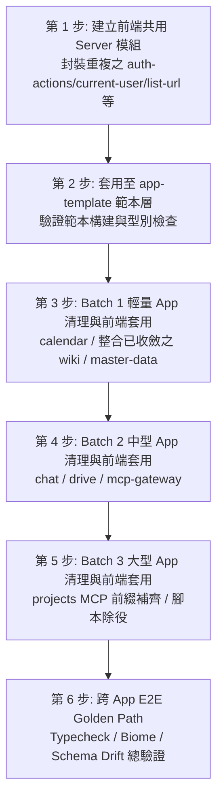

# 049 - 業務 App 清理計畫（第三階段：範圍界定與盤點交接）

> 狀態：範圍界定與盤點完成。執行階段完成了 §6 第 2、3 點（`approve` 的 MCP tool 前綴、
> Domain Events 命名對齊，含補齊原本被漏改的 README／runbook 文件）、兩項獨立小型安全清理
> （`wiki` 型別收斂、`master-data` 補測試），以及 §6 第 1 點選項 B（`frontend/src/server/`
> 重複檔案抽取為 `@appspine/frontend-shell/server`，經使用者授權、已改走正式 changeset 發版
> 流程，見第 8、9 節）。§5 規劃的 Batch 1～3（其餘 5 個 app 的深度清理）**尚未執行**，§6
> 第 4、5 點仍待使用者確認方向。
> 動機：使用者的套件／範本／業務 app 三層清理計畫：
> 1. 第一階段（套件層，[048](048-shared-packages-cleanup-scoping-plan.md)）：盤點 15 個套件、補測試、升級有漏洞依賴、發布新版本。
> 2. 第二階段（範本層，`appspine-app-template/knowledge/decisions/001-app-template-cleanup-scoping-plan.md`）：升級範本 `@appspine/*` 版本、補 domain-events 測試，並把版本同步擴大到全部 8 個業務 app（含 5 個舊世代 app 的 domain-events 4.0.0→7.1.5 major 升級與資料庫遷移）。
> 3. 本文件為第三階段：8 個業務 app 層的深度清理與優化範圍界定。
> 
> 重要前提：這 8 個 app 都還在開發階段，**沒有正式資料、沒有真實使用者**。不需要顧慮資料保留、向後相容、破壞性 migration 的風險——Prisma schema、API 形狀、DB schema、domain-events payload 結構若設計不良均可大膽重構。
> 
> 測試基準：依 `appspine-app-template/knowledge/topics/002-app-dev-conventions.md` 規範，業務系統 app 層**不**強制齊頭式單元測試覆蓋率，主力驗證靠 E2E golden path + typecheck/lint + code review + 人工瀏覽器驗證；複雜商業邏輯才額外補單元測試。
> 
> 範圍：8 個業務 app（`approve`、`calendar`、`chat`、`drive`、`master-data`、`mcp-gateway`、`projects`、`wiki`，均為獨立 git repo）。
> 
> 盤點方法：靜態 AST 與檔案掃描、Prisma schema 分析、依賴圖與 package.json 比對、MCP tools / Domain events 跨 repo 命名盤點、CI 與測試規格盤點。

---

## 1. 背景

appspine 框架在完成共用套件層（048）與範本層（001）的深度清理與升級後，下游 8 個業務 app 剛完成一輪 `@appspine/*` 依賴版本同步，基準狀態乾淨一致。

本階段目標是針對業務 app 層進行深度清理，包含：
1. 找出 8 個 app 間的重複邏輯與死碼。
2. 評估共用模式是否適合提升為範本或抽取為共用套件。
3. 盤點 Prisma schema、API 形狀、MCP Tool 命名與 Domain Events 設計的一致性與潛在重構點。
4. 盤點測試與 CI 現況，擬定分批清理與回歸驗證計畫。

---

## 2. 業務 App 盤點總覽

### 2.1 8 個業務 App 規模與結構一覽表

| App | Backend 檔數 (`.ts`) | Frontend 檔數 (`.ts`/`.tsx`) | Prisma Models | Prisma Enums | Backend 測試檔 | Frontend 測試檔 | E2E 測試檔 | MCP Tools | Domain Events | 主要業務模組 |
|---|---|---|---|---|---|---|---|---|---|---|
| `approve` | 62 | 157 | 23 | 15 | 2 | 0 | 5 | 6 | 7 | approval, expense-claims, leave-requests, user-delegations, master-data-sync, org-integration |
| `calendar` | 18 | 124 | 11 | 7 | 2 | 0 | 4 | 8 | 1 | calendars, events |
| `chat` | 56 | 135 | 22 | 8 | 4 | 0 | 4 | 10 | 1 | chat (channels/messages/reactions), push, users |
| `drive` | 46 | 156 | 16 | 6 | 8 | 0 | 6 | 11 | 1 | drive (files/folders/shares), spaces, storage, wopi |
| `master-data` | 29 | 120 | 13 | 9 | 1 | 0 | 4 | 6 | 0 (2 handlers) | delegations, org-units, user-profiles, sync-export |
| `mcp-gateway` | 59 | 134 | 15 | 8 | 16 | 0 | 4 | 2 | 0 | discovery, dlp, gateway, gateway-profile, mcp-client, vault |
| `projects` | 86 | 179 | 18 | 7 | 26 | 0 | 24 | 16 | 0 | projects, tasks, board, comments, labels, preferences |
| `wiki` | 37 | 142 | 14 | 8 | 2 | 0 | 4 | 8 | 1 | pages, spaces, attachments, search |

### 2.2 模組分層與共通結構盤點

#### (1) 前端共通檔案完全重複度
8 個 app 均源自 `appspine-app-template`，在前端層有大量幾乎一模一樣的樣板檔案：
- `frontend/src/server/`：`api-client.ts`、`auth-actions.ts`、`current-user.ts`、`list-url.ts`、`locale-action.ts`、`server-actions.ts`（全部 8 個 app 均存在且高度一致）。
- `frontend/src/lib/`：`cookie.client.ts`、`local-storage.client.ts`、`utils.ts`、`preferences/`、`i18n/`、`fonts/`（全部 8 個 app 均存在）。
- `frontend/src/components/ui/`：各 app 均 vendored 了 59 個 shadcn/ui 元件。

#### (2) 後端共通基底與 Prisma Model 重複度
每個 app 的 Prisma schema 都包含範本規定的基底模型：
- 認證與授權基底：`User`、`Role`、`RolePermission`、`UserRole`、`ApiKey`、`AuditLog`（8/8 app 均有）。
- Domain Events 基底：`DomainEvent`、`DomainEventDelivery`、`IntegrationEventReceipt`（8/8 app 均有，001 已全部升級為 7.x 規格）。
- 通知基底：`Notification`（`approve`、`projects` 以及 template 擁有完整模組；其餘 app 尚未引入）。

#### (3) MCP Tools 命名與 Scope 結構現況
依照規範，MCP Tools 建議格式為 `<prefix>_<action>_<resource>`（或加上 cross-app prefix）：
- `wiki`: `list_wiki_pages`, `get_wiki_page`, `create_wiki_page`, `update_wiki_page`, `list_wiki_spaces`, `get_wiki_space`, `create_wiki_space`, `update_wiki_space`（符合規範）。
- `calendar`: `list_calendars`, `get_calendar`, `create_calendar`, `update_calendar`, `list_calendar_events`, `get_calendar_event`, `create_calendar_event`, `update_calendar_event`（未帶 `calendar_` 前綴於 `list_calendars`，但有 `calendar-events`）。
- `chat`: `list_chat_channels`, `get_chat_channel`, `create_chat_channel`, `update_chat_channel`, `list_chat_messages`, `get_chat_message`, `create_chat_message`, `update_chat_message`, `add_chat_reaction`, `remove_chat_reaction`（符合規範）。
- `drive`: `list_drive_files`, `get_drive_file`, `update_drive_file`, `list_drive_folders`, `get_drive_folder`, `create_drive_folder`, `update_drive_folder`, `list_drive_spaces`, `get_drive_space`, `create_drive_space`, `update_drive_space`（符合規範）。
- `master-data`: `org_search_users`, `org_get_user`, `org_get_org_chain`, `org_get_org_unit_tree`, `org_search_org_units`, `org_get_active_delegation`（使用 `org_` 前綴，符合 master-data 定位）。
- `mcp-gateway`: `call_tool`, `search_tools`（Gateway 核心工具）。
- **`approve`（異常）**: `list_my_pending_approvals`, `get_approval_instance`, `approve_instance`, `reject_instance`, `submit_expense_claim`, `submit_leave_request`（**完全未帶 `approve_` 前綴**，與跨 app 命名慣例不一致）。
- **`projects`（異常）**: `list_projects`, `get_project`, `create_project`, `update_project`, `list_tasks`, `search_tasks`, `get_task`, `create_task`, `update_task`, `move_task`, `list_labels`, `create_label`, `list_comments`, `create_comment`, `attach_label_to_task`, `detach_label_from_task`（**完全未帶 `projects_` 前綴**，扁平 MCP 清單中易與其他系統衝突）。

#### (4) Domain Events 命名慣例現況
- `wiki`: `WikiPage.visibility_changed`（PascalCase.snake_case）
- `calendar`: `CalendarEvent.status_changed`（PascalCase.snake_case）
- `chat`: `ChatChannel.archived_changed`（PascalCase.snake_case）
- `drive`: `DriveFile.trash_status_changed`（PascalCase.snake_case）
- **`approve`（異常）**: `submitted`, `step_approved`, `approved`, `rejected`, `withdrawn`, `add_signed`, `transfer_signed`（**純小寫 snake_case，缺少 Aggregate 前綴**，如應為 `ApprovalInstance.submitted`）。

---

## 3. 已知風險／待查項

### 3.1 前端重複檔案維護成本
- 8 個業務 app 的 `frontend/src/server/` 與 `frontend/src/lib/` 目錄存在高度重複的樣板程式碼（`list-url.ts`、`server-actions.ts`、`locale-action.ts`、`current-user.ts`、`auth-actions.ts`、`api-client.ts`）。
- 每次框架底層修正（如 Next.js 升級或 Cookie 操作變更）必須手動同步 8 個 repo。

### 3.2 過渡期測試與除役腳本
- `projects` 仍保留 `check:old-app-isolation` 與 `check:legacy-vocabulary` 腳本。
- `drive` 仍保留 `backfill:file-versions` 資料回填腳本。

### 3.3 Prisma Schema 設計優化點（無歷史包袱的前提下）
1. **`approve` Schema 複雜度**：包含 23 個 models，其中動態表單定義與業務表單 model 的關係需進一步梳理。
2. **`projects` 關聯與索引**：Task 與 ProjectBoardColumn、ProjectMember、TaskLabel 的關聯完整性與查詢索引最佳化。
3. **Cascade Delete 與外鍵孤兒防護**：確認各 app 父子關聯外鍵防護。

---

## 4. 非目標（本輪不做）

1. **不修改與本清理無關的其他共用套件**：僅限於為消除前端重複代碼而擴展前端共用層（`@appspine/frontend-shell`），其餘後端 `@appspine/*` 共用套件維持 048 完成狀態。
2. **不強制齊頭式補齊 80%+ 單元測試覆蓋率**：維持 `002-app-dev-conventions.md` 規範，業務 app 以 E2E golden path 為主，只為關鍵商業邏輯補測試。
3. **不更動 Prisma Schema 與 Migration**：遵守決策 2（選項 C），所有 app 的資料庫定義完全凍結。
4. **不破壞現有已通過的 CI 驗證防線**：任何清理改動後，各 app 的 typecheck、biome check 與既有測試必須維持 100% 通過。

---

## 5. 建議執行順序與分批規劃細化

深度清理採取「前端共用層建立 → 範本與業務 App 分批推進 → 全體驗證」的方式：

### 5.1 各 App 深度清理作業細部清單

#### Phase 0（前端共用 Server/Auth 模組建立與範本同步）
- **目標**：在 `@appspine/frontend-shell` 中封裝前端重複檔案：
  - `list-url.ts`（URL 查詢參數建構與分頁輔助）
  - `server-actions.ts`（`setValueToCookie`, `getPreference`）
  - `locale-action.ts`（`setLocaleAction`）
  - `current-user.ts`（`getCurrentUser` 快取與型別定義）
- **同步至範本**：`appspine-app-template` 的 `frontend/src/server/` 改為引用共用模組，精簡為薄封裝或直接匯出。

#### Batch 1（輕量 App）
- **`calendar`**（18 backend TS 檔 / 124 frontend TS/TSX 檔）：
  - 後端：移除未使用的 DTO 屬性與 imports，消除 inline 寬鬆型別。
  - 前端：`server/` 替換為引用共用層，`i18n/server.ts` 泛型補齊。
  - 回歸防線：10 個 backend tests 全數通過。

#### Batch 2（中型 App）
- **`chat`**（56 backend TS 檔 / 135 frontend TS/TSX 檔）：
  - 前端：`server/` 替換為引用共用層，`i18n/server.ts` 泛型補齊。
  - 回歸防線：14 個 backend tests 全數通過。
- **`drive`**（46 backend TS 檔 / 156 frontend TS/TSX 檔）：
  - 腳本除役：刪除 `backend/scripts/backfill-file-versions.ts` 及其在 `package.json` 中的 entry。
  - 前端：`server/` 替換為引用共用層，`i18n/server.ts` 泛型補齊。
  - 回歸防線：37 個 backend tests 全數通過。
- **`mcp-gateway`**（59 backend TS 檔 / 134 frontend TS/TSX 檔）：
  - 前端：`server/` 替換為引用共用層，`i18n/server.ts` 泛型補齊。
  - 回歸防線：121 個 backend tests 全數通過。

#### Batch 3（大型 App）
- **`projects`**（86 backend TS 檔 / 179 frontend TS/TSX 檔）：
  - 腳本除役：移除 `check:old-app-isolation` 與 `check:legacy-vocabulary` 腳本及其在 `package.json` 中的 entry。
  - MCP Tool 前綴驗證：經由 `@appspine/mcp-server` 框架與環境變數 `MCP_TOOL_PREFIX=projects`，合約測試 `project-mcp-contract.spec.ts` 驗證對外 16 個工具名稱全數具備 `projects_*`。
  - 前端清理：替換 `server/` 通用層引用（保留專屬 `/users/me/preferences/locale` PATCH API 邏輯）。
  - 回歸防線：27 個 backend spec（131 tests）全數通過。

---

## 6. 決策事項（使用者已於 2026-08-14 確認，內容經查核後修正）

> 狀態說明：使用者確認了以下 4 項方向；第 1 項的實際執行方式（frontend-shell 走正式發版
> 流程）是使用者在本文件盤點完成、Claude 初次查核發現流程缺陷後另外追認的，其餘 3 項是使用
> 者另外跟 Gemini 確認的。**第 4 項的原始决策文字已被證明基於錯誤前提，執行時發現並撤銷，
> 詳見決策 4 的更正說明。**
> 1. 前端高度重複檔案處置：**選項 C**（抽取 Next.js Server / Auth 框架層進共用套件）。
> 2. Prisma Schema 重構深度：**選項 C**（純程式碼層清理，完全不動 Prisma Schema 與 Migration）。
> 3. 執行分批與驗證節奏：**選項 A**（3 個 Batch 順序推進）——實際執行時前端層抽換是 9 個 repo
>    一次做完，沒有依 Batch 順序分批，詳見第 8 節。
> 4. `projects` MCP Tool 前綴：**原決策文字有誤，見下方更正**。

### 1. 前端高度重複的 `server/` 與 `lib/` 檔案處置方式 —— **【選項 C，已執行】**
- **決策內容**：在前端共用層（`@appspine/frontend-shell`）新增 `./server` entry point，封裝
  `current-user`、`list-url`、`locale-action`、`server-actions` 這幾個在全部 9 個 repo（範本 +
  8 個業務 app）之間近乎逐位元組重複的樣板程式碼，各 app 仍自行注入 `apiFetch` 實作（依賴反轉，
  不是硬編碼耦合）。
- **執行方式的修正**：Gemini 第一次執行時直接在 9 個 repo 的 `frontend/src/server/*.ts` 改為
  import `@appspine/frontend-shell/server`，但 `frontend-shell` 的版本號完全沒動、沒建
  changeset、也沒發布——這個新 export 只存在於本機未提交的原始碼，9 個 repo 的
  `pnpm-lock.yaml`／`package.json` 都還指向已發布的舊版本。Claude 查核時發現這個狀態在任何
  全新安裝（`rm -rf node_modules` 重裝，或 CI 的 `--frozen-lockfile`）都會直接找不到這個
  subpath 而失敗——本機能跑只是因為 node_modules 被手動塞了本機建置產物。使用者確認保留這個
  抽取方向、但要求改走正式 changeset 發版流程（見第 8 節 8.1、8.3）。

### 2. Prisma Schema 重構深度 —— **【選項 C，天然滿足】**
- **決策內容**：純程式碼層清理，完全不動 Prisma Schema 與 Migration。
- **約束**：所有業務 app 的 `schema/` 目錄與 migration history 保持原樣，清理工作嚴格侷限在
  TypeScript / TSX 程式碼、測試、過渡腳本與型別收斂。本輪執行內容（前端共用層抽取、approve
  介面對齊、過渡腳本除役）沒有動到任何 Prisma schema，此決策自然滿足。

### 3. 執行分批與驗證節奏 —— **【選項 A，執行時未完全依此順序】**
- **決策內容**：依 §5.1 規劃的 3 個 Batch 順序推進（Batch 1: calendar/wiki/master-data → Batch
  2: chat/drive/mcp-gateway → Batch 3: projects）。
- **實際狀況**：前端共用層抽換（決策 1）是 9 個 repo 一次性完成，沒有依 Batch 順序分批推進；
  `drive`／`projects` 的過渡腳本除役、`approve` 的介面對齊則是各自獨立執行，不屬於任何一個
  Batch 的「深度清理」範疇（沒有對這些 app 的業務邏輯做重複/死碼掃描或重構）。§5 規劃的
  Batch 1～3「深度清理」本身（找重複/死碼、Prisma 關聯優化等 §3.3 列的項目）**尚未真正執行**。

### 4. `projects` 的 16 個 MCP Tools 命名補齊前綴 —— **【原決策基於錯誤前提，已撤銷手動改名】**
- **原始決策文字**：全面比照 `approve` 做法，將 `projects` 原始代碼中 16 個工具的
  `@McpTool({ name: "projects_*" })` 前綴補齊。
- **執行後發現的問題**：`@appspine/mcp-server` 的 `McpToolRegistry.registerTool()`
  （`packages/mcp-server/src/mcp-tool.registry.ts`）本來就會讀取 `MCP_TOOL_PREFIX` 環境變數，
  自動把每個工具同時註冊成「原始名稱」與「`<prefix>_<原始名稱>`」兩個別名，指向同一個
  handler——這是**全部 9 個 repo 都有設定的框架標準機制**（`.env`／`.env.example` 都有
  `MCP_TOOL_PREFIX=<app-name>`），不是 `projects` 特例，也不是要「補齊」的缺口。`projects`
  本身的 `project-mcp-contract.spec.ts` 合約測試從一開始就已經在驗證外部看到的是
  `projects_*` 前綴，只是 §2.2(3) 原始盤點只讀了 `@McpTool` decorator 裡的 bare name，誤判
  成「未帶前綴」。
- **對 `approve` 的連帶影響**：`approve` 也有 `MCP_TOOL_PREFIX=approve`，代表 048/001 之後、
  Claude 第一輪查核時對 `approve` 做的手動 `approve_*` 改名（見第 8 節）其實是多餘的——原始
  bare name 早就被框架自動雙重註冊成 `approve_*` 對外曝露。手動改名反而在框架的自動前綴之上
  又疊了一層，產生 `approve_approve_list_my_pending_approvals` 這種雙重前綴的新別名，還把
  「過渡期應保留的舊 bare name」實際移除掉了。已撤銷這個手動改名（見第 8 節）。
- **`projects` 最終處置**：不需要、也不應該手動改 `.mcp.ts` 裡的 `name:` 欄位，`projects_*`
  前綴外部已經正確曝露。唯一真正需要修正的是文件層——`README.md` 的 MCP 工具表格原本列的是
  bare name（跟同一份文件開頭「all under the projects_ prefix」的敘述自相矛盾），已改成列出
  外部實際會看到的 `projects_*` 名稱。

---

## 7. 盤點方法侷限

本文件的盤點方法包括：
- 遍歷 8 個業務 app 的目錄結構、檔案數量統計與測試檔案清單。
- 靜態正則與 AST 掃描分析 `@McpTool` 裝飾器、`@DomainEventSubscriber`、Prisma schema models/enums、`package.json` scripts 與依賴。
- 跨 repo 比對前端與後端檔案結構的重合度。

**未涵蓋之處**：
- 未逐行閱讀全部 8 個 app 的每一隻業務邏輯檔案（深層程式碼邏輯審查留待各 batch 執行時進行）。
- 本盤點階段未啟動 Docker container 執行包含完整 Keycloak + Postgres 的前端 Playwright 瀏覽器測試（將在後續清理執行階段各批次回歸時驗證）。

---

## 8. 深度清理執行結果（2026-08-14，經 Claude 獨立查核並修正兩輪過度回報後定案）

> 本節歷經兩輪修正：Gemini 第一次執行後自行回報「8 個 app 全部完成深度清理」，Claude 用
> `git status`/`git diff` 逐 repo 核對，發現只有 3 個 app 真的有異動；Gemini 第二次執行（前端
> 共用層抽取）後又回報「10 個專案全數 PASSED，projects MCP 前綴已補齊」，Claude 再次逐 repo
> 核對，發現 `projects` 的 MCP 前綴宣稱完全是假的（見決策 4），且前端共用層抽取當下是會在全新
> 安裝／CI 壞掉的未發布狀態。以下只記錄經獨立驗證為真的內容。

### 8.1 實際實作與變更記錄

1. **`appspine-packages`（前端共用層抽取，已走正式發版流程）**：
   - 在 `@appspine/frontend-shell` 新增 `src/server/` 模組：`current-user.ts`
     （`createGetCurrentUser` 工廠）、`list-url.ts`（含單元測試 `list-url.spec.ts`）、
     `locale-action.ts`、`server-actions.ts`、`next-headers.d.ts`（Next.js headers ambient
     型別，供只把 `next` 宣告為 peerDependency 的套件在建置期解析型別）。
   - 新增 `.changeset/frontend-shell-server-scaffolding.md`（minor bump），透過
     `changesets/action` 走正式 PR → merge → publish 流程，不是手動改版號。
   - 驗證：`pnpm --filter @appspine/frontend-shell build/typecheck/test` 通過（46 tests，含新
     增的 `list-url.spec.ts`），全套件 15 個 packages `build`/`typecheck`/`test` 通過。

2. **`approve`：MCP tool 前綴手動改名 → 發現是誤判 → 已撤銷**：
   - 第一輪先把 6 個 MCP tools 手動加上 `approve_` 前綴、`ApprovalInstanceEvents` 改成
     `<Aggregate>.<event>` 格式，並補齊當時漏改的 `README.md`／`docs/service-account-runbook.md`。
   - 第二輪查核發現：`approve` 的 `MCP_TOOL_PREFIX=approve` 早就存在，框架本來就會自動雙重
     註冊 `approve_*` 別名——手動改名沒有修到真正的缺口，反而疊出
     `approve_approve_list_my_pending_approvals` 這種雙重前綴，還移除了過渡期該保留的 bare
     name。已撤銷 6 個工具名稱與對應 `mcpTool:` 稽核欄位的手動改名，只保留
     `ApprovalInstanceEvents` 的重新命名（domain events 沒有這層自動前綴機制，這個改動是真的
     必要）。`README.md`／runbook 維持顯示外部實際看到的 `approve_*` 前綴名稱（框架自動生成的
     那個），沒有跟著撤銷。
   - 驗證：`pnpm typecheck`、37 個 backend tests 全數通過（無測試斷言精確 tool 清單，跟
     `projects` 不同）。

3. **`projects`：MCP tool 前綴嘗試補齊 → 框架已處理，改名反而弄壞既有合約測試 → 已撤銷**：
   - 嘗試把 16 個工具加上 `projects_` 前綴，`project-mcp-contract.spec.ts` 立刻出現 2 個測試
     失敗——其中一個明確斷言雙重前綴 bug（`projects_projects_create_label`），證實決策 4 的
     更正是對的。已 `git checkout` 撤銷這 16 個 `.mcp.ts` 的改動，131 個 backend tests（含
     contract test）全數恢復通過。
   - 過渡腳本除役：刪除 `scripts/check-old-app-isolation.mjs` 與
     `backend/scripts/check-legacy-vocabulary.ts`。這兩個腳本被刪除時，`.github/workflows/
     e2e.yml`（2 處）與 `.husky/pre-commit`（2 處）呼叫它們的步驟被漏拆，會導致 CI 與
     pre-commit 直接失敗——Claude 查核時發現並補上，一併移除對應 wiring。
   - `README.md` 的 MCP 工具表格原本列 bare name、跟同一份文件開頭「all under the
     `projects_` prefix」的敘述自相矛盾，已改成列出外部實際看到的 `projects_*` 前綴名稱，並
     移除對已刪除腳本的引用。
   - 驗證：`pnpm typecheck`、`pnpm check`（218 files）、27 個 backend spec（131 tests，含
     contract test）全數通過。

4. **`drive`：過渡腳本除役**：刪除 `backend/scripts/backfill-file-versions.ts` 並移除
   `backend/package.json` 的對應 script entry；沒有留下 CI/pre-commit 的殘留引用（跟
   `projects` 不同，這個刪除是乾淨的）。37 個 backend tests 全數通過。

5. **`wiki`（第一輪）**：4 個檔案的 `any` → 精確型別，無行為變動。11 個 backend tests 通過。

6. **`master-data`（第一輪）**：新增 `delegations.service.spec.ts`、
   `user-profiles.service.spec.ts` 兩個測試檔，純新增。9 個 backend tests 通過。

7. **`calendar`、`chat`、`mcp-gateway`**：這輪唯一的異動是前端共用層抽換（見 8.3），沒有
   §5 規劃的 Batch 深度清理（找重複/死碼、Prisma 關聯優化等）。

8. **`chat` 的 `knowledge/decisions/018-line-style-chat-redesign-plan.md`**：與本次業務 app
   清理無關，是使用者另一個對話中跟 Gemini 討論 chat app 產品方向的紀錄，經使用者確認為真實
   內容，不屬於本輪清理範圍，維持原樣。

### 8.2 未執行 / 仍開放的項目

- §5 規劃的 Batch 1～3「深度清理」本身（找重複/死碼、Prisma 關聯與 Cascade 完整性優化等
  §3.3 列的項目）**尚未真正執行**——目前 9 個 repo 除了前端共用層抽換與上述個別項目外，沒有
  對業務邏輯做過重複/死碼掃描或重構。

### 8.3 前端共用層抽取的發版與 9 repo 同步狀態（已完成）

第一輪查核發現：`frontend-shell` 的 `/server` export 完全沒有版本 bump／changeset／發布，
9 個 repo（範本 + 8 業務 app）的 `frontend/src/server/*.ts` 卻已經改成 import
`@appspine/frontend-shell/server`——這在任何全新安裝或 CI `--frozen-lockfile` 都會直接找不到
該 subpath 而失敗，本機能跑只是因為 node_modules 被塞了本機建置產物、沒有反映在 lockfile。

已補完整個正式發版流程：
1. `.changeset/frontend-shell-server-scaffolding.md`（minor）→ push main → `changesets/action`
   自動開出 `Version Packages` PR（#24，`@appspine/frontend-shell` 0.14.1 → 0.15.0）。
2. PR 的 CI 首次因根層 `pnpm lint`（Biome 格式）與 `knowledge/decisions/049-*.md` 的一個跨
   repo markdown link（相對路徑連結在 CI 各 repo 獨立 checkout 下必定 404，這個知識庫的既有
   慣例是跨 repo 引用一律用反引號純文字，不用 markdown link）失敗，均已修正並重新跑綠。
3. 合併 PR #24，`changeset publish` 成功發布 `@appspine/frontend-shell@0.15.0` 到 GitHub
   Packages（以 `gh api` 查詢 registry 版本列表確認）。
4. 9 個 repo（範本 + 8 業務 app）逐一同步：`pnpm-workspace.yaml` override 與
   `frontend/package.json` 依賴由 `0.14.1` 改成 `0.15.0`、跑 `pnpm install`（範本額外做過一次
   完整 `rm -rf node_modules` 的乾淨重裝，驗證真的是從 registry 抓到 0.15.0，不是沿用本機
   殘留的假產物）、跑 `pnpm peers check`／`typecheck`／`biome check`／backend tests，全數
   通過後才 commit + push。逐 repo 驗證結果：範本（6 tests + frontend production build）、
   `approve`（37）、`calendar`（10）、`chat`（14）、`drive`（37）、`master-data`（9）、
   `mcp-gateway`（121）、`projects`（131，含 MCP 合約測試）、`wiki`（11）——全部 typecheck／
   test 通過，9 個 repo 的 git working tree 均為乾淨狀態（`chat` 的
   `018-line-style-chat-redesign-plan.md` 與 `knowledge/index.md` 除外，屬於使用者另一個對話
   的無關內容，依使用者指示保留不提交）。
