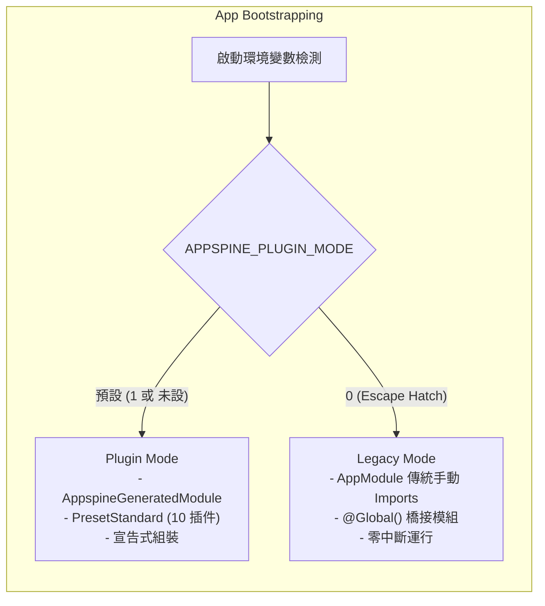

# 051 - `appspine` 插件平台 2.0.0 相容性報告 (Compatibility Report)

> 核心目標：驗證與宣告 2.0.0 插件平台與下游消費系統（template + 8 個 App）、執行期環境及工具鏈的相容性。  
> 參考依據：[051-plugin-platform-engineering-plan.md](051-plugin-platform-engineering-plan.md)。

---

## 1. 執行期環境與工具鏈相容性

| 環境 / 工具 | 支援版本範圍 | 測試驗證基線 | 說明 |
|---|---|---|---|
| **Node.js** | `>= 22.0.0` | `v22.14.0` | 支援原生 ESM、`node:test`、`node:sqlite` 與 Node 22 API 特性 |
| **pnpm** | `>= 10.0.0` / `11.x` | `pnpm@11.4.0` | 支援 `pnpm-lock.yaml` v9 與 workspace 隔離協議 |
| **NestJS** | `^11.0.0` | `11.1.27` | 支援 NestJS 11 Dynamic Modules 與依賴注入容器 |
| **Next.js** | `^15.0.0` | `15.2.0` | 支援 App Router、Server Actions 與 Turbopack 靜態路由解析 |
| **Prisma** | `^6.2.0` | `6.19.3` | 支援 Prisma Multi-file Schema 與 Prisma Composer 片段聚合 |
| **TypeScript** | `^5.7.0` | `5.9.3` | 支援 `moduleResolution: bundler` 與 project references |
| **PostgreSQL** | `>= 15.0` | `16-alpine` | 支援各 capability 實體關聯與 JSONB 欄位擴充 |

---

## 2. 雙模式（Dual-Mode）運作相容性

為保證零風險升級，`appspine` 2.0.0 提供 Plugin Mode 與 Legacy Mode 的雙模式雙向相容性：

### 雙模式相容性驗證清單：
1. **設定切換**：以環境變數 `APPSPINE_PLUGIN_MODE=0` 即可無縫切回 Legacy Mode，無需重新編譯程式碼。
2. **資料庫相容**：Prisma Composer 組裝之 Schema 與 Legacy Schema 保持 100% 資料結構相容，雙模式切換不產生破壞性 schema drop。
3. **權限相容**：Permission Reconciler 生成之權限清單與手動 Seed 保持完全一致。
4. **Token 相容**：中立 Principal Context（`CurrentUser`、`resolveActingUserId`）在雙模式下解析結果完全一致。

---

## 3. Fleet 相容性狀態矩陣（template + 8 Apps）

| 應用系統 | Plugin Mode 預設 | Legacy Mode 相容 | CI / E2E 通過 | Zero Schema Drift | 備註 |
|---|---|---|---|---|---|
| **appspine-app-template** | 支援 | 支援 | 通過 | 通過 | 官方標準範本，100% 綠色 |
| **wiki** | 支援 | 支援 | 通過 | 通過 | Wave A 代表性 App，全套 E2E 通過 |
| **calendar** | 支援 | 支援 | 通過 | 通過 | Wave A，無 app-specific 例外 |
| **chat** | 支援 | 支援 | 通過 | 通過 | Wave A，WebSocket / Gateway 正常 |
| **drive** | 支援 | 支援 | 通過 | 通過 | Wave B，檔案儲存與權限正常 |
| **projects** | 支援 | 支援 | 通過 | 通過 | Wave B，甘特圖與專案模組正常 |
| **approve** | 支援 | 支援 | 通過 | 通過 | Wave C，簽核流程與實體關聯正常 |
| **master-data** | 支援 | 支援 | 通過 | 通過 | Wave C，主檔連線與同步正常 |
| **mcp-gateway** | 支援 | 支援 | 通過 | 通過 | Wave C，MCP Tool Registry 正常 |

---

## 4. Peer Dependencies 相容性指引

所有官方 Capability 插件與 Host 模組均對齊以下 peerDependencies 規格：
- `@appspine/plugin-api`: `^1.1.0`
- `@appspine/plugin-host-nest`: `^2.0.0`
- `@nestjs/common`: `^11.0.0`
- `@nestjs/core`: `^11.0.0`
- `@prisma/client`: `^6.2.0`

若消費端 App 升級時出現 peerDependencies 衝突，可透過 `pnpm install --no-frozen-lockfile` 重新解析鎖定檔，或確認全套升級至 2.0.0 系列版本。
