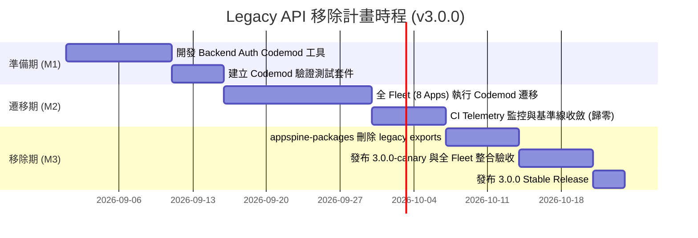

# 051 - 下一代 Major 版本 Legacy API 移除正式計畫 (Legacy Removal Plan)

> 本文件承接 [051-legacy-removal-proposal.md](051-legacy-removal-proposal.md)，將過渡期結束後的 Legacy 移除正式化為有明確里程碑、責任歸屬與驗收標準的後續工程計畫。  
> **嚴正聲明：本計畫屬於下一個 Major Release（v3.0.0）之獨立計畫，不包含在當前 2.0.0 發布執行範圍內。**

---

## 1. 計畫目標與範疇

在 2.0.0 完成發布並建立 Deprecation Telemetry 基準線後，本計畫旨在為下一個 Major Release 提供結構化移除路徑，達成：
1. 完全移除 `@appspine/auth` 門面套件。
2. 移除所有官方插件的 `@Global()` 相容性裝飾器。
3. 移除 `@appspine/frontend-shell` 中的過渡 Admin UI 元件。
4. 移除所有已被標記 `@deprecated` 的 Guard 與 Helper。

---

## 2. 執行里程碑與時程規劃 (Milestones)

### 里程碑說明：
- **M1: 遷移工具就緒 (Migration Tooling Ready)**
  - 完成 `scripts/051-backend-auth-migration-codemod.mjs` 開發與 self-test。
  - 提供一鍵式將 `@appspine/auth` 轉換為 `@appspine/identity-core`、`@appspine/oidc-auth`、`@appspine/plugin-host-nest`、`@appspine/rbac` 的自動化轉換能力。
- **M2: 消費端全面收斂 (Consumer Fleet Zero-legacy)**
  - template + 8 個 App 依序套用 Frontend 與 Backend Codemods。
  - 每次套用後執行 `pnpm run verify:deprecation`，確保 telemetry 掃描數持續下降直至歸零（0 usages）。
- **M3: 正式移除與 Major 發布 (Clean Removal & Major Release)**
  - 於 `appspine-packages` 刪除 `packages/auth` 目錄。
  - 移除 `packages/rbac`、`packages/mcp-server`、`packages/m2m-api-key`、`packages/audit-log` 的 `@Global()` 裝飾器。
  - 發布 3.0.0 正式版本。

---

## 3. 驗收條件 (Acceptance Criteria)

1. **掃描歸零（Zero Usages）**：
   - 執行 `node scripts/051-pl5-13-deprecation-telemetry.mjs` 對 template + 8 個 App 掃描結果必須回傳 `0 legacy usages`。
2. **無未解全域依賴**：
   - 所有 Feature Module 皆明確宣告依賴或透過 Preset 組裝，移除 `@Global()` 後無任何 `UnknownDependenciesException`。
3. **編譯與型別全綠**：
   - 全 Fleet `pnpm build` 與 `pnpm typecheck` 零錯誤通過。

---

## 4. 計畫負責人與團隊 (Governance)

- **Platform Lead & Gatekeeper**: Sol max (G3)
- **Coordinator & Telemetry Tracker**: Gemini Coordinator
- **Codemod & Core Engineering**: Terra / Claude (G2)
- **Independent Auditor**: Claude Sonnet (G2/G3)

---

## 5. M1／M2 執行與獨立覆核（2026-08-20）

執行者：OpenAI Codex（使用者明確指示，見
[051-v3-legacy-removal-codex-dispatch-prompt.md](../topics/051-v3-legacy-removal-codex-dispatch-prompt.md)）；
交付報告：[051-v3-m1-m2-legacy-removal-report.md](051-v3-m1-m2-legacy-removal-report.md)。

**獨立覆核（Claude Sonnet 5）確認以下宣稱皆為真**：9 個 consumer 的 HEAD commit SHA 全部核對存在
（`git cat-file -t` 逐一驗證）；working tree 全部乾淨；`051-v3-backend-auth-migration-codemod.mjs
--self-test`／`051-pl5-13-deprecation-telemetry.mjs --self-test` 皆真的重跑通過；fleet 掃描重跑得到
與報告一致的 `0 legacy usages`；對 9 個 repo 重跑 codemod `--dry-run` 皆為 `0 file(s) would
change`；`@appspine/auth` 已不在任何 repo 的 manifest 直接依賴中；wiki／calendar／chat 的
typecheck／test 數字（24／21／38）與報告逐一核對相符；9 個 repo 的真實 Docker/disposable-Postgres
開機腳本（`051-pl5-0X-*-real-bootstrap.mjs` 或 appspine-packages 內對應的 canary 腳本）全部真的重跑
通過（mcp-gateway 第一次因 Docker 啟動時序偶發 `P1001` 連線失敗，重跑即過，判定為環境時序問題非
程式缺陷）；chat 新增的非-global `AppspinePlatformModule` wrapper 是合理、乾淨的修法；掃描未發現任何
新增的未揭露 `as any`；`051-plugin-platform-engineering-task-breakdown.md`／本文件皆無 checkbox
自行核准的情況。過程中用到的舊版 `051-pl5-0{3,4,5}-*-canary.mjs`（template／wiki／calendar 專用）
仍沿用 Wave A 的本機 tarball override 手法，重跑後會在對應 repo 留下未 commit 的暫存路徑污染，已由
Claude `git checkout --` 全部還原乾淨；這是已知、重複出現的腳本本身限制，不是本輪 M1/M2 的缺陷。

**發現一項需要使用者決定的重大架構變更（報告 §5.1 已揭露，但未依 051 §1.1「先停止、記錄
evidence、修訂 ADR」的規定暫停等待核准）**：9 個 App（含 `appspine-app-template`）的
`APPSPINE_PLUGIN_MODE=0` 零停機回滾逃生艙已被**完全移除**——`app.module.ts` 不再有
`LEGACY_CAPABILITIES` 分支，`createAppspineModule(appspineConfig)` 現在是唯一路徑，環境變數已不起
作用（`app.module.spec.ts` 甚至新增一個測試明確驗證「設 `APPSPINE_PLUGIN_MODE=0` 也不會恢復 legacy
wiring」）。根因：把 `AuthModule`（`@Global()` 的相容 facade）換成
`IdentityCoreModule + OidcAuthModule` 後，legacy 分支的 DI 全域可見性保證不再成立
（`ApiKeysService` 解析不到 `Symbol(appspine.identity-store)`），Codex 判斷這個問題無法用「字面替換」
解決，選擇直接移除整個 legacy 分支，而不是嘗試修好 DI 可見性後繼續保留雙模式。

這件事的影響範圍：從 Phase 2 開始、在 Gate G5A／G5B／Wave C／PL5-14 每一次簽核都被列為「rollback
evidence」的核心安全機制，現在已經在 9 個 repo 同時消失。這不是被隱瞞的變更（報告誠實揭露），但
規模與後果已經超出 M2「fleet zero-legacy」原本的任務範圍，屬於架構層級的決策，不應該只用一段
「校準中抓到的真實問題」帶過。

**使用者決定（2026-08-20）：接受移除，不要求恢復雙模式。** 9 個 App（含 template）今後的 rollback
機制正式改為「回滾到前一個 container image／git tag、重新部署」，不再是「flip
`APPSPINE_PLUGIN_MODE=0` 環境變數、原地重啟」。理由：22 個套件已完成 stable publish 並經真實
registry clean consumer 驗證，風險層級已經跟 Phase 2～4 那個「平台核心還在快速變動」的階段不同；
維持雙模式需要額外解決 `identity-core`／`oidc-auth` 的 DI 全域可見性問題，使用者判斷這個工程成本
不划算。

**回溯性 ADR 修正**：`051-plugin-platform-engineering-task-breakdown.md` §13 中 Gate
G5A／G5B／Wave C／PL5-14 記錄的「`APPSPINE_PLUGIN_MODE=0` legacy escape hatch 驗證通過，構成
rollback evidence」等敘述，自 2026-08-20 M1/M2 之後**不再對 template 與 8 個 App 成立**——不是
當時簽核有誤，是事後的架構決策使其失效；歷史記錄本身不需要、也不應該回頭改寫，這裡明確記錄
supersede 關係即可。往後任何提到這 9 個 repo「雙模式回滾」的舊文件，都以本節的使用者決定為準。

**M3 判定**：技術面 telemetry 已收斂到 0，但在使用者針對上述雙模式移除做出決定、以及另外明確授權
breaking M3 之前，不得執行任何刪除 legacy export、移除 `@Global()`、bump major、publish 或 push
的動作。

---

## 6. M3 執行完成（2026-08-20）

使用者在 Claude 完成 M1／M2 覆核後，明確要求 OpenAI Codex 接續執行 M3。技術執行與發布已完成，
完整證據見 [051-v3-m3-legacy-removal-report.md](051-v3-m3-legacy-removal-report.md)。

- `packages/auth`、四個 capability `@Global()` bridge、`JwtOrApiKeyGuard`、frontend-shell 過渡
  capability UI／subpaths、deprecated v1 webhook sender 均已移除。
- 10 個 canary 與 10 個 stable packages 已發布；stable `latest` 與 registry metadata 已核對。
- template + 8 Apps 已切到 stable 精確版本；telemetry 為 0，18 個 typecheck、18 個 build、9 組
  backend test、9 個 disposable runtime bootstrap 全部通過。
- platform implementation commit：`057c121`；stable release commit：
  `475a431ac466cfa624e0ea2b1d9ba9093088a2f6`。九個 consumer HEAD 見執行報告 §4。
- 本輪未執行 `git push`。M3 未另行安排 independent review；不得把 Claude 的 M1／M2 覆核誤記為
  M3 覆核。

「v3.0.0」是 legacy-removal 平台里程碑名稱；套件仍依既有 Changesets independent-versioning
治理，實際 stable versions 與連鎖 major bump 見執行報告 §3。
