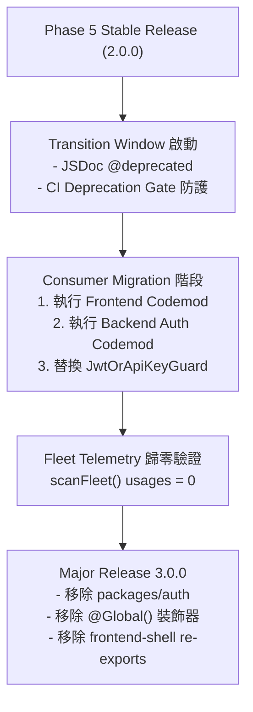

# 051 - 下一個 Major 版本 Legacy API 移除提案 (Draft)

> **注意**：本文件為 Phase 5 收尾（PL5-13）產出之**未來重大變更移除提案（Draft Proposal）**，非本次發布之執行項目。
> 依據 [051 插件平台工程化計畫](051-plugin-platform-engineering-plan.md) 決策 6，`@appspine/auth` 與相關相容性 export 至少保留一個完整的 Major Transition Window。
> **本次 2.0.0 Release 期間嚴禁執行任何實際移除**。

---

## 1. 提案摘要與目標

在 `appspine` 插件平台 2.0.0 中，所有 Capability 均已完成 Plugin 化拆分，並提供了獨立的 subpath exports 與穩定的 Injection Ports。為了確保既有應用（template + 8 個 App）能夠平滑升級，2.0.0 保留了以下過渡層：

1. **`@appspine/auth` 過渡門面（Facade）**：包含 22 個 re-exports，將身分識別、OIDC 驗證、請求主體與角色模型轉發至新套件。
2. **Capability Packages 中的 `@Global()` 相容性橋接**：包含 `RbacModule`、`McpModule`、`ApiKeysModule`、`AuditLogModule`、`AuthModule`。
3. **`@appspine/frontend-shell` 中的 Capability UI 匯出**：包含 Users、Roles、ApiKeys、DomainEvents、Notification 等元件與 hooks。
4. **個別已廢棄的 Guard 與 Helper**：如 `@appspine/m2m-api-key` 的 `JwtOrApiKeyGuard`。

本提案規劃於**下一個 Major Release（預定為 3.0.0 / `@appspine/auth@8.0.0` 標記為 empty/deprecated 或正式下架）**中徹底移除上述過渡層，達到架構完全收斂。

---

## 2. 待移除項目清單與 Consumer 現況

根據 PL5-13 Deprecation Telemetry 掃描（2026-08-20 基準線），目前全 Fleet 共有 389 處 Legacy 引用，分佈如下：

### 2.1 `@appspine/auth` 門面套件

| 匯出符號 / 模組 | 目前引用數 | 已知 Consumer Apps | 建議遷移替代路徑 | 遷移難易度 |
|---|---|---|---|---|
| `JwtUser` | 52 | template, wiki, calendar, chat, drive, projects, approve, master-data, mcp-gateway (9/9) | `@appspine/plugin-host-nest` | 低（可 Codemod） |
| `ApiKeyUser` | 51 | 9/9 | `@appspine/plugin-host-nest` | 低（可 Codemod） |
| `CurrentUser` | 48 | 9/9 | `@appspine/plugin-host-nest` | 低（可 Codemod） |
| `resolveActingUserId` | 43 | 9/9 | `@appspine/plugin-host-nest` | 低（可 Codemod） |
| `SYSTEM_ADMIN_ROLE` | 37 | 9/9 | `@appspine/identity-core` | 低（可 Codemod） |
| `AuthModule` | 10 | 9/9 | `@appspine/preset-standard` (Plugin Mode) 或 `@appspine/identity-core` + `@appspine/oidc-auth` | 低（Plugin Mode 預設已不用手動 import） |
| `SYSTEM_USER_ROLE` | 9 | 9/9 | `@appspine/identity-core` | 低（可 Codemod） |
| `AdminGuard` | 6 | master-data, mcp-gateway | `@appspine/identity-core` | 低（可 Codemod） |
| `JwtVerifierService` | 1 | chat | `@appspine/oidc-auth` | 低 |
| **總計** | **257** | **全 Fleet** | **完全收斂至 4 個專屬套件** | - |

> [!NOTE]
> 預定處置：在下一個 Major 版本中，直接從 npm workspace 移除 `packages/auth`，或發布最後一個空的 major 版本並標記 `npm deprecate`。

---

### 2.2 `@appspine/frontend-shell` Capability UI Components

| 匯出元件 / Hook | 目前引用數 | 已知 Consumer Apps | 建議遷移替代路徑 | 遷移難易度 |
|---|---|---|---|---|
| `LoginButton`, `mapAuthErrorKey` | 16 | 8/8 Apps | `@appspine/oidc-auth/frontend` | 低（PL3-09 Codemod 已支援） |
| `ApiKeysTable`, `CreateApiKeyDialog` | 16 | 8/8 Apps | `@appspine/m2m-api-key/frontend` | 低（PL3-09 Codemod 已支援） |
| `RolesTable`, `CreateRoleDialog` | 16 | 8/8 Apps | `@appspine/rbac/frontend` | 低（PL3-09 Codemod 已支援） |
| `UsersTable`, `CreateUserDialog` | 15 | 8/8 Apps | `@appspine/identity-core/frontend` | 低（PL3-09 Codemod 已支援） |
| `DomainEventsTable`, `DomainEventCatalogTable`, `DomainEventDeliveriesPanel`, `DomainEventDetailPanel` | 20 | wiki, calendar, chat, drive, approve (5 Apps) | `@appspine/domain-events/frontend` | 低（PL3-09 Codemod 已支援） |
| `NotificationBell`, `useNotificationPolling` | 0 (已先期遷移) | - | `@appspine/notification/frontend` | 已完成 |
| **總計** | **83** | **8 Apps** | **`@appspine/<plugin>/frontend`** | - |

> [!NOTE]
> 預定處置：從 `packages/frontend-shell/src/index.ts` 移除所有已轉交 Capability 擁有的 Admin UI 重新匯出，使 `frontend-shell` 回歸純 Shell / UI 基礎原子元件。

---

### 2.3 相容性 `@Global()` 裝飾器移除

| 模組 | 涉及套件 | 目的與風險 | 建議替代方案 |
|---|---|---|---|
| `RbacModule` | `@appspine/rbac` | 避免未顯式 import 之 feature controller 拋出 DI 錯誤 | 在 Plugin Mode 中由 `preset-standard` 統一載入，或 Feature 模組顯式宣告依賴 / 注入 `RBAC_POLICY` |
| `McpModule` | `@appspine/mcp-server` | 避免 `*.mcp.ts` feature 模組未 import McpModule 時無法注入 `McpToolRegistry` | 採用 `MCP_TOOLS` multi-provider 或由 Preset 自動管理 |
| `ApiKeysModule` | `@appspine/m2m-api-key` | 避免全域 Guard 依賴失效 | 採用 `@appspine/plugin-host-nest` 的中立 `AppspineAuthGuard` |
| `AuditLogModule` | `@appspine/audit-log` | 避免全域 Audit 寫入失效 | 採用 `AUDIT_SINK` Token 注入 |
| `AuthModule` | `@appspine/auth` | 隨 `@appspine/auth` 一併移除 | - |

---

### 2.4 已廢棄之 Guard 與 Helper

| 廢棄符號 | 涉及套件 | 目前引用數 | 替代方案 |
|---|---|---|---|
| `JwtOrApiKeyGuard` | `@appspine/m2m-api-key` | 49 | `@appspine/plugin-host-nest` 的 `AppspineAuthGuard` |

---

## 3. 遷移路線圖與執行前置條件

### 3.1 前置條件（Prerequisites）
1. **全 Fleet 切換 Plugin Mode 穩定運作**：所有 8 個 App 與 template 皆以 `preset-standard` 穩定運行至少一個版本迭代週期。
2. **自動化 Codemod 工具就緒**：
   - Frontend Codemod：`scripts/051-pl3-frontend-migration-codemod.mjs`（已具備）。
   - Backend Codemod：需開發 `scripts/051-backend-auth-migration-codemod.mjs`，一鍵將 `@appspine/auth` imports 與 `JwtOrApiKeyGuard` 改寫為新套件 imports。
3. **CI Telemetry Baseline 歸零**：在各 App repo 逐一跑過 Codemod 並確認測試通過後，`deprecation-baseline.json` 數量收斂為 0。

---

## 4. 責任歸屬（Ownership & Governance）

- **Proposal Author**: Gemini Coordinator
- **Design Reviewer**: Claude Sonnet (G2/G3)
- **Gate Sign-off**: Sol max (G3)
- **Target Milestone**: Next Major Release (v3.0.0)
