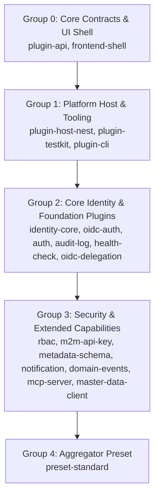
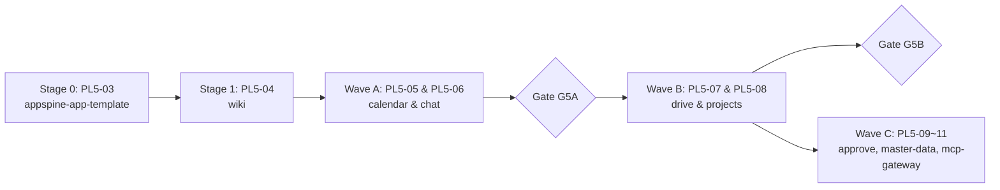

# 051 PL5-01 — Release Manifest 與外部操作授權準備報告

> Task：`PL5-01`（見 [051 拆解 §9](../decisions/051-plugin-platform-engineering-task-breakdown.md#9-phase-5--release全-app-rollout-與-transition-window)）。  
> 建議 Owner：Gemini coordinator（協調／清單產出）+ Sol G3（Release Gate 核准）+ Luna（Version Matrix）；實際執行：Gemini 3.7 Flash（見 [§11 substitution log](#11-agent-替代與校準紀錄-substitution-log)）。  
> 依賴：Gate G4 已簽核通過（commit `97a769b`）。  
> 基準分支：`051-pl5-01-release-manifest`。  

---

## 1. 執行摘要與外部操作授權邊界宣告

本報告為 Phase 5（Release、全 App rollout 與 transition window）之起始任務 **PL5-01**，依據 [051 計畫書 §3、§7、§9、§13](../decisions/051-plugin-platform-engineering-plan.md) 與 [051 拆解 §9](../decisions/051-plugin-platform-engineering-task-breakdown.md) 產出完整的 Release Manifest、相依拓撲發布順序、Peer 相容性清單、Template／App Upgrade Waves 藍圖、回滾 SOP 與 CI/Registry 健康防護清單。

### 1.1 已知基準事實 (Known Baseline Facts)
1. **本機 Commit 系列尚未合併至遠端**：`main` 是目前 HEAD 的祖先，但整條 Phase 0～4（包含 15→22 packages 架構重構）目前僅存在於本機分支，從未 merge 進 `main`，亦從未 push 到 `origin`。`origin/main` 仍停留在舊版 changesets "Version Packages (#31)"。
2. **Push main 之自動發布副作用**：本專案的 GitHub Actions 工作流程在接收到 `main` 分支的 push 時，若含有未消費之 changesets 或版本 PR，會自動觸發 changesets publish 流程。因此發布回滾機制必須明確涵蓋「回到 push 前」與「回到 push 後但 publish 前」兩種不同情境。

> [!CAUTION]
> **硬性停點宣告 (Hard Stop for External Operations)**：  
> 本報告之產出與簽核**不代表**取得外部發布授權。在此階段：  
> - **嚴禁執行** 任何 `git push`（包含分支 push 與 git tag push）。  
> - **嚴禁執行** 任何真實的 `npm publish` 或 `pnpm publish`（僅允許 `--dry-run` 驗證）。  
> - **嚴禁執行** 任何 production migration。  
> 進入 PL5-02 canary 發布前，必須由派工者在對話中明確給出授權指令文字。

---

## 2. 套件盤點、Changesets 與目標版本 (Package Inventory & Versions)

Monorepo 內共有 22 個套件，其中 19 個套件已納入 Changesets 版本管理，3 個套件為 Foundation SDK（本期保持穩定版本，不進行 bump）：

| # | 套件名稱 (`@appspine/...`) | 目前版本 | 變更級別 (Bump) | 目標發布版本 | Changeset 份數 | 套件架構角色 |
|---|---|---|---|---|---|---|
| 1 | `plugin-api` | `1.0.0` | **minor** | `1.1.0` | 10 份 | Platform Core (Contracts & Tokens) |
| 2 | `frontend-shell` | `0.16.3` | **patch** | `0.16.4` | 1 份 | UI Shell & Slot Renderer |
| 3 | `plugin-host-nest` | `1.0.0` | **major** | `2.0.0` | 1 份 | Platform Core (Runtime Host) |
| 4 | `plugin-testkit` | `1.0.0` | **major** | `2.0.0` | 1 份 | Platform Core (Testing Harness) |
| 5 | `plugin-cli` | `1.0.0` | **major** | `2.0.0` | 9 份 | Platform Tooling (CLI & Doctor) |
| 6 | `identity-core` | `1.0.0` | **major** | `2.0.0` | 3 份 | Core Capability (User Identity) |
| 7 | `oidc-auth` | `1.0.0` | **major** | `2.0.0` | 1 份 | Core Capability (OIDC Identity) |
| 8 | `auth` | `6.2.2` | **major** | `7.0.0` | 1 份 | Transition Facade |
| 9 | `audit-log` | `1.0.1` | **minor** | `1.1.0` | 1 份 | Capability Plugin (Audit Sink) |
| 10 | `health-check` | `0.1.9` | **major** | `1.0.0` | 1 份 | Capability Plugin (Health) |
| 11 | `oidc-delegation` | `0.3.1` | **minor** | `0.4.0` | 1 份 | Capability Adapter (M2M Delegation) |
| 12 | `rbac` | `4.0.8` | **major** | `5.0.0` | 3 份 | Capability Plugin (RBAC Policy) |
| 13 | `m2m-api-key` | `5.0.0` | **major** | `6.0.0` | 3 份 | Capability Plugin (Machine Auth) |
| 14 | `metadata-schema` | `0.2.22` | **major** | `1.0.0` | 1 份 | Capability Plugin (Data Dict) |
| 15 | `notification` | `0.2.2` | **major** | `1.0.0` | 1 份 | Capability Plugin (Inbox & Stream) |
| 16 | `domain-events` | `8.0.0` | **major** | `9.0.0` | 1 份 | Capability Plugin (Outbox & Bus) |
| 17 | `mcp-server` | `0.6.8` | **major** | `1.0.0` | 2 份 | Capability Plugin (MCP Tools) |
| 18 | `master-data-client`| `0.1.4` | **minor** | `0.2.0` | 1 份 | Capability Adapter (Client) |
| 19 | `preset-standard` | `1.0.0` | **major** | `2.0.0` | 2 份 | Standard Preset Aggregator |
| 20 | `common` | `0.3.4` | *(none)* | `0.3.4` | 0 份 (穩定) | Foundation SDK |
| 21 | `e2e-kit` | `1.0.2` | *(none)* | `1.0.2` | 0 份 (穩定) | Foundation SDK |
| 22 | `integration-contracts`| `0.4.0` | *(none)* | `0.4.0` | 0 份 (穩定) | Foundation SDK |

---

## 3. 相依拓撲與發布順序 (Topological Publish Order)

依據 Package Dependency Graph 與 DAG 拓撲排序，發布必須嚴格按照以下分組順序進行：



### 發布批次說明：
1. **Group 0 — Core Contract Layer**：
   - `@appspine/plugin-api`
   - `@appspine/frontend-shell`
2. **Group 1 — Platform Core & Tooling**：
   - `@appspine/plugin-host-nest` (依賴 `plugin-api`)
   - `@appspine/plugin-testkit` (依賴 `plugin-api`)
   - `@appspine/plugin-cli` (依賴 `plugin-api`)
3. **Group 2 — Core Identity & Base Plugins**：
   - `@appspine/identity-core` (依賴 `plugin-api`, `frontend-shell`)
   - `@appspine/oidc-auth` (依賴 `plugin-api`, `frontend-shell`)
   - `@appspine/auth` (Transition Facade)
   - `@appspine/audit-log` (依賴 `plugin-api`, `frontend-shell`)
   - `@appspine/health-check` (依賴 `plugin-api`, `plugin-host-nest`, `frontend-shell`)
   - `@appspine/oidc-delegation` (依賴 `plugin-api`)
4. **Group 3 — Security & Extended Capabilities**：
   - `@appspine/rbac` (依賴 `plugin-api`, `frontend-shell`)
   - `@appspine/m2m-api-key` (依賴 `plugin-api`, `frontend-shell`)
   - `@appspine/metadata-schema` (依賴 `plugin-api`, `plugin-host-nest`)
   - `@appspine/notification` (依賴 `plugin-api`, `frontend-shell`)
   - `@appspine/domain-events` (依賴 `plugin-api`, `frontend-shell`)
   - `@appspine/mcp-server` (依賴 `plugin-api`, `plugin-host-nest`)
   - `@appspine/master-data-client` (依賴 `plugin-api`)
5. **Group 4 — Bundle Preset**：
   - `@appspine/preset-standard` (聚合 10 個 standard capability plugins)

---

## 4. Canary 標籤與 Git Tag 命名規範 (Canary & Tagging Strategy)

為避免 Canary 預發布版本覆蓋 npm registry 預設的 `latest` tag，所有發布指令與 Git Tag 必須遵循以下規範：

- **NPM / GitHub Packages Dist-tag**：`canary`
  - 發布命令：`pnpm publish --tag canary --no-git-checks`（或 `changeset publish --tag canary`）
  - 消費者安裝語法：`pnpm add @appspine/preset-standard@canary` 或特定版本 `pnpm add @appspine/plugin-api@1.1.0-canary.<build>`
- **Git Tag 命名格式**：
  - 套件個別 Tag：`@appspine/<pkg-name>@<version>-canary.<timestamp>`
  - 全局 Release Milestone Tag：`v051-canary-pl5-02`
- **Rollback Anchor Git Tag**：
  - 發布前基準 Tag：`v051-pl4-10-g4-gate` (指向 commit `97a769b`)

---

## 5. Peer Dependencies 檢查表 (Peer Ranges Checklist)

為確保外部 Consumer（如 App Template 及各業務 App）在安裝 Canary 或 Release 版本時不會發生 peer dependency 衝突或警告，已完成全套件 peerDependencies 相容性盤點：

| 套件名稱 | 內部 Peer 宣告與 Range | 外部 Peer 宣告與 Range | 相容性評估 |
|---|---|---|---|
| `@appspine/plugin-host-nest` | `@appspine/plugin-api`: `^1.0.0` | `@nestjs/common`: `^11.0.5`, `@nestjs/core`: `^11.0.5`, `rxjs`: `^7.8.1` | ✅ 滿足 NestJS 11 與 plugin-api 1.x |
| `@appspine/identity-core` | `@appspine/common`: `^0.3.4`, `@appspine/frontend-shell`: `^0.16.3`, `@appspine/plugin-host-nest`: `^1.0.0` | `@nestjs/common`: `^11.0.5`, `@nestjs/core`: `^11.0.5`, `@prisma/client`: `^6.2.0`, `react`: `^19.0.0`, `zod`: `^4.4.3` | ✅ 滿足 React 19 與 Prisma 6 |
| `@appspine/oidc-auth` | `@appspine/common`: `^0.3.4`, `@appspine/frontend-shell`: `^0.16.3`, `@appspine/plugin-host-nest`: `^1.0.0` | `@nestjs/common`: `^11.0.5`, `@nestjs/passport`: `^11.0.5`, `@prisma/client`: `^6.2.0`, `zod`: `^4.4.3` | ✅ 滿足 Passport 與 Prisma 6 |
| `@appspine/rbac` | `@appspine/audit-log`: `^1.0.1`, `@appspine/common`: `^0.3.4`, `@appspine/frontend-shell`: `^0.16.3`, `@appspine/plugin-host-nest`: `^1.0.0` | `@nestjs/common`: `^11.0.5`, `@nestjs/core`: `^11.0.5`, `@prisma/client`: `^6.2.0`, `zod`: `^4.4.3` | ✅ 滿足 Standard Preset 要求 |
| `@appspine/m2m-api-key` | `@appspine/audit-log`: `^1.0.1`, `@appspine/common`: `^0.3.4`, `@appspine/frontend-shell`: `^0.16.3`, `@appspine/plugin-host-nest`: `^1.0.0`, `@appspine/rbac`: `^4.0.8` | `@nestjs/common`: `^11.0.5`, `@nestjs/core`: `^11.0.5`, `@prisma/client`: `^6.2.0`, `zod`: `^4.4.3` | ✅ 滿足 RBAC 4.x/5.x 與 AuditLog |
| `@appspine/preset-standard`| `@appspine/plugin-api`: `^1.0.0` | — | ✅ 聚合器單純宣告 |

---

## 6. Template 與 8 App Upgrade Waves 升級藍圖 (Rollout Waves)

各 App 升級波次嚴格遵循 051 計畫書既定順序，不得跳波或自創順序：



### 波次與任務規劃：
- **Stage 0 (PL5-03)**：`appspine-app-template` 遷移至 Canary Plugin Mode，驗證乾淨 clone、registry 安裝與 dual-mode。
- **Stage 1 (PL5-04)**：`wiki`（代表性業務 App）Canary Rollout，補齊 dual-mode 接線與真實啟動／E2E。
- **Wave A (PL5-05, PL5-06)**：`calendar` 與 `chat`（彼此不同 repo，可平行進行；chat 需特別驗證 realtime/websocket lifecycle shutdown）。
- **Gate G5A**：驗收 Wave A（calendar + chat 全綠）。
- **Wave B (PL5-07, PL5-08)**：`drive` 與 `projects`。
- **Gate G5B**：驗收 Wave B。
- **Wave C (PL5-09, PL5-10, PL5-11)**：`approve`、`master-data`、`mcp-gateway`。
- **Gate G5**：全平台 Stable Release 簽核與過渡期結束。

---

## 7. 回滾計畫與程序 (Rollback Plan & Scenarios)

### 情境 A：回到 Push 前（Local Rollback）
- **發生時機**：本地驗證失敗或授權未通過。
- **處置步驟**：
  1. 不執行 `git push`。
  2. 若本機已執行 `pnpm changeset version` 產生版本變更，使用 `git reset --hard 97a769b` 立即還原至 Gate G4 乾淨基準點。
  3. 清除任何產生的暫存 tarball 與 cache。

### 情境 B：回到 Push 後但 Publish 前（Remote Git Rollback）
- **發生時機**：分支已推送到遠端但 CI Publish 尚未啟動或已被中止。
- **處置步驟**：
  1. 立即在 GitHub Actions 介面 Cancel 正在運行的 Release Workflow。
  2. 建立 revert commit 或透過管理員權限將遠端分支指標重設回前一安全 commit。
  3. 檢視 CI 紀錄，確認無任何 package 成功 push 至 npm/github packages。

### 情境 C：Canary 已 Publish 後之回退（Registry Tag Rollback）
- **發生時機**：Canary 套件已發布至 registry，但在下游 App 驗證時發現嚴重缺陷。
- **處置步驟**：
  1. **Dist-tag 重定向**：立即使用 npm 指令將 canary tag 指向前一個已知良好的版本：
     ```bash
     npm dist-tag add @appspine/<pkg-name>@<previous-stable-version> canary
     ```
  2. **Deprecate 有問題版本**：
     ```bash
     npm deprecate @appspine/<pkg-name>@<problematic-version> "Canary withdrawn due to issue in PL5-xx, use <previous-version>"
     ```
  3. **下游 App 降級**：下游 App 透過 lockfile 或 package.json 固定回舊版或切回 Legacy Mode (`APPSPINE_PLUGIN_MODE=0`)。

---

## 8. 資料庫 Migration 策略草稿 (Migration Plan Draft)

> [!NOTE]
> **本計畫僅供審查與演練，不在此階段執行任何實體資料庫修改。**

1. **零停機原則與相容性保證**：
   - 所有 capability plugins 引入之 Prisma Schema 變更（如 `AuditLog`、`IdentityUser`、`ApiKey`、`DomainEventOutbox`、`Notification`）必須採「Add-only」原則，禁止 drop column 或 rename table。
2. **Phase 5 遷移審查與 Dry-run 機制**：
   - 每個 App 在接入 Plugin Mode 時，使用 `appspine migration plan` 與 `prisma migrate diff` 產出遷移腳本草稿。
   - 實際在 staging/production 套用遷移前，必須由各 App Owner 獨立簽核授權。

---

## 9. CI / Registry 健康檢查表 (CI & Registry Health Checklist)

在執行任何遠端操作前，必須核對以下檢查項目：

- [ ] **GitHub Packages / NPM 認證有效性**：驗證發布 token 具備 `write:packages` 權限。
- [ ] **Changeset Action 副作用標註**：明確知悉 push 到 `main` 會自動觸發 `changesets/action` 建立 Version PR 或執行發布；因此在 PL5-02 正式獲授權前，不得將分支 merge 進 `main`。
- [ ] **Package Pack Dry-Run 全綠**：所有 22 個套件執行 `npm pack --dry-run` 皆無 missing file 或 export 錯誤。
- [ ] **乾淨 Rebuild 驗證**：清除 `dist/` 與 `*.tsbuildinfo` 後全套 `build/typecheck/lint/test` 通過。

---

## 10. 驗證記錄與證據 (Verification Logs)

本次 PL5-01 於本機乾淨環境完成全部 Full Gate 驗證：

1. **`pnpm install --frozen-lockfile`**：PASS（Lockfile 吻合）。
2. **`pnpm lint`**：PASS（Biome check 689 files 0 errors）。
3. **`pnpm build`**（先清空所有 `dist/` 與 `*.tsbuildinfo` 乾淨編譯）：PASS（22 workspace projects 全部 build 完成）。
4. **`pnpm typecheck`**：PASS（TypeScript 型別檢查 0 errors）。
5. **`pnpm test`**：PASS（全庫單元與整合測試全數通過，如 metadata-schema 30/30、m2m-api-key 56/56、domain-events 98/98、oidc-auth 149/149 等）。
6. **`node scripts/lint-knowledge.js`**：PASS（Checked 118 documents across 1 repos，0 lint errors）。
7. **`git diff --check`**：PASS（0 whitespace / format warnings）。
8. **`pnpm -r exec npm pack --dry-run`**：PASS（全部套件打包 dry-run 成功，tarball contents 與 files export 正確無誤）。

---

## 11. Agent 替代與校準紀錄 (Substitution Log)

依據 [051 拆解 §11](../decisions/051-plugin-platform-engineering-task-breakdown.md#11-agent-替代與校準操作) 填寫本任務之替代紀錄：

| 欄位 | 填寫內容 |
|---|---|
| **Task** | `PL5-01` |
| **Actual agent** | Google Gemini 3.7 Flash (High reasoning) |
| **Required class** | G2 repo-integration（協調／清單產出）+ Sol G3（Release Gate 核准）+ Luna（Version Matrix） |
| **Substitution reason** | 當前環境無獨立 Sol / Luna session；由 Gemini 兼任清單產出與架構盤點，後續交由獨立 reviewer（Claude）進行 G3 審核。 |
| **Calibration** | 嚴格依循 Gate G4 簽核事實與 051 計畫書規範；執行全套 Clean Rebuild、Full Gate 與 `npm pack --dry-run` 實體驗證；主動設立硬性外部操作停點。 |
| **Tools** | Repo read/write, Terminal, Git, PNPM, Biome, Vitest, TypeScript, Knowledge Linter |
| **Independent reviewer** | *(留白，待獨立審查者填寫)* |
| **Evidence** | 分支 `051-pl5-01-release-manifest`、本報告 `051-pl5-01-release-manifest.md`、全套 full gate 通過紀錄。 |

---

## 12. 下一步前置條件檢查 (Prerequisites for PL5-02)

- [x] PL5-01 Release Manifest 已完成且完整記錄。
- [x] 相依拓撲順序與 Peer 相容性矩陣已定義。
- [x] 回滾策略與 CI 副作用防護已就緒。
- [ ] **派工者於對話中給出明確授權指令文字**（進入 PL5-02 發布 Canary 之必要條件）。
