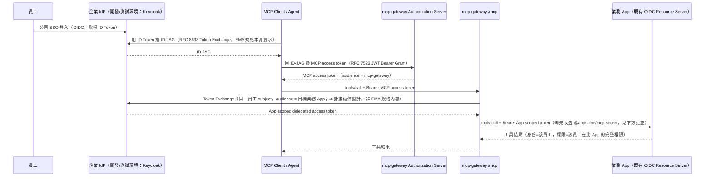
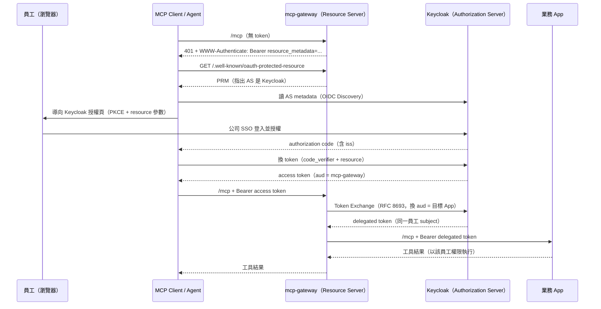

# Z30 - MCP 認證機制遷移可行性研究（未來計畫，已擱置）

> 🅿️ **狀態：擱置（`paused`），不排入執行。** 本文件是一份**未來計畫的可行性研究**，不是
> 待執行的正式編號計畫。2026-08-04 完成全部技術驗證後，決定**不在此時推進**。
>
> **擱置理由（非技術性）**：使用者確認 `GatewayProfileApiKey`（031「一人一 key」）**目前並無
> 實際使用者**——也就是現階段沒有人在用 mcp-gateway。既然沒有 key 要管、沒有離職撤銷需求、
> 沒有稽核缺口在痛，這套遷移是在為尚不存在的使用場景預先建設，而代價明確（兩個共用套件改造、
> 兩輪 10 repo 傳播、新增 Keycloak client、Keycloak 升版、額外的 `azp` 驗證）。投報率在此時
> 不成立。**這不是技術不可行，是時機問題**——技術面的結論見下方。
>
> **重啟條件**：當實際出現 MCP 使用需求（有人要用 Agent 跨 App 操作、開始發放個人 key、
> 或出現離職撤銷／稽核追溯的實際需要）時，本文件的 Phase 1 已全部完成，可直接從 Phase 2
> 接續，不需重做可行性評估。
>
> ---
>
> **技術結論摘要（皆已實測，非推論）**：
>
> | 項目 | 結論 |
> | --- | --- |
> | EMA（Enterprise-Managed Authorization） | ❌ **不可行**。Keycloak 不支援 ID-JAG（非版本問題）；MCP client 支援度僅 Archestra.AI 一家 |
> | 方案 A（MCP 核心 OAuth） | ✅ **可行**。Keycloak 26.2 Token Exchange 實測五項判準全過；Claude Code 核心 OAuth 支援完整 |
> | RFC 8707 Resource Indicators | ❌ Keycloak 完全不支援，但不影響功能（規格容許 AS 忽略） |
> | 衍生的必要對策 | gateway 必須加驗 `azp`，僅驗 `aud` 無法滿足規格（見 §8 A.6c） |
>
> **本研究另外挖出一個與本主題無關、但確實存在於已上線程式碼的安全缺口**（§6 風險第 14 點）：
> `azp=chat` 的 token 以 `audience:'wiki'` 驗證會通過，任一 App 外洩 token 即可橫向存取該
> 使用者在其他 App 的權限。那是 035 範圍的既有問題，不隨本文件一起擱置——**已獨立開正式編號
> 計畫 [[040-oidc-audience-azp-hardening-plan]] 處理**。
>
> ---
>
> **閱讀指引——各章節的有效性**：
>
> | 章節 | 狀態 |
> | --- | --- |
> | §1 目標、§2 目標架構、§3 IdP 能力表 | **仍以 EMA 敘述**，保留作為決策脈絡；ID-JAG 相關要求（§3 第 2 項 a、第 3 項、第 5 項）在方案 A 下不再需要 |
> | §4 Phase 1 執行結果／補充盤點 | **有效，實測結論**，重啟時可直接沿用 |
> | §4 Phase 2 | 需注意風險第 13 點（`issuer + sub` 主鍵與現行實作牴觸） |
> | §4 Phase 3、4 | **已依方案 A 改寫**，是重啟時的執行方向 |
> | §4 Phase 5、6 | 大致沿用 |
> | §5 完成條件、§6 風險 | 部分條目仍為 EMA 措辭；風險第 13、14 點為實測後新增，最重要 |
> | §8 方案 A（含 A.6b／A.6c 實測） | **技術結論最權威處** |
>
> **沿革**：2026-08-03 以 `Z27-mcp-enterprise-managed-authorization-plan` 草稿提出 →
> 2026-08-04 轉為正式編號計畫 `039` → 同日完成 Phase 1 技術驗證後，因缺乏實際使用需求，
> 退回未來計畫並改編為 `Z30`。承接
> [[038-mcp-spec-2026-07-28-migration-plan]] 的授權延伸議題。
>
> **appspine 是 OIDC-only 架構（035），不是 Keycloak-only**——Keycloak 目前只是開發／測試環境
> 的 IdP，正式環境要用自架 Keycloak 還是 Okta／Entra 等商用服務，035 §4.5 明確留給後續獨立
> 計畫定案。本文件因此把 IdP 相關敘述寫成通用的 OIDC／OAuth 標準能力（§3），供選型時逐項確認。

## 1. 目標

導入 MCP 官方的 Enterprise-Managed Authorization（EMA）擴充
（`io.modelcontextprotocol/enterprise-managed-authorization`），讓企業管理者可以在企業 IdP
統一設定員工對 MCP Server 的存取權限，避免每位員工逐一對每個 MCP Server 授權。

**EMA 是 MCP 存取的唯一認證方式，M2M key 只留給各業務 App 自己的 REST API 認證，不涉入 MCP
協定本身**：

- `/mcp`（client → gateway）：只接受 EMA Bearer access token，不接受 `x-api-key`。
- gateway → 各業務 App 的工具呼叫：不再使用 `VaultedAppKey`，改用 OAuth 2.0 Token Exchange
  （RFC 8693，§3 有詳細規格）換發「audience 指向該業務 App、身份仍是同一位員工」的 delegated
  access token。**這需要改造共用套件 `@appspine/mcp-server`**——各業務 App 的 `/mcp` 目前
  只認 API key（見 §2.1 的更正說明），無法直接吃 Bearer OIDC token。
- M2M key（`ApiKey`／`GatewayProfileApiKey`）保留給各業務 App（含 mcp-gateway 自己）的一般
  REST API 認證用途——例如 mcp-gateway 的管理端點（`gateway-profiles`、`discovery`、
  `gateway-audit-logs`）、CI／背景工作對各業務 App REST API 的既有整合。這些都不是 MCP 協定，
  M2M 機制本身不需要改動，只是不再參與 `/mcp` 這條路徑。
- CI／自動化測試不再用 M2M 抄捷徑打 `/mcp`：改用 IdP 裡一個專門的測試身份，走跟真人一樣的
  SSO/ID-JAG 流程，確保測試路徑與正式路徑完全一致。**這個測試身份要用哪種非互動方式取得
  憑證，取決於 IdP 支援什麼**（不能預設是 ROPC／direct grant，見 §3 第 8 項）。

**權限委派模型**：Agent 換到的 downstream App token，權限範圍等於該員工在該 App 的**全部**
權限，不做額外縮小。也就是說，只要員工在某個業務 App 有權限做的事，透過 Agent 委派也能做到；
不引入額外的「MCP 專屬 scope」讓 App 端做二次授權判斷。這個模型把安全防線集中在撤銷與 TTL
（見 §6 風險第 6 點），是刻意的取捨，不是疏漏。

**這個委派語意與各 App 現行行為一致，不是新引入的模型**：各業務 App 的 MCP tool 目前就是用
`ctx.actingUserId` + `ctx.roleNames` 做授權（例如
``apps/wiki/backend/src/pages/pages.mcp.ts:45``、
``apps/wiki/backend/src/spaces/spaces.mcp.ts:43``），
也就是「以某個真人身份、用他在該 App 的完整角色權限執行工具」。本計畫改變的只是**這個身份的
來源**（從 API key 的 acting-user 綁定改為 OIDC token claims），`McpCallContext` 的欄位語意
不需要重新設計。這讓 §2 提到的共用套件改造範圍比表面看起來小：主要是新增一條「從已驗證的 JWT
填 `actingUserId`／`roleNames`／`scopes`」的路徑，而不是重寫工具授權模型。

## 2. 目標架構

`mcp-gateway` 同時扮演 MCP Authorization Server 與現有的 Resource Server。

### 2.1 更正：業務 App 的 `/mcp` 目前不接受 OIDC token（2026-08-04 覆核發現）

本計畫初版曾宣稱「業務 App 端不需要為此新增或修改任何驗證邏輯」，**這是錯的**，實查程式碼後
更正如下：

各業務 App 的 `/mcp` 端點來自共用套件 `@appspine/mcp-server`，而它**只認 M2M API key，沒有
JWT fallback**：

- [`mcp.controller.ts:29`](../../packages/mcp-server/src/mcp.controller.ts) —
  `@UseGuards(ApiKeyGuard)`，單一 guard。
- 同檔 `:19-20` 的註解：「MCP is for external agents (n8n, AI clients) authenticated via M2M
  API key」。
- [`types.ts`](../../packages/mcp-server/src/types.ts) 的 `McpCallContext` 註解寫得更
  直接：「**MCP is exclusively API-key-gated** (see mcp.controller.ts)」，且 context 帶有
  `isApiKey: boolean` 欄位。

因此 gateway 若直接把 delegated OIDC token 以 Bearer 送到業務 App 的 `/mcp`，會被 guard 擋下。
要讓本計畫的架構成立，**必須修改共用套件 `@appspine/mcp-server` 讓 `/mcp` 能驗證並解析 OIDC
Bearer token，再依 template propagation 流程傳播到 `appspine-app-template` 與 9 個業務 App**
（見 §4 Phase 4）。這正是原 Z27 草稿刻意迴避的「改造每個業務 App 的內部認證」，本計畫既然
決定移除 `VaultedAppKey`，就必須承擔這部分工作，不能假設 App 端零改動。

**v3 前的 `JwtOrApiKeyGuard` 不能直接沿用**：其語意是「API key 優先，沒有 API key 才
fallback 到 JWT」，與本計畫「`/mcp` 只認 EMA 委派 token」的方向相反，需要另外實作或改造。
該 deprecated guard 已在 [051 v3 M3](../decisions/051-v3-m3-legacy-removal-report.md) 移除；此段保留
作為當時可行性判斷的歷史脈絡。

### 2.2 兩個層級的 `/mcp` 必須分開討論

本計畫涉及兩個同名但層級不同的端點，Phase 4 的驗收條件必須分別敘述：

| 端點 | 呼叫者 | 目標狀態 |
| --- | --- | --- |
| `mcp-gateway` 的 `/mcp` | MCP Client／Agent | 只接受 EMA access token，完全不解析 `x-api-key` |
| 各業務 App 的 `/mcp`（`@appspine/mcp-server` 提供） | mcp-gateway（唯一合法呼叫者） | 接受 gateway 帶來的 delegated OIDC token；是否保留 `x-api-key` 需在 Phase 1 盤點後決定（見 §6 風險第 10 點） |

**兩段 exchange 的性質不同**：Agent→IdP 換 ID-JAG、Agent→gateway 換 MCP access token 這兩步
是 EMA 規格本身的規定（§3 有 RFC 依據）；gateway→IdP 換 App-scoped delegated token 是本計畫
在 EMA 規格之外自行設計的延伸（用來取代 `VaultedAppKey`），語意上沿用同一個 RFC 8693 Token
Exchange 機制，但不是 EMA spec 的強制要求，選型時要分開評估兩者的 IdP 支援狀況。

## 3. 本計畫依賴的 OIDC/IdP 標準能力

這份清單是給 035 §4.5「正式環境 IdP 選型（自架 Keycloak vs Okta／Entra 等）」用的檢查表：
選型時要逐項確認候選 IdP 是否支援，而不是預設它支援。

> ⚠️ **本表以 EMA 為前提編製；方案 A 下要求已改變**（見文件開頭的章節有效性表）：
>
> - **不再需要**：第 2 項 (a)（ID-JAG 換發）、第 3 項（JWT Bearer Grant）、第 5 項
>   （ID-JAG claims）——這三項都是 EMA 專屬，也正是 Phase 1 判定不可行的部分。
> - **仍然需要**：第 1 項（OIDC Code Flow）、第 2 項 (b)（下游委派用的 Token Exchange）、
>   第 4 項（JWKS）、第 6 項（audience 綁定）、第 7 項（RFC 9728 PRM，在方案 A 下從「選填
>   但建議」升級為**規格 MUST**）、第 8 項（CI 非互動憑證）。
> - **方案 A 新增**：OAuth 2.1 相容的 AS、RFC 8414 或 OIDC Discovery（擇一）、RFC 8707
>   `resource` 參數（AS 不支援亦可降級，見 §8 A.6）、RFC 9207 `iss` 參數（SHOULD）、
>   CIMD 或 pre-registration 的 client 註冊機制。
>
> 待方案 A 定案後，本表應整份改寫為方案 A 版本。

| # | 能力 | 規格來源 | appspine 用途 | 備註 |
| --- | --- | --- | --- | --- |
| 1 | OIDC Authorization Code Flow | OpenID Connect Core | 員工 SSO 登入，取得 ID Token | 035 已完成，開發環境 Keycloak 已驗證 |
| 2 | OAuth 2.0 Token Exchange | RFC 8693 | (a) MCP Client 用 ID Token 換 ID-JAG（EMA 規格強制要求，`grant_type=urn:ietf:params:oauth:grant-type:token-exchange`、`requested_token_type=urn:ietf:params:oauth:token-type:id-jag`）；(b) gateway 用員工身份換發 App-audience delegated token（本計畫延伸設計，非 EMA 規格要求） | **本計畫最關鍵的可行性關卡，且被依賴兩次**；不同 IdP 支援程度差異大（Keycloak 原生支援；Okta 需對應方案；Entra 用概念相近但形狀不同的 On-Behalf-Of flow，不是同一組 API） |
| 3 | JWT Bearer Grant | RFC 7523 | MCP Client 拿 ID-JAG 向 mcp-gateway（MCP Authorization Server）換 MCP access token，`grant_type=urn:ietf:params:oauth:grant-type:jwt-bearer` | 這段由 mcp-gateway 自己實作（不依賴 IdP 提供這個 grant），但依賴 IdP 簽發的 ID-JAG 可被驗證（見下一項） |
| 4 | JWKS / Key Discovery | OIDC Discovery | mcp-gateway 驗證 IdP 簽發的 ID-JAG 簽章 | IdP 要能公開簽章用的公鑰端點 |
| 5 | ID-JAG 必要 claims | draft-ietf-oauth-identity-assertion-authz-grant §3.1 | `iss`／`aud`／`resource`（選填）／`sub`／`client_id`／`scope`／`exp`／`iat`／`jti` | 穩定的 `sub` 是 §4 Phase 2「`issuer+sub` 主鍵」設計的前提；這是草案規範（IETF draft），尚未定案為正式 RFC，選型時要留意 IdP 對草案的支援可能隨版本變動 |
| 6 | Audience-restricted 簽發 | RFC 8693 / 一般 OAuth 安全實務 | MCP access token 與 App-scoped delegated token 都必須嚴格綁定單一 audience | ⚠️ **原本以為「appspine 本來就嚴格驗 audience」，實測後證實過度樂觀**——見 §6 風險第 14 點：多 App 使用者的登入 token `aud` 會涵蓋其有權限的**全部** App，而 `jsonwebtoken` 對陣列 aud 採「任一相符即通過」，故跨 App 重放目前**不會**被擋。Token Exchange 換發的 token 反而較窄，是改善而非退步 |
| 7 | OAuth 2.0 Protected Resource Metadata（選填但建議） | RFC 9728 | MCP Server／各業務 App 發佈自己的 resource descriptor，讓 IdP 管理端能針對特定 MCP Server 設定存取政策 | 對應 §4 Phase 3「MCP OAuth metadata／`.well-known` discovery endpoint」 |
| 8 | 非互動式取得 Identity Assertion 的機制 | 依 IdP 而定（ROPC／service account／workload identity 等） | CI e2e 測試身份要在無人值守情況下取得 ID Token，才能接著走 ID-JAG 流程 | **不能預設用 ROPC（Resource Owner Password Credentials）**：OAuth 2.1 已移除此 grant，Entra 對它有諸多限制（例如不支援啟用 MFA 的帳號），Keycloak 雖支援 direct grant 但屬需明確開啟的設定。選型時要確認候選 IdP 提供哪一種可被自動化的憑證取得方式 |

## 4. 分階段計畫

### Phase 1 執行結果（2026-08-04）：**兩項阻斷性發現，已據此改採方案 A**

以 `dev-infra/` 的實際設定與官方文件查證後，Phase 1 的兩個 go/no-go 前提**都不成立**。

**阻斷 1：Keycloak 不支援 ID-JAG——這是 EMA 的核心，且不是版本升級能解決的**

- Keycloak 的 Standard Token Exchange（V2）只接受 access token／refresh token／ID token 作為
  `requested_token_type`，**沒有 `urn:ietf:params:oauth:token-type:id-jag`**
  （[Keycloak token exchange 文件](https://www.keycloak.org/securing-apps/token-exchange)）。
  ID-JAG 是 §3 第 5 項、也是 EMA 規格用來承載企業政策決策的憑證，缺了它整個 EMA 流程無法成立。
- 附帶發現：**現行 dev-infra 的 Keycloak 版本連標準 Token Exchange 都沒有**。Standard Token
  Exchange 是在 **Keycloak 26.2.0** 才從 preview 轉為正式支援（[26.2.0 release
  notes](https://www.keycloak.org/2025/04/keycloak-2620-released)：「The token exchange feature
  was in preview for a long time, so we are glad to finally support the standard token
  exchange」），而 `dev-infra/docker-compose.yml` 釘 `26.0`、`dev-infra/Dockerfile.keycloak`
  釘 `26.1.0`，兩者皆早於 26.2，且兩個檔案版本本身就不一致；`dev-infra/` 也沒有任何
  `--features` 設定，因此舊版 preview 的 V1 token-exchange 同樣沒有啟用。
- 影響區分：§3 第 2 項 (b)（gateway→App 的委派換發，本計畫延伸設計）**只是版本問題**，升級到
  Keycloak 26.2+ 並開啟該 client 的「Standard token exchange」即可，且 V2 明確支援
  client-to-client（A client 的 token 換成 audience 為 B client 的 token）。真正無解的是 (a)
  ID-JAG 那一段。

**阻斷 2：實際會用的 MCP Client 都不支援 EMA**

依 [MCP Extension Support Matrix](https://modelcontextprotocol.io/extensions/client-matrix)，
Enterprise Auth 欄位目前**只有 Archestra.AI 打勾**；Claude Desktop、Claude（web）、Cursor、
VS Code GitHub Copilot、ChatGPT、Goose、Postman 等全部空白（Claude Code 未列於該表，狀態不明，
但沒有任何跡象顯示已支援）。EMA 必須 client 與 server 雙方 opt-in，因此若照本計畫讓 `/mcp`
只認 EMA，**結果會是沒有任何主流 client 能連上**。該矩陣由社群維護、可能落後於實作，但要當成
「可以開工」的依據，需要對實際使用的 client 逐一實測確認，不能只看矩陣就樂觀推進。

> ⚠️ **本項阻斷只對 EMA 成立，不可外推到方案 A**：該矩陣三欄**全部都是 extension**，其中
> 「OAuth Client Credentials」是專供 M2M（無真人登入）的擴充，與本計畫需求相反；該頁並註明
> extension 支援度「is tracked separately from the core MCP authorization features」——**核心
> 授權不在該矩陣上**。實查 Claude Code 官方文件後確認其核心 OAuth 支援完整（見 §8 A.6）。

**已驗證成立的部分**（這些不受上述阻斷影響，未來任何方案都可沿用）：

- realm `appspine-dev` 已為 9 個 App 各建一個 confidential client（`wiki`／`calendar`／`drive`／
  `chat`／`project`／`approve`／`mcp-gateway`／`master-data`／`template`），且每個 client 都掛了
  `oidc-audience-mapper` 把 `aud` 設為自己的 clientId——§3 第 6 項的 audience-per-app 前提
  **完全成立**，`OIDC_AUDIENCE` 即 client ID（補齊了 §7 未查證的 5 個 App）。
- 已有 per-app 群組（`wiki-users`／`approve-users`／…／`appspine-dev-admins`），可直接作為
  Phase 2「群組→profile／scope 映射」的基礎，不必從零設計。
- 9 個 App client 全部 `directAccessGrantsEnabled=true`，§3 第 8 項（CI 非互動取得憑證）在
  Keycloak 環境下有現成解，惟仍受「正式環境 IdP 是否支援」的限制。
- `accessTokenLifespan=300`（5 分鐘），與 §6 風險第 6 點「靠短 TTL 控制全權限委派」的假設相符。

**待決策**：本計畫的前提（EMA）在現階段不可實作。後續方向見 §8。

#### Phase 1 補充盤點（2026-08-04）

**1. 各業務 App 的 `/mcp` 直連呼叫者盤點——決定 App 端能否移除 `x-api-key`**

- **程式碼層面：全 repo 無 gateway 以外的呼叫者。** 以 `/mcp`／`mcpUrl`／`mcpEndpoint` 掃過
  `apps/**` 的 `.ts/.js/.mjs/.json/.yml`，13 個命中檔案**全部位於 `apps/mcp-gateway` 內**
  （`mcp-client.ts`、`gateway-catalog.service.ts`、`call-tool.mcp.ts`、`discovery.service.ts`、
  golden-path e2e 等）。其餘 8 個業務 App 沒有任何呼叫他人 `/mcp` 的程式碼。
- **架構意圖一致**：031 §2 已拍板「路線 A：使用者用 Claude Desktop／Claude Code 等現成 MCP
  client **直接連 025 的 `/mcp`**」——外部 client 只連 gateway，各業務 App 的 `/mcp` 在設計上
  就是給 gateway 呼叫的。
- **但這是文件化的公開介面，不是內部實作細節**：各業務 App 的 `README.md`「MCP tools」章節
  明載「Exposed at `POST /mcp` ... Auth via `x-api-key` header」，並指向 `docs/agent-guide.md`
  的 service-account 帳號／key 設定 runbook（wiki、approve、drive 等皆有）。這是 gateway 出現
  之前就存在的直接整合面。
- **盤點的邊界**：程式碼盤點只能證明「repo 內沒有呼叫者」，**無法證明實際佈署環境中沒有人
  依照 runbook 建了 service-account key 在用**。這需要維運端確認，不是讀 code 能回答的。
- **結論**：移除 App 端 `/mcp` 的 `x-api-key` 在架構上可行且與 031 意圖一致，但屬於**對已文件化
  公開介面的破壞性變更**，須（a）由維運端確認無實際使用者，（b）同步更新 9 個 repo 的 README
  與 agent-guide，不可當作內部重構靜默移除。§6 風險第 10 點的未決事項據此收斂。

**2. 9 個 App 的 `OIDC_AUDIENCE` 已全數確認**：realm 的 client ID 即 App 資料夾名
（`wiki`／`calendar`／`drive`／`chat`／`project`／`approve`／`mcp-gateway`／`master-data`，
加上 `appspine-app-template` 用 `template`），每個 client 皆掛 `oidc-audience-mapper` 將 `aud`
設為自身 clientId。Token Exchange 的 `audience` 參數可直接用此對照，先前「僅抽查 4 個」的缺口
已補齊。

**3. 試點 App 建議：`apps/wiki`**

- 031 的端到端驗證（T-11800）與 038 的跨 App rollout smoke（`wiki_list_wiki_spaces`，真實
  vaulted M2M downstream call 回 HTTP 200）都以 wiki 為對象，是**唯一被兩個計畫實際驗證過的
  路徑**，基準線最清楚。
- 領域模型最單純（Space／Page），且有純讀取工具可在不涉及寫入權限的前提下驗證委派身份。
- 對照組：approve 的四張 engine-core 表刻意不提供泛用 CRUD 工具（016 §8），驗證面較窄且牽涉
  domain events，不適合當第一個試點。

**4. gateway catalog scope 映射規則草案**

方案 A 下，gateway 層級的 scope **只決定「這個員工在 catalog 裡看得到哪些 App／工具」**，
不做業務 App 內部的細粒度授權（那完全交給該 App 既有的 OIDC 權限模型，見 §1 權限委派模型）。
現成素材：realm 已有 per-app 群組（`wiki-users`／`approve-users`／…／`appspine-dev-admins`）。
建議規則：**Keycloak 群組成員資格 → 該 App 的工具是否出現在 catalog**，預設「無對應群組即不
曝光」（fail-closed）。與 031 §3.1 既有的「照角色分 GatewayProfile」如何併用，需在 Phase 2
定案——兩者是不同的分類軸（031 是職能角色，此處是 App 存取權），不可直接混為一談。

### Phase 1：可行性與試點確認

- 確認目前／候選 IdP 是否支援 §3 表格全部項目，尤其是第 2 項 OAuth 2.0 Token Exchange（兩處
  依賴都要各自確認，不能只驗證其中一處就視為可行）。
- ~~確認實際使用的 MCP Client／Agent 是否支援 EMA~~ → **已完成，結論為不支援**（阻斷 2）；
  方案 A 所需的核心 OAuth 支援度已另行查證成立，見 §8 A.6。
- ~~確認 §3 第 8 項：候選 IdP 提供哪一種可自動化的憑證取得方式供 CI 測試身份使用~~ →
  **開發環境已確認**：realm 9 個 client 皆 `directAccessGrantsEnabled=true`；正式環境 IdP
  仍待 035 §4.5 選型後確認。
- ~~盤點是否有 mcp-gateway 以外的呼叫者直接打各業務 App 的 `/mcp`~~ → **已完成**，見上方
  「Phase 1 補充盤點」第 1 項。
- ~~盤點 9 個業務 App 的 `OIDC_AUDIENCE` 實際值~~ → **已完成**，見上方「Phase 1 補充盤點」
  第 2 項。
- **仍待維運端確認**：實際佈署環境中是否有人依 agent-guide runbook 建立了直接呼叫各業務 App
  `/mcp` 的 service-account key。這是程式碼盤點無法回答的問題。
- ~~以一個 App 作為試點~~ → **已建議 `apps/wiki`**，理由見「Phase 1 補充盤點」第 3 項
  （待使用者確認）。
- ~~定義 gateway 層級的 GatewayProfile／scope 對應規則~~ → **已產出草案**，見「Phase 1 補充
  盤點」第 4 項；scope 只決定 catalog 曝光範圍，不做 App 內部細粒度授權（見 §1「權限委派
  模型」）。與 031 職能角色分類的併用方式留待 Phase 2 定案。

**Phase 1 尚未結束的項目**：§8 A.6「仍待驗證」三項（Keycloak 的 RFC 8707 支援、MCP client
專用 realm client 設定、端對端實測），以及上方「仍待維運端確認」一項。

### Phase 2：身份與權限資料模型

- 新增企業身份到 `GatewayProfile` 的對應資料。
- 使用 `issuer + sub` 作為穩定主鍵。
- `email` 只作為既有帳號遷移或明確的 fallback，不作為長期唯一身份。
- 定義 IdP 群組／角色到 gateway profile／catalog scope 的映射（僅用於決定 Agent 看得到哪些
  工具，不影響工具實際執行時的 App 端權限）。
- 盤點 `VaultedAppKey` 現有資料與程式碼，規劃隨 Phase 4 一併停用／移除的範圍。
- **決定既有 audit 欄位在無 API key 情境下的語意**：`McpCallContext.sub` 目前的定義是「the
  calling API key's id（`ApiKeyUser.sub`）— needed for `AuditLog.actingApiKeyId` snapshots」
  （見 [`types.ts`](../../packages/mcp-server/src/types.ts)）。EMA 之後這條路徑不再有
  API key，必須明確裁定 `AuditLog.actingApiKeyId` 要留空、改存 IdP subject，還是新增獨立欄位
  區分「M2M key 呼叫」與「EMA 委派呼叫」；同時確認 `McpCallContext.isApiKey` 這個既有欄位的
  去留。這是 schema 與稽核可讀性的決策，不能留到實作時臨場決定。

### Phase 3：mcp-gateway 成為 OAuth Resource Server（依方案 A 改寫，2026-08-04）

> **本 Phase 已依 §8 方案 A 全面改寫**。原版是「在 gateway 自建 Authorization Server」
> （ID-JAG 驗證 + JWT Bearer Grant + 自行簽發 token），因 Phase 1 確認 ID-JAG 不可行而作廢。
> 現版 gateway **只當 Resource Server**，AS 由 Keycloak 擔任，工作量與安全風險都顯著下降。

**A. IdP 端前置設定**

- 將 `dev-infra` 的 Keycloak 升級至 **26.2+**（現行 `docker-compose.yml` 為 `26.0`、
  `Dockerfile.keycloak` 為 `26.1.0`，兩者本身也不一致，需一併對齊）。
- 新增 MCP Client 專用的 **public client + PKCE**（realm 現有 9 個皆為 confidential），
  以 pre-registration 方式建立；規格允許此機制，不強制 DCR。
- 在 `mcp-gateway` client 啟用 **Standard token exchange**，供下游委派使用。

**B. gateway 作為 Resource Server（規格 MUST）**

- 實作 **RFC 9728 Protected Resource Metadata** endpoint
  （`/.well-known/oauth-protected-resource`），內容指向 Keycloak 作為 AS，並宣告
  `scopes_supported`（以「基本功能所需的最小集合」為準，其餘透過 step-up 逐步取得）。
- `/mcp` 改為驗證 OIDC Bearer token：驗證簽章、issuer、expiration，並**強制驗證 audience
  確實為自己**。可沿用 `@appspine/auth` 既有的 `jwt-verifier.service.ts` 機制。
- **⚠️ 但只驗 `aud` 不足以滿足規格，必須加驗 `azp`**（2026-08-04 實測發現，見 §8 A.6c）：
  Keycloak 會把使用者有 client role 的所有 client 列入 `aud`，因此「為 chat 前端簽發的 token」
  其 `aud` 也含 `mcp-gateway`，與「為 MCP client 簽發的 token」在 `aud` 上**無法區分**。規格
  要求「MUST validate that access tokens were issued specifically for them as the intended
  audience」，在 Keycloak 上唯一能滿足此語意的做法是**額外驗證 `azp` 等於 MCP client 的
  `client_id`**。缺這道檢查，任一 App 前端外洩的 token 都能打 `/mcp`，並觸發整條下游委派鏈。
- 未帶 token 或 token 無效時回 **401** 並附
  `WWW-Authenticate: Bearer resource_metadata="...", scope="..."`。
- scope 不足時回 **403** 並附 `error="insufficient_scope"` 與該次操作所需的完整 scope 集合
  （規格要求一次給齊，不可逐個挑戰造成多次授權往返）。

**C. gateway → 業務 App 的委派換發**

- 實作 gateway → Keycloak 的 **RFC 8693 Token Exchange**：以 Agent 請求所帶的 access token
  換發 audience 指向目標業務 App、subject 仍為同一員工的 delegated token。
- **不得**把 Agent 的原 token 直接轉發給業務 App——核心授權規格明訂
  「MCP servers MUST NOT accept or transit any other tokens」（見 §8 A.5）。
- 封裝在獨立介面（例如 `TokenExchangeProvider`）之後，IdP 換人時只需替換此實作。Entra 等
  IdP 以 On-Behalf-Of flow 達成等價語意，API 形狀不同，介面需能容納。

**D. 待驗證項目**（依 §8 A.6，須在本 Phase 內取得實測結論）

- Keycloak 對 RFC 8707 `resource` 參數的支援程度，以及 `aud` 應採 client ID 或 canonical URI。
- MCP client 專用 realm client 的實際建立與 redirect URI 策略（`--callback-port` 對應）。
- 端對端實測：Claude Code → gateway 401 → PRM → Keycloak 授權 → 帶 token 呼叫成功。

> **已排除的疑慮**（見 §8 A.6）：Claude Code 對核心 OAuth、401 + `WWW-Authenticate` 自動探索、
> 以及 DCR／CIMD／pre-registration 三種註冊機制均已支援，因此「client 支援度」與「Keycloak
> 是否支援 CIMD」不再是本 Phase 的風險項。

### Phase 4：共用套件改造、`/mcp` 單一認證與舊機制除役（依方案 A 調整，2026-08-04）

> **本 Phase 的主體不因方案 A 而改變**——共用套件改造與 10 repo 傳播是 `VaultedAppKey` 除役
> 的必要前提，兩個方案都躲不掉（見 §8 A.3）。改變的只有 gateway `/mcp` 接受的 token 種類：
> 從「EMA access token」改為「Keycloak 簽發、audience 為 mcp-gateway 的 OAuth access token」。

**這是本計畫規模最大的一個 Phase**，因為它包含一次共用套件改造與 10 個 repo 的傳播（§2.1
的更正發現）。工作順序：先讓 App 端能接受委派 token，再切換 gateway，最後才除役舊機制。

- **改造共用套件 `@appspine/mcp-server`**：讓 `McpController` 能驗證 OIDC Bearer token，並把
  已驗證的 JWT claims 映射成 `McpCallContext` 的 `actingUserId`／`roleNames`／`scopes`
  （語意與現行 API key 路徑一致，見 §1「委派語意與各 App 現行行為一致」）。依 Phase 1 的盤點
  結果決定是否同時保留 API key 路徑；若保留，兩條路徑都必須產生語意一致的
  `McpCallContext`，且不得出現「送了無效 Bearer 卻 fallback 成 API key 通過」這類降級漏洞
  （現成的 `JwtOrApiKeyGuard` 正是這種「API key 優先」語意，不可直接沿用，見 §2.1）。
- App 端同樣要**強制驗證 audience 為自己**——delegated token 的 `aud` 是目標 App，不是
  gateway；這道檢查是防止跨 App 重放的關鍵，不可因為「反正是 gateway 送來的」而略過。
- 依 template propagation 流程（`list-template-changes.mjs` → 手動 replay → 回填各 repo 的
  `docs/template-sync.md`）把改造傳播到 `appspine-app-template` 與 9 個業務 App。
- **mcp-gateway 的 `/mcp`**：只接受 Keycloak 簽發、audience 為 `mcp-gateway` 的 OAuth
  access token；不接受、不解析 `x-api-key`。401／403 回應須符合 Phase 3 B 項的規格要求。
- gateway 呼叫業務 App 時一律使用 Phase 3 C 項換發的 delegated token，不再讀取／使用
  `VaultedAppKey`。
- 除役 `VaultedAppKey` 相關程式碼與資料（`vault/vaulted-app-key.controller.ts`、
  `VaultedKeyResolverService` 等），確認移除後沒有殘留的死碼或無效參照。
- CI e2e golden-path 測試改用 IdP 測試身份，走完整 OAuth flow 呼叫 gateway 的 `/mcp`
  （realm 9 個 client 皆已 `directAccessGrantsEnabled=true`，Keycloak 環境下有現成解；正式
  環境 IdP 若不同則須另尋非互動取得憑證的方式，見 §3 第 8 項）。

### Phase 5：稽核、撤銷與安全控制

- 每次 MCP tool call 都記錄 IdP subject、GatewayProfile、Agent、App、tool 與 workflow ID。
- 驗證員工離職、群組移除與 token 過期後的行為，包含 gateway → App 的第二段 Token Exchange
  是否會因為員工帳號狀態變化而正確失敗。
- 明確區分「無法驗證 token」、「身份不存在」與「gateway catalog scope 不足」。
- 對 ID-JAG 與兩段 access token（gateway 段、App 段）都設定合理的 audience、issuer、TTL 與
  replay 防護。
- 不把 token 內容直接寫入 audit log 或錯誤訊息。
- 因為採用「全權限委派」模型，Agent 在 session 有效期間內等同該員工本人操作該 App 的全部
  權限——撤銷／TTL 是唯一的風險控制手段（沒有 scope 縮小這道防線），本 Phase 的 TTL 與撤銷
  驗證因此是本計畫的關鍵安全門檻，不可簡化。

### Phase 6：試點驗證與逐步推廣

- 驗證已授權員工可以呼叫允許的工具，且工具執行時在業務 App 端的權限與該員工手動操作一致。
- 驗證未授權員工、gateway catalog scope 不足、錯誤 issuer／audience、過期 token 都會被拒絕。
- 驗證 CI 測試身份能穩定走完整 EMA 流程，取代原本的 M2M 捷徑。
- 先對內部少數使用者開放，再逐步加入 wiki、approve、calendar 等 App。
- 全部試點 App 驗證通過後，`/mcp` 的 M2M 認證路徑與 `VaultedAppKey` 機制視為正式除役，
  不需要保留切換開關。

## 5. 完成條件

- 員工使用企業 SSO 後，不需要逐一對每個 MCP Server 做授權。
- IT 可以透過企業 IdP 集中授予或撤銷 MCP 存取權。
- mcp-gateway 的 `/mcp` 只接受 EMA Bearer token；`x-api-key` 已從該路徑移除。
- `@appspine/mcp-server` 已能驗證 OIDC Bearer token 並正確映射 `McpCallContext`，改造已傳播到
  `appspine-app-template` 與 9 個業務 App，各 repo 的 `docs/template-sync.md` 已回填。
- gateway → 業務 App 的呼叫改用 OAuth Token Exchange 轉發員工身份，`VaultedAppKey` 機制與
  相關程式碼已移除。
- M2M key 持續正常運作於各業務 App 自己的 REST API 認證（未受本計畫影響）。
- MCP tool audit 可以穩定追溯到真人員工與 GatewayProfile；`AuditLog.actingApiKeyId` 在 EMA
  路徑下的語意已依 Phase 2 的裁定實作，稽核紀錄能明確區分 M2M 呼叫與 EMA 委派呼叫。
- CI／自動化測試改用專門的 IdP 測試身份，不再依賴 M2M key 呼叫 `/mcp`。
- 通過單元測試、整合測試、負向安全測試與實際 Agent 互通測試。

## 6. 主要風險與未決事項

1. IdP 是否原生支援 EMA 所需的 ID-JAG（含 draft-ietf-oauth-identity-assertion-authz-grant
   的 claims 要求），而不是只有一般 OIDC 登入。
2. IdP 是否支援 client-to-client 的 OAuth 2.0 Token Exchange（RFC 8693）：Keycloak 原生支援
   （部分版本為 preview feature，需額外啟用）；Okta 需搭配對應方案；Entra 是用 On-Behalf-Of
   flow 做等價的事，不是同一組 API 形狀。**這項目前完全依附在 035 §4.5 尚未定案的正式 IdP
   選型結果上**——選型還沒定案前，本計畫的 Phase 3/4 只能先以開發用 Keycloak 驗證概念，
   不能假設正式環境會有相同能力。
3. 目標 MCP Client 是否已支援 EMA；client 不支援時，server 端無法單方面啟用完整流程。
4. `sub` 的生命週期與帳號遷移策略，避免員工重建或 IdP migration 後錯綁帳號。
5. EMA access token（含 gateway 段與 App 段兩層）的簽發與撤銷策略，尤其是短 TTL、refresh 與
   員工離職後即時失效的時效差異。
6. **全權限委派的風險集中在撤銷與 TTL**：因為不做 scope 縮小，一旦 Agent session 被濫用或
   誤用，影響範圍等同該員工在該 App 的全部權限；短 TTL、即時撤銷與完整 audit 是唯一的緩解
   手段，需要在 Phase 5 明確驗證，不能只做到「有記錄」的程度。
7. `VaultedAppKey` 機制已在 038 驗證過可正常運作於生產環境，除役時需確認沒有除 gateway 以外
   的其他呼叫路徑仍依賴它（避免除役後出現未預期的破壞性變更）。
8. IdP 群組／角色與 appspine gateway catalog scope 的映射是否需要額外的管理介面。
9. §3 第 2 項的 Token Exchange 換不同 IdP 實作方式差異可能很大，Phase 3 的
   `TokenExchangeProvider` 介面設計要能容納「同一 RFC、不同 API 形狀」（如 Entra 的
   On-Behalf-Of），不能假設所有 IdP 都長得跟 Keycloak 一樣。
10. **業務 App 的 `/mcp` 是否保留 `x-api-key`**（見 §2.2）：Phase 1 補充盤點已確認 repo 內無
    gateway 以外的呼叫者，且與 031「路線 A」的架構意圖一致，**架構上可移除**。但各 App 的
    README／agent-guide 把它記載為公開的 service-account 整合介面，因此屬於破壞性變更：須先由
    維運端確認實際佈署無使用者，並同步更新 9 個 repo 的文件。若決定保留，則要防止「無效
    Bearer 降級成 API key 通過」的漏洞（見 Phase 4）。
11. **Phase 4 的共用套件改造牽動 10 個 repo**，是本計畫最大的單一風險來源：`@appspine/mcp-server`
    是所有業務 App 的 MCP 基礎，改壞會同時影響 9 個 App。需要比照 038 的做法，先在試點 App
    驗證，再逐一傳播，且每個 App 都要有可回退的 commit 邊界。
12. 本計畫初版曾錯誤宣稱「業務 App 端零改動」（見 §2.1 更正），代表規劃階段的工作量估算基準
    已經改變。若後續要據此排程，須以更正後的範圍重新估算，不可沿用初版的規模印象。
13. **Phase 2 的「`issuer + sub` 主鍵」與現行實作牴觸**（見 §8 A.6b）：`buildOidcJwtUser` 目前
    以 `email` 為唯一身份鍵，IdP `sub` 未被儲存。改為 `issuer + sub` 需修改 `@appspine/auth`
    並再做一輪 10 repo 傳播——這是**第二個**共用套件改造，與 `@appspine/mcp-server` 那一輪
    相加後，本計畫的實際範圍明顯大於原始估計。也可選擇維持 email 主鍵、放棄 Phase 2 的該項
    設計，但須明確承擔程式碼註解已載明的風險（未驗證 email 可能撞上同名帳號並繼承其角色）。
14. **既有的跨 App token 重放缺口（非本計畫造成，實測發現）**：Keycloak 會把使用者持有 client
    role 的所有 client 都列入 `aud`，因此多 App 使用者從任一 App 取得的 token，其 `aud` 涵蓋
    他有權限的全部 App；而 `@appspine/auth` 僅以 `jsonwebtoken` 的 `audience` 選項驗證（陣列
    aud 任一相符即通過）、**不檢查 `azp`**。實測：`azp=chat` 的 token 以 `audience:'wiki'`
    驗證會通過。這代表任一 App 若遭入侵或 token 外洩，可橫向存取該使用者在其他 App 的權限。
    §3 第 6 項原先「audience 已嚴格驗證」的假設據此作廢。

    **此問題有兩個層面，處理歸屬不同**：
    - **既有 App 之間的橫向重放**（chat 的 token 可打 wiki 的 REST API）：屬 035 範圍的既有
      問題，與本研究無關，已獨立開 [[040-oidc-audience-azp-hardening-plan]] 處理，不擴大本
      計畫範圍。**更正（040 獨立 Opus 覆核後）**：此處「`@appspine/auth` 僅驗 `audience`」
      的敘述本身正確，但 REST 與 WebSocket 是兩條獨立路徑（分別由 `passport-jwt` 與
      `verifyOidcSignature()` 各自驗簽），唯一匯流點是 `buildOidcJwtUser()`；040 計畫已據此
      修正檢查點位置，本段不再更新，以 040 文件為準。
    - **對 gateway `/mcp` 的影響**：屬本研究 **必須自行處理**的範圍。實測確認 chat 簽發的 token
      其 `aud` 亦含 `mcp-gateway`，故 gateway 光驗 `aud` 無法滿足 MCP 規格的「issued
      specifically for them」要求，且會讓任一 App 外洩的 token 觸發整條下游委派鏈。對策為
      Phase 3 B 新增的 **`azp` 驗證**，已列為該 Phase 的 MUST（見 §8 A.6c）。

## 7. 審查記錄

**第一輪（2026-08-04，Opus 對本文件初版的實查覆核）**：以實際程式碼查證初版的架構前提，找出
一項會實質改變工作量估算的錯誤與四項缺口，均已併入本版：

1. **核心前提錯誤——「業務 App 端不需要新增或修改任何驗證邏輯」**。實查
   `appspine/packages/mcp-server/src/mcp.controller.ts:29` 為 `@UseGuards(ApiKeyGuard)` 單一
   guard，且 `types.ts` 的 `McpCallContext` 註解明載「MCP is exclusively API-key-gated」，
   證明業務 App 的 `/mcp` 無法接受 OIDC Bearer token。初版把「App 端零改動」當成本設計的
   優點來陳述，實際上必須改造共用套件並傳播到 10 個 repo。已在 §2.1 記錄更正、§4 Phase 4
   納入該工作、§6 風險第 11／12 點記錄影響。
2. **委派語意其實已存在（初版低估了設計的貼合度）**。實查
   `apps/wiki/backend/src/pages/pages.mcp.ts:45`、`spaces.mcp.ts:43`，各 App 的 MCP tool 早就
   以 `ctx.actingUserId` + `ctx.roleNames` 授權，「全權限委派」是既有行為而非新模型；改動的
   只是身份來源。這使第 1 點的改造範圍比表面小。已補進 §1。
3. **`JwtOrApiKeyGuard` 存在但方向相反**。`jwt-or-api-key.guard.ts:14-18` 是「API key 優先，
   失敗才 fallback JWT」，不能直接沿用於「只認 EMA」的需求。已補進 §2.1。
4. **audit 欄位語意變更未規劃**。`McpCallContext.sub` 綁定於 `AuditLog.actingApiKeyId`，EMA
   之後無 API key，此欄位語意需明確裁定。已補進 §4 Phase 2 與 §5 完成條件。
5. **兩個層級的 `/mcp` 未區分**、**CI 測試身份的 ROPC 假設未查證**。已分別補進 §2.2 表格、
   §3 能力表第 8 項與 §4 Phase 1 的盤點項目。

已驗證成立的前提：抽查的 4 個業務 App 各自設定了獨立的 `OIDC_AUDIENCE`（`wiki`／`approve`／
`calendar`／`chat`，值即 App 名稱），且 `@appspine/auth` 的 `jwt-verifier.service.ts:166` 確實
以 `audience` 嚴格比對，因此 §2 audience-per-app 的 Token Exchange 設計前提成立。**其餘 5 個
App 未逐一查證**，僅依此一致的命名慣例推定；Phase 1 應把「9 個 App 的 `OIDC_AUDIENCE` 全數
盤點」列為明確項目，因為 Token Exchange 的 `audience` 參數要逐一對應到正確的值。

## 8. 後續方向（Phase 1 阻斷後的選項；已採方案 A）

### 方案 A：改走 MCP 核心 OAuth，不使用 EMA 擴充（建議，§4 Phase 3／4 已依此改寫）

MCP **核心**授權規格（[`basic/authorization`](https://modelcontextprotocol.io/specification/latest/basic/authorization)，
不是 EMA 擴充）本身就定義了完整的 OAuth 2.1 flow。改用它可以達成原本真正的目標，且繞開
Phase 1 的兩項阻斷：

- 不需要 ID-JAG，因此不受 Keycloak 缺乏該能力的限制。
- client 支援度完全不同：核心授權是所有 MCP client 的基礎，不是需要雙方 opt-in 的擴充，不會
  出現「只有一個 client 支援」的窘境（仍須對實際使用的 client 實測確認，見下方「待驗證」）。
- 一樣能達成：MCP 存取綁真人 OIDC 身份、IdP 端集中撤銷、移除 `GatewayProfileApiKey`。

#### A.1 核心洞察：mcp-gateway 不需要成為 Authorization Server

規格明文允許 AS 與 Resource Server 分離：

> The implementation details of the authorization server are beyond the scope of this
> specification. It may be hosted with the resource server **or a separate entity**.

因此 **Keycloak 直接擔任 AS，`mcp-gateway` 純粹是 OAuth 2.1 Resource Server**。EMA 方案
Phase 3 要在 gateway 自建的整套 Authorization Server（ID-JAG 驗證、JWT Bearer Grant endpoint、
自行簽發 access token、自訂撤銷策略）**整段消失**。這不只是省工，更是安全上的淨收益：少一套
自製的 token 簽發與撤銷邏輯，就少一整類可能寫錯的地方。

#### A.2 目標流程

#### A.3 各元件職責

**`mcp-gateway`（規格的 MUST）**

- **MUST** 實作 RFC 9728 Protected Resource Metadata（`/.well-known/oauth-protected-resource`），
  指向 Keycloak 作為 AS。
- **MUST** 驗證 access token，且**必須驗證 audience 確實是自己**（RFC 8707 §2），失敗回 401。
- **MUST** 在 401 回應帶 `WWW-Authenticate: Bearer resource_metadata="..."`；**SHOULD** 一併帶
  `scope` 指出所需 scope。
- scope 不足時**SHOULD** 回 403 + `error="insufficient_scope"` + 所需 `scope`。

**Keycloak（AS）**

- 升級到 **26.2+**（Standard Token Exchange 才在該版轉正）。
- 為 MCP Client 註冊 client：**規格明列 pre-registration 為三種合法機制之一**，不強制 DCR
  （RFC 7591 在新版規格中已標記 deprecated，僅為向後相容保留）。MCP client 通常是 public
  client + PKCE，realm 現有 9 個都是 confidential，需另建。
- AS metadata：Keycloak 的 OIDC Discovery 已滿足規格「RFC 8414 或 OIDC Discovery 擇一」的要求。
- 在 `mcp-gateway` client 啟用 Standard token exchange（供 A.2 的下游委派）。

**`@appspine/mcp-server`（共用套件）**

- 與 EMA 方案相同，仍須改造成能驗證 OIDC Bearer token（§2.1 的更正發現）。**這部分兩個方案
  都躲不掉**，是 `VaultedAppKey` 除役的必要前提。

#### A.4 現成基礎比預期多

- **gateway 已經在驗 Keycloak token**：其管理端點使用 `JwtOrApiKeyGuard`，JWT 驗證機制是現成
  的，不是從零接。
- `@appspine/auth` 的 `jwt-verifier.service.ts:166` 本來就嚴格比對 `audience`，正好對應規格
  「MUST validate that access tokens were issued specifically for them as the intended audience」。
- Keycloak realm 的 9 個 client、audience mapper、per-app 群組皆已就緒（見 Phase 1 執行結果）。
- **EMA 方案的 Phase 2（身份資料模型、群組→catalog scope 映射）幾乎原封不動保留**；Phase 5／6
  也大致沿用。真正被刪掉的只有 Phase 3 的 AS 建置。

#### A.5 規格對「token passthrough」的禁令，反向驗證了委派設計

核心授權規格明訂：

> MCP servers **MUST NOT** accept or transit any other tokens.

也就是 **gateway 不得把 client 的 token 原封轉發給業務 App**。而本計畫的 Token Exchange 設計
（重新簽發一張 audience 指向目標 App 的新 token）正是規格允許的做法。這代表委派換發不只是
「比較乾淨」，而是合規的必要手段——即使不談 `VaultedAppKey` 除役，也不能改用轉發原 token 的
捷徑。

#### A.6 client 支援度查證結果（2026-08-04）

> **背景更正**：[MCP Extension Support Matrix](https://modelcontextprotocol.io/extensions/client-matrix)
> 的三個欄位**全部都是 extension**，其中「OAuth Client Credentials」是
> `io.modelcontextprotocol/oauth-client-credentials` 這個特定擴充，用途是「M2M auth
> **without** interactive user login」，與 appspine 需要的真人 SSO 委派正好相反。該頁明確
> 註明 extension 支援度「is tracked separately from **the core MCP authorization features
> (DCR, CIMD)**」——**核心授權不在該矩陣上**，該欄空白不代表 client 不支援核心 OAuth。
> Phase 1 阻斷 2 只對 EMA 成立，不能外推到方案 A。

**已查證成立**（來源：[Claude Code MCP 官方文件](https://code.claude.com/docs/en/mcp)）：

1. **核心 OAuth 支援**：「Claude Code supports OAuth 2.0 for secure connections」；當伺服器回
   `401 Unauthorized` 或 `403 Forbidden` 時會標記該 server 需要認證，並自動走 OAuth flow。
2. **401 + `WWW-Authenticate` 自動探索**：「A custom server that returns a `WWW-Authenticate`
   header pointing to its authorization server gets the same automatic discovery as any other
   remote server」——**與 §4 Phase 3 B 項要求 gateway 實作的行為逐字對應**，這條路徑已可走通。
3. **三種 client 註冊機制全部支援**，選擇彈性高：
   - DCR：`claude mcp add --transport http --callback-port <port> ...`
   - CIMD：「supports servers that use a Client ID Metadata Document (CIMD) ... and discovers
     these automatically」
   - Pre-registration：`--client-id` + `--client-secret` + `--callback-port`
   → **原「Keycloak 是否支援 CIMD」的疑慮已不構成阻礙**：即使 Keycloak 不支援 CIMD 或 DCR，
   退回 pre-registration 即可，client 端完全接受。
4. **token refresh 自動處理**：refresh 失敗才提示重新登入。

**新發現的限制**：

- **非互動模式無法執行 OAuth flow**：「In non-interactive mode there's no `/mcp` panel, so
  Claude Code can't run the OAuth flow for you」（`claude -p`／Agent SDK）。對本計畫的 CI
  影響有限——appspine 的 e2e golden-path 測試是直接以 fetch 呼叫 `/mcp`，不透過 Claude Code，
  因此仍可用非互動方式取得 token 後自行帶 Bearer。但**若未來想在 CI 跑「Claude Code 連
  gateway」的端對端整合測試，這是硬限制**，需改用互動式登入後持久化憑證，或放棄該類測試。

**仍待驗證**（Token Exchange 一項已於 A.6b 實測通過，不再列此）：

- ~~**Keycloak 是否支援 RFC 8707 `resource` 參數**~~ → **已實測，答案為完全不支援**，且衍生出
  「必須加驗 `azp`」的新要求。詳見 §8 A.6c。
- **MCP client 專用的 realm client 設定**：需新增並確認 redirect URI 策略。Claude Code 的
  callback 形式為 `http://localhost:PORT/callback`，可用 `--callback-port` 固定以配合
  預先註冊的 redirect URI。公開／機密 client 皆可（`--client-secret` 支援機密 client），
  OAuth 2.1 下 PKCE 一律必要。
- **其他 client**：本次只查證 Claude Code。若還有其他 client 要接入，需各自確認；但核心
  授權是所有 MCP client 的共同基礎，風險遠低於 EMA 擴充。

#### A.6b 垂直切片實測結果（2026-08-04，Keycloak 26.2 實跑）

以獨立容器（`quay.io/keycloak/keycloak:26.2`，另開 port 8280／8281，未動 `dev-infra` 既有的
26.0 實例）匯入相同 realm，僅對 `mcp-gateway` client 加上
`standard.token.exchange.enabled=true` 後實測。

**結論：方案 A 的下游委派在 Keycloak 26.2 上成立。** 以 `dev-user` 走 direct grant 取得
`mcp-gateway` 的 access token，再以 RFC 8693 換發 `audience=wiki`，五項判準全數通過：

| 判準 | 結果 |
| --- | --- |
| 換發後 `aud` 指向 `wiki` | ✅ |
| `aud` 不再包含 `mcp-gateway`（正確窄化） | ✅ |
| `sub` 未變（仍是同一員工） | ✅ |
| 帶有 `email` claim（`buildOidcJwtUser` 的硬需求） | ✅ |
| `email_verified` 非 `false` | ✅ |

`resource_access` 也同步從 9 個 App 收斂為 `{"wiki":{"roles":["access"]}}`。附帶確認：
`wiki-user`（僅 `wiki-users` 群組）向 `mcp-gateway` 取 token 回 **HTTP 401**，realm 的
per-client 存取限制有效。

**先前對「roles 從何而來」的擔憂已解除，但原因與預期不同**：實查
[`jwt-verifier.service.ts:37-72`](../../packages/oidc-auth/src/jwt-verifier.service.ts)
發現 `buildOidcJwtUser` **以 `email` 為身份鍵**（無 email 直接拒絕），`roleNames` 來自**各 App
自己資料庫**的 `user.userRoles`，而非 Keycloak claims；回傳的 `JwtUser.sub` 是**本地 user id**，
不是 IdP subject。因此換發 token 不需要攜帶目標 App 的角色，只需帶得動經驗證的 `email` 與正確
`aud`——實測已確認兩者都在。

**但這使 §4 Phase 2 的既有設計與實作牴觸**（重要，見 §6 風險第 13 點）：Phase 2 原訂
「使用 `issuer + sub` 作為穩定主鍵，`email` 只作 fallback」，而現行實作正好相反——`email` 就是
主鍵，IdP 的 `sub` 根本沒有被儲存。要改成 `issuer + sub`，就得動 `@appspine/auth` 這**第二個
共用套件**並再做一輪 10 repo 傳播，範圍比 Phase 2 現有敘述大得多。

#### A.6c RFC 8707 實測結果與衍生的 `azp` 要求（2026-08-04）

**Keycloak 26.2 完全不支援 RFC 8707 Resource Indicators**：

| 測試 | 結果 |
| --- | --- |
| discovery metadata 是否宣告相關能力 | 無任何 resource／audience 欄位 |
| token 請求帶 `resource=<canonical MCP URI>` | **忽略**，`aud` 不變 |
| Token Exchange 帶 `resource` | **忽略**，`aud` 維持 9 個 App 的寬集合 |
| Token Exchange 帶 `audience=wiki` | ✅ 正確窄化為 `wiki` |

**結論**：只有 `audience=<clientId>` 能指定目標並窄化，canonical URI 形式不可用。這本身可接受
——MCP 規格要求 client「MUST send this parameter regardless of whether authorization servers
support it」，AS 忽略不會導致流程失敗，`aud` 改以 client ID 表達即可。

**但衍生出一個必須處理的規格落差**：實測確認**為 `chat` 簽發的 token，其 `aud` 也包含
`mcp-gateway`**（`chat,calendar,template,master-data,approve,mcp-gateway,wiki,project,drive,account`）。
因此 gateway 若僅驗證 `aud`，無法區分「為 MCP client 簽發」與「為 chat 前端簽發」的 token，
**無法滿足規格的「MUST validate that access tokens were issued specifically for them」**。

風險路徑：任一 App 前端外洩的 token → 通過 gateway 的 `aud` 驗證 → gateway 據以換發各業務 App
的 delegated token → 一張前端 token 觸發整條委派鏈。

**必要對策**：Phase 3 B 的 token 驗證**必須加驗 `azp` 等於 MCP client 的 `client_id`**。`azp`
是唯一能表達「這張 token 實際簽給誰」的 claim，且其他 client 無法偽造（只有走該 client 的
OAuth flow 才會產生對應的 `azp`）。替代方案是改造 realm 讓 token 不帶其他 client 的 audience，
但那會影響全部 9 個 App 的既有登入行為，波及面遠大於在 gateway 加一道 `azp` 檢查。

#### A.7 取捨

失去「IT 在 IdP 管理台集中登錄哪個員工可用哪些 MCP server」這個 EMA 特有能力。但 **EMA 對
appspine 的邊際效益本來就低**：它要解的是「員工得對 N 個 MCP server 逐一授權」，而 appspine
只有 `mcp-gateway` **一個** MCP 入口，「每個 server 授權一次」實際上等於「授權一次」。用不上
EMA 的主要賣點，卻要承擔它的全部前提條件，性價比不成立。替代做法是用 gateway 自己的
GatewayProfile／catalog scope 搭配既有的 per-app Keycloak 群組來近似。

### 方案 B：暫停等待

等 IdP 實作 ID-JAG、且實際使用的 client 實作 EMA。兩者都不在 appspine 可控範圍內，且 ID-JAG
目前仍是 IETF draft（尚未成為正式 RFC），時程不可預測。若選此方案，本計畫應轉為 `status:
paused` 並定期回頭檢查上述兩個外部條件。

### 方案 C：只做 gateway→App 這一段

維持 client→gateway 現狀（M2M key），只把 `VaultedAppKey` 換成 Token Exchange 委派。可獨立
帶來價值（業務 App 端的稽核能直接看到真人、少維護一套憑證機制），且不受兩項阻斷影響，但沒有
解決「MCP 認證統一到 IdP」這個原始訴求，屬於局部改善。

## 9. 參考資料

- **[MCP 核心授權規格](https://modelcontextprotocol.io/specification/latest/basic/authorization)——方案 A 的規格依據**
- [MCP Extension Support Matrix（client 支援度，Phase 1 阻斷 2 的依據）](https://modelcontextprotocol.io/extensions/client-matrix)
- [Keycloak Token Exchange 文件（ID-JAG 不支援的依據）](https://www.keycloak.org/securing-apps/token-exchange)
- [Keycloak 26.2.0 release notes（Standard Token Exchange 轉正）](https://www.keycloak.org/2025/04/keycloak-2620-released)
- [MCP Enterprise-Managed Authorization 官方說明](https://modelcontextprotocol.io/extensions/auth/enterprise-managed-authorization)
- [MCP Authorization Extensions](https://modelcontextprotocol.io/extensions/auth/overview)
- [Enterprise-Managed Authorization 技術規格（RFC 8693／7523 依據）](https://github.com/modelcontextprotocol/ext-auth/blob/main/specification/stable/enterprise-managed-authorization.mdx)
- [[038-mcp-spec-2026-07-28-migration-plan]]
- `031-cross-app-agent-access-plan`
- [[035-oidc-only-auth-plan]]
