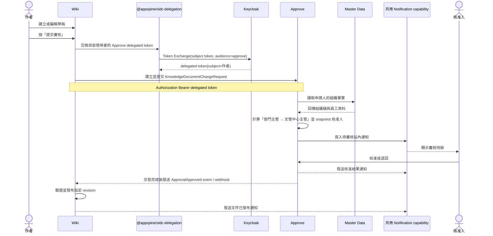

# Z31 - 知識庫文件治理流程計劃

> 狀態：討論中的草案。本文件記錄 `apps/wiki`、`apps/approve`、`apps/master-data` 與 `apps/mcp-gateway`，以及共用 Notification capability 之間，第一條端到端業務流程的提案。這是一份設計計劃，尚未代表實作核准。

> 平台前置能力：Wiki → Approve 的使用者身分委派由正式計畫 [042 - `@appspine/oidc-delegation`](../decisions/042-oidc-delegation-package-plan.md) 提供。Z31 不自行實作 token exchange 或自訂身分轉交協定。

> [!info] 目前交接狀態（2026-08-07）
> 043 已完成 Z31 的 canonical capability／binding contracts、generated local views、可靠性／安全 fixture 與 package propagation；這些成果只凍結跨 App 邊界，**不代表 Z31 業務 vertical slice 已開始或完成**。目前 `apps/wiki`、`apps/approve`、`apps/master-data` 與 `apps/mcp-gateway` 尚未有這條流程的業務實作，下一階段需依本文件第 10、11 節開始實作與端到端驗收。

## 1. 目標

在擴充更多跨 App 流程之前，先驗證一條完整、接近正式營運形態的業務流程：

```text
建立或編輯知識庫文件
    → 提交特定 revision 進行審核
    → Approve 依 Master Data 的組織事實計算固定核准鏈
    → 核准或退回異動
    → 發布核准的 revision
    → 通知相關人員
    → 透過 MCP 提供 Agent 查詢結果
```

這不只是驗證 Wiki 功能，而是同時驗證 OIDC、RBAC、Master Data、Domain Events、跨 App 資料引用、通知、MCP、稽核，以及實際的錯誤處理能力。

## 2. MVP 範圍

### 包含

- 文件類型：內部制度與作業程序文件
- 異動類型：新增、修改、停用
- 固定兩階段順序核准：文件所屬部門主管 → 文管中心主管
- Approve 依 Master Data 的組織事實計算核准鏈，並在 Approve 內 snapshot 核准人
- Approve 建立輕量的 `KnowledgeDocumentChangeRequest`，只保存文件與 revision reference，不保存文件正文
- 核准後自動發布
- 退回時記錄原因或意見
- 每次重送都建立新的 revision 與新的申請單
- 第一版 MCP 只提供唯讀查詢
- 對提交、核准、退回、發布與取消建立稽核紀錄
- 建立測試組織資料：工程部、文管中心、工程部主管、作者與文管中心主管

### 暫緩

- 通用工作流設計器
- 可由管理員任意配置的多階段或條件式核准路由
- 代理核准或委派核准
- Agent 主動執行核准或發布
- 複雜的文件差異比較與協作編輯增強功能
- 超出本流程需要的跨 App 全域事件匯流排

## 3. 使用者流程提案

使用者從 Wiki 開始操作。使用者在文件頁面按下「提交審核」後，Wiki 後端透過 `@appspine/oidc-delegation` 將目前使用者的身分委派給 Approve，再由 Approve 建立本地的 `KnowledgeDocumentChangeRequest`。使用者不需要離開 Wiki，也不需要重新輸入整份文件內容。



## 4. 資料責任邊界

| App | 負責資料 | 不負責資料 |
| --- | --- | --- |
| Wiki | 文件、草稿內容、不可變更的 revision、已發布內容 | 核准決定與核准規則 |
| Approve | `KnowledgeDocumentChangeRequest`、核准狀態、審核意見、核准路由計算結果與 snapshot、核准稽核紀錄 | 文件的正本內容與發布動作 |
| Master Data | 部門、員工、組織關係、代理設定等組織事實；測試用工程部與文管中心主管資料 | Approve 的核准政策與工作流執行歷程 |
| 共用 Notification capability | 通知任務、發送狀態、重試歷程 | 業務核准狀態 |
| MCP Gateway | 提供 Agent 使用的查詢與發現介面 | 業務資料的來源真相 |

異動申請只保存 `document_id`、`revision_id`、異動摘要與必要的顯示資訊，不複製整份文件內容。核准人必須能在 Wiki 查看審核中的那個不可變更 revision。

這張本地申請單是為了配合 Approve 現有的 `ApprovalEnabledService` extension point：`getApprovalData()`、`getSubject()` 與 `onApproved()` 等 hook 目前都以 Approve 自己的資料模型和交易為邊界。它不是 Wiki 文件的第二份正本。

測試資料使用穩定的組織單位 code 與 `employeeNumber`，不把「老子」這個顯示名稱寫死在程式碼中：

```text
工程部（ENGINEERING）
  主管：王小明
  作者：張三

文管中心（DOCUMENT_CONTROL_CENTER）
  主管：老子
```

## 5. 狀態模型

### Wiki revision

```text
DRAFT → SUBMITTED → PUBLISHED
                   → RETURNED
```

### Approve 本地異動申請

```text
DRAFT → PENDING → APPROVED
                → REJECTED
                → WITHDRAWN
```

### Wiki 發布狀態

```text
NOT_PUBLISHED → PUBLISH_PENDING → PUBLISHED
                              → PUBLISH_FAILED
```

Approve 的 `ApprovalInstance` 仍沿用現有的 `IN_PROGRESS → APPROVED / REJECTED / WITHDRAWN` 狀態機；本地異動申請的狀態只反映表單與整合狀態。核准狀態與 Wiki 發布狀態保持分離。

## 6. 核心不變條件

1. revision 提交後，在該申請完成前不可被修改。
2. Approve 審核的必須是申請單記錄的 `revision_id`。
3. 只有被核准的 revision 可以由這條流程發布。
4. 被退回的 revision 絕對不能發布。
5. 退回後重新提交時，建立新的 revision 與新的異動申請；過去的決定保留為不可變更的歷史。
6. 預設禁止申請人核准自己的申請，除非未來有明確政策允許。
7. 提交與重試操作必須具備冪等性，至少使用 `document_id + revision_id` 作為穩定的請求識別依據。
8. 跨 App 溝通使用經驗證的 API 或 Domain Events；App 不直接讀取其他 App 的資料庫。
9. `KnowledgeDocumentChangeRequest` 的 `onSubmitted()`、`onApproved()`、`onRejected()` 與 `onWithdrawn()` 只更新 Approve 本地資料；不得在 Approve 的資料庫交易內直接呼叫 Wiki。
10. 核准交易完成後，才可透過 Domain Event 或 webhook 要求 Wiki 發布；發布失敗必須可重試且可被看見。
11. Wiki → Approve 的 requester identity 必須來自 `@appspine/oidc-delegation` 驗證後的 delegated token，不得由 request body 任意指定。

## 7. 初版 Domain Events

| Event | 來源 | 初版消費者 |
| --- | --- | --- |
| `DocumentRevisionSubmitted` | Wiki | Approve 的建立/提交 API |
| `ApprovalInstance.submitted` | Approve | Audit、integration relay |
| `ApprovalInstance.approved` | Approve | Wiki 發布 relay、Notification、Audit |
| `ApprovalInstance.rejected` | Approve | Wiki、Notification、Audit |
| `DocumentRevisionPublished` | Wiki | Notification、MCP 查詢層、Audit |

每個事件至少應攜帶：

```text
event_id
event_type
occurred_at
actor_id
source_app
aggregate_id
document_id
revision_id
request_id（適用時）
schema_version
```

對 Approve 而言，`ApprovalInstance.submitted/approved/rejected` 應沿用現有的 `ApprovalInstanceEvents` 常數與 transaction-bound outbox。跨 App relay 必須額外帶出 `document_id`、`revision_id` 與 `change_request_id`；不能假設通用的 `ApprovalInstance` snapshot 自己就包含 Wiki reference。事件應與來源 App 的業務異動在同一個交易中寫入，之後非同步發送，並由消費者以冪等方式處理及重試。

## 8. 跨 App 整合契約草案

以下是討論層級的契約，實作前仍可調整。

### Wiki → Approve

```text
POST /knowledge-document-change-requests

{
  "documentId": "...",
  "revisionId": "...",
  "revisionChecksum": "...",
  "changeType": "UPDATE",
  "ownerDepartmentId": "...",
  "summary": "...",
  "idempotencyKey": "..."
}
```

Wiki 呼叫此 API 時使用 `@appspine/oidc-delegation` 交換出的 Approve delegated token，並以 `X-Idempotency-Key` 或等價的穩定識別值防止重複提交。`requesterId` 從驗證後的 token principal 取得，不可信任 request body 自行指定。第一版對使用者提供單一「提交審核」動作；Approve 內部可以在同一個服務流程中建立本地申請，再呼叫 `ApprovalInstancesService.submit("KnowledgeDocumentChangeRequest", requestId, ...)`。

Approve 依 Master Data 提供的組織事實，套用「文件所屬部門主管 → 文管中心主管」政策，然後快照核准人。Master Data 組織資料後續改變，也不能悄悄改變進行中的申請。

### Approve → Wiki

Approve 的核准交易完成後，由 event handler 或 webhook relay 將 `change_request_id`、`document_id` 與 `revision_id` 傳給 Wiki。Wiki 驗證該 revision 仍然有效且尚未發布，再以冪等方式發布；不能由 `ApprovalEnabledService.onApproved()` 在 Approve transaction 內直接呼叫 Wiki。

Wiki 發布成功後，應產生 `DocumentRevisionPublished`，並讓文件與流程狀態可以被查詢。發布失敗時，Wiki 或 integration relay 必須保留可重試的狀態。

### Approve 模組的實作形狀

建議新增 `knowledge-document-change-requests` module：

- `KnowledgeDocumentChangeRequestService extends ApprovalEnabledService`。
- `entityType` 固定為 `KnowledgeDocumentChangeRequest`，`entityId` 指向 Approve 本地申請單，而不是直接指向 Wiki revision。
- `getApprovalData()` 回傳異動類型、文件 metadata 與核准政策需要的資料。
- `getSubject()` 使用提交時保存的文件標題或摘要，避免收件匣顯示內容隨 Wiki 後續修改而漂移。
- `generateSteps()` 使用現有 `OrgContext` 與 Approve 的路由政策計算「部門主管 → 文管中心主管」核准鏈。
- `onSubmitted()`、`onApproved()`、`onRejected()`、`onWithdrawn()` 只更新本地申請狀態。
- Wiki 發布由核准完成後的 Domain Event 或 webhook relay 負責。

### MCP Gateway

第一版唯讀工具應能回答：

- 文件目前的狀態與 revision
- 異動申請目前的狀態
- 某位使用者目前待處理的核准事項
- 審核歷程與退回原因

Approve 現有的 `get_approval_instance` 與 `list_my_pending_approvals` 可以提供核准層級查詢；文件層級的 `get_document_workflow_status` 則應由 Wiki 或 MCP Gateway 統一組合 Wiki、Approve 與發布狀態。MCP 回傳結果必須遵守與人類 UI 相同的授權規則，並反映目前實際狀態。

## 9. 安全與稽核要求

- 人類使用者透過 OIDC 驗證身分。
- Wiki → Approve 的使用者委派使用 `@appspine/oidc-delegation`；Approve 驗證 delegated token 的 issuer、audience、正規化後的 `clientId`（Keycloak `azp` 或 RFC 9068 `client_id`）與 subject。**042 定案 `act` claim 不是第一版授權依據**（見 [[042-oidc-delegation-package-plan]] §17.1），不得作為 requester 識別方式。
- 核准完成後的 Approve → Wiki 發布通知使用服務對服務憑證或 Domain Event relay，不冒充原始使用者。
- Wiki 呼叫 Approve 時必須保留原始操作者的 acting identity；不得讓所有申請都看起來是 Wiki service account 提交。
- 同時執行角色權限與資源層級的擁有權檢查。
- 預設禁止自我核准。
- 授權核准人查看正在審核的特定 revision。
- 稽核紀錄包含操作者、acting identity、來源 App、request ID 與 event ID。
- Event payload 與稽核 snapshot 不得包含 access token、API key 或其他秘密。

### 9.1 042 平台能力回填（以目前發布狀態為準，2026-08-07）

> 本節只回填 [[042-oidc-delegation-package-plan]] 已凍結、Z31 可直接依賴的 contract；**不代表
> Z31 業務實作已開始**，見本文件頂部「討論中的草案」狀態。042 的 code review 修正版已由
> 043 交接紀錄確認為 `@appspine/auth@6.2.1` 與 `@appspine/oidc-delegation@0.3.1`，因此
> 「等待 042 package 重新發布」不再是 Z31 的發布阻塞；Z31 整合環境仍須用這兩個版本完成
> 實際 Keycloak／Wiki／Approve smoke test，不能只以 contract fixture 代替。

- **Policy／delegation scope**：policy 名稱 `submit-knowledge-document-change`；delegation
  scope `approve:knowledge-document-change:submit`（命名空間 `approve:`）。若 Z31 §5 的
  `WITHDRAWN` 狀態未來也需要委派能力，需另外向 042 註冊新 policy／scope，不能沿用同一條。
- **Requester client**：`wiki-delegation`——一個獨立、無登入能力的 confidential client，
  不是 Wiki 前端使用者登入用的 `wiki` client。Wiki backend 需持有 `wiki-delegation` 的
  client secret 才能發起交換。
- **Delegated principal metadata**：Approve 端驗證成功後，`request.user` 是與一般登入
  相同形狀的 `JwtUser`（可用既有 `@CurrentUser()` 讀取）；委派相關的
  `issuer`／`externalSubject`／`sourceClientId`（即 `wiki-delegation`）／`audience`／
  `scopes` 另外附掛在 `request.delegationContext`（`@CurrentDelegatedUser()` 讀取），僅供
  稽核使用，不得記錄進一般 log/trace。
- **`provisioning: 'never'`（預設）的業務含義**：Approve 不會因為收到合法 delegated token
  就自動幫使用者建立 Approve 本地帳號。**若一個使用者從未在 Approve 有本地帳號（例如只用過
  Wiki，從未直接登入過 Approve），透過 Wiki 提交審核會直接被拒絕（統一不透明 401）**，不是
  以完整流程呼叫 `KnowledgeDocumentChangeRequest` 建立後才發現沒有權限。Z31 的 UX 需要考慮
  「使用者在 Wiki 端點了提交，但因為在 Approve 從未有帳號而失敗」這個情境的錯誤訊息與引導。
- **錯誤分類**：Wiki 呼叫 `@appspine/oidc-delegation` 的 `exchange()` 可能得到
  `invalid_subject_token`／`policy_not_found`／`policy_violation`／`exchange_denied`／
  `provider_unavailable`／`malformed_provider_response` 六種分類（只有
  `provider_unavailable` 建議由業務層重試，其餘不可重試）；Approve 端對 delegated token 的
  拒絕一律是統一 401（不區分細節）。Z31 §8「跨 App 整合契約草案」的 API 錯誤處理設計需要對
  這兩層分別呼應，不能假設 Approve 會回傳結構化的 042 內部錯誤分類。
- **`SUBMISSION_PENDING`／`SUBMISSION_FAILED` handoff 需求**：042 的 `exchange()` 不做跨
  request cache、不做內部重試（見 §12.3、§8）；Z31 §5「Wiki revision」狀態模型目前只有
  `DRAFT → SUBMITTED → PUBLISHED/RETURNED`，**缺少「提交過程本身失敗待重試」的中介狀態**
  （對應 §6 不變條件 7 的冪等重試要求）。建議 Z31 業務實作時在 `SUBMITTED` 之前補一個
  `SUBMISSION_PENDING`（已呼叫但尚未確認 Approve 端建立成功）／`SUBMISSION_FAILED`
  （delegation exchange 或 Approve API 呼叫失敗，需要以同一個 `idempotencyKey` 重試）狀態，
  比照 §5「Wiki 發布狀態」既有的 `PUBLISH_PENDING`／`PUBLISH_FAILED` 模式，而不是讓「提交
  審核」變成一個沒有中間狀態的單一同步動作。
- **耦合邊界維持不變**：Wiki 只依賴一個窄的 `wiki-delegation` client 與 Approve 的
  `POST /knowledge-document-change-requests` façade；不 import Approve 的 service/schema／
  internals；不共用資料庫；核准 transaction 完成後才透過 outbox event 或固定 relay 通知
  Wiki，不在 Approve transaction 內同步呼叫 Wiki（見 [[042-oidc-delegation-package-plan]]
  §5）。

### 9.2 043 交接後的 Z31 缺口

| 區域 | 目前狀態 | 尚待完成 |
| --- | --- | --- |
| Wiki | 已有一般頁面／版本能力與 generated contract views | Z31 文件類型、不可變 revision、提交審核 API／UI、`SUBMISSION_PENDING`／`SUBMISSION_FAILED`、核准後發布與發布失敗重試 |
| Approve | 已有通用 approval、notification 與 domain-event 基礎能力 | `KnowledgeDocumentChangeRequest` module、本地狀態、兩階段核准路由、Master Data snapshot、退回／withdraw／冪等與 delegated endpoint |
| Master Data | 已有 org units、user profiles 等基礎模組 | ENGINEERING／DOCUMENT_CONTROL_CENTER 測試事實、主管鏈查詢與 Z31 reference contract |
| Notification | 已有部分 App 內通知能力 | 共用待審核／核准／退回／發布通知的 capability、consumer、重試與冪等 |
| MCP Gateway | 已有通用 discovery／tool routing | `get_document_workflow_status`、申請狀態、待核准事項、審核歷程與同等授權檢查 |
| 跨 App runtime | 043 fixture 已驗證 contract、event／receipt／reconciliation 邊界 | 真實 OIDC exchange、Wiki → Approve submit、Approve outbox → Wiki publish、通知與 MCP 的整合環境 E2E |

其中最先要補的是 Wiki 的提交中介狀態與 Approve 的冪等 status query；沒有這兩者，delegation exchange 或 HTTP timeout 後無法安全判斷「申請已建立但回應遺失」的結果，也無法提供可恢復的使用者流程。

## 10. 實作階段

1. 使用已發布的 [042 - `@appspine/oidc-delegation`](../decisions/042-oidc-delegation-package-plan.md) 版本（`@appspine/auth@6.2.1`、`@appspine/oidc-delegation@0.3.1`）完成 Z31 整合環境的 Keycloak 設定與 smoke test。
2. 確認 MVP 範圍、角色、文件類型與「部門主管 → 文管中心主管」核准規則。
3. 建立 Keycloak、Master Data 與 Approve 的測試身分、組織與 mirror 資料。
4. 定義 Wiki 文件/revision、Approve 本地 `KnowledgeDocumentChangeRequest` 與 Master Data reference model。
5. 實作 Wiki 草稿與「提交審核」按鈕，以及不可變更的 revision 行為。
6. 實作 Approve 本地異動申請與兩階段固定核准步驟，接入現有 `ApprovalEnabledService` registry。
7. 以 Master Data 組織事實計算核准鏈，並在 Approve snapshot 解析結果。
8. 加入交易式 Domain Events 與站內 Notification 消費者。
9. 實作核准 revision 發布，以及發布失敗的重試可見性。
10. 補齊 OIDC、RBAC、稽核與唯讀 MCP 查詢。
11. 在整合環境驗證完整成功路徑與失敗路徑。

## 11. 完成定義

以下情境全部成立時，這條 vertical slice 才算完成：

- 作者可以建立並提交制度文件 revision。
- 作者在 Wiki 按下「提交審核」後，Approve 能辨識實際操作者，而不是只辨識 Wiki service account。
- Approve 建立本地異動申請，並依 Master Data 組織事實計算、snapshot 正確的「部門主管 → 文管中心主管」核准鏈。
- 核准人可以針對確切的提交 revision 核准或退回。
- 核准後透過事件或 webhook 只發布該 revision，而且發布具備冪等性。
- 退回原因可以回傳給作者並支援後續修改。
- 相關人員收到待審核與結果通知。
- 所有 App 的稽核紀錄能說明誰在何時做了什麼。
- MCP 可以查詢文件、申請與待核准狀態。
- 重試不會重複建立申請、發布、通知或稽核紀錄。
- 發布或通知失敗時，狀態可見且可以恢復。

## 12. 待討論決策

1. 文件停用是否沿用新增/修改的同一條核准流程，或使用獨立生命週期？
2. `ownerDepartmentId` 是否只允許從 Master Data 的有效組織單位選取？
3. 文管中心主管是否固定由 `DOCUMENT_CONTROL_CENTER` 組織單位的 `headId` 提供？
4. 發布失敗後由 Wiki、Approve admin，還是 integration relay 負責手動重試？
5. MCP 即時組合狀態的 endpoint 與授權邊界要放在 Wiki 還是 MCP Gateway？
6. `@appspine/oidc-delegation` 的 provider-neutral interface 與 Keycloak claims mapping 已由 042 計畫定案；Z31 不再另行設計，僅需在整合環境驗證設定與錯誤映射。
