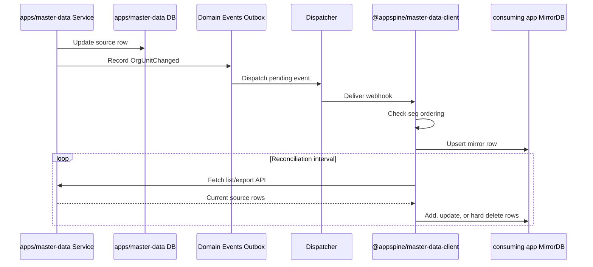

# @appspine/master-data-client

Reusable master-data Sync/Cache helpers for appspine consuming apps.

## Consuming App Setup

1. Declare mirror tables in the consuming app Prisma schema. Use `docs/mirror-schema.md` as the
   convention source.
2. Register a `@DomainEventSubscriber` handler and call `createMasterDataSyncHandler()` from that
   handler.
3. Import `MasterDataClientModule.forRoot({ intervalMs, entities })` to enable package-owned
   reconciliation.

The package does not manage consuming-app migrations, does not do cross-app aggregation, and does
not support soft deletes. Snapshot fields remain the source for historical transaction evidence;
mirror tables are for browsing, filtering, and current-state cache reads.
